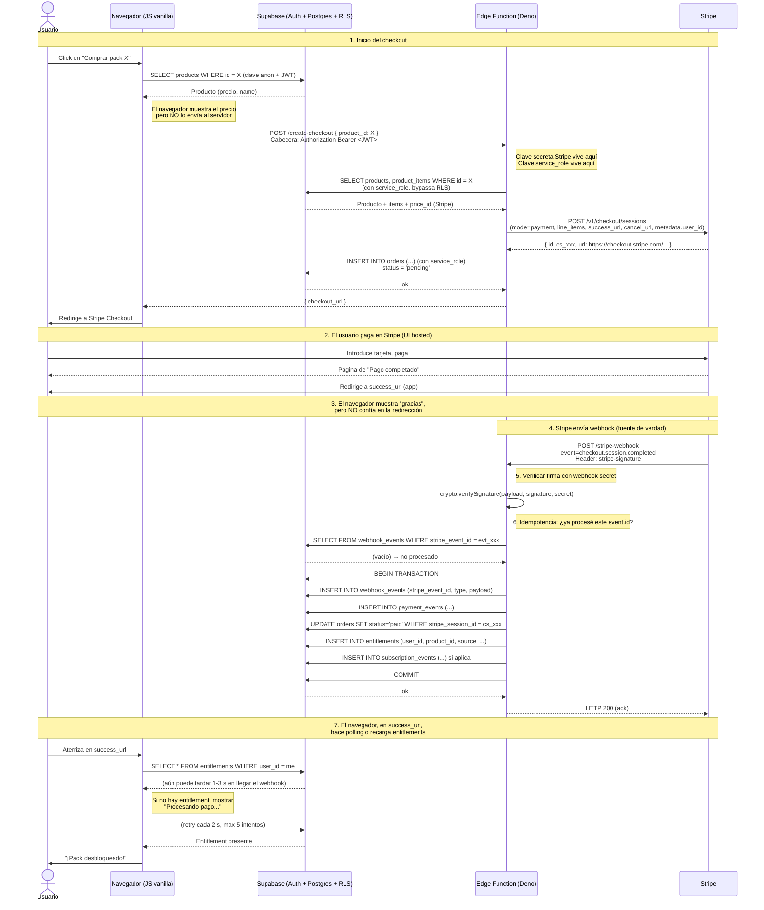

# 02 — Decisión de arquitectura

> **Propósito:** Comparar de forma honesta dos alternativas de backend para PoseArt, justificar la elección y fijar los límites de confianza y los flujos de datos antes de escribir una sola línea de SQL.

---

## 0. Cómo leer este documento

Cada apartado sigue, cuando aplica, esta plantilla:

| Campo | Descripción |
|---|---|
| **Objetivo** | Qué se quiere lograr |
| **Por qué se necesita** | Motivación conectada con la auditoría (`01-CURRENT-STATE-AUDIT.md`) |
| **Prerrequisitos** | Qué debe existir antes |
| **Dónde se ejecuta** | Consola / panel / local |
| **Acción exacta** | Comando o paso |
| **Resultado esperado** | Qué se observa si todo va bien |
| **Cómo verificar** | Comprobación concreta |
| **Errores comunes** | Qué suele romperse |
| **Cómo revertir** | Cómo volver atrás |
| **Fuente oficial** | URL primaria |

> Nota sobre fuentes: las características de los servicios se verificaron en la documentación oficial vigente a agosto de 2026. Los precios y los límites de los planes gratuitos cambian; antes de registrarte, confirma en el sitio oficial. Marca `[VERIFICA]` cualquier punto que vayas a aplicar en producción.

---

## 1. Alternativas comparadas

### Alternativa A (recomendada): Supabase + Stripe + PostHog + Sentry

- **Frontend:** HTML/CSS/JS vanilla en GitHub Pages (sin cambios).
- **Auth + DB + Storage + Functions:** Supabase (PostgreSQL gestionado, RLS nativo, Edge Functions en Deno).
- **Pagos:** Stripe (Checkout hosted, Customer Portal, Webhooks).
- **Analytics:** PostHog (free tier 1M eventos/mes — [verifica límites actuales](https://posthog.com/pricing)).
- **Errores:** Sentry (free tier 5k errores/mes — [verifica límites actuales](https://sentry.io/pricing/)).

### Alternativa B: Firebase + Stripe + Google Analytics + Crashlytics

- **Frontend:** HTML/CSS/JS vanilla en GitHub Pages (sin cambios).
- **Auth + DB + Storage + Functions:** Firebase (Firestore NoSQL, Cloud Functions en Node.js, Firebase Auth).
- **Pagos:** Stripe (igual que la A).
- **Analytics:** Google Analytics 4 (GA4).
- **Errores:** Firebase Crashlytics (orientado a mobile; en web se usa Sentry bajo el capó en muchos casos).

> Aclaración: Firebase Crashlytics está diseñado principalmente para apps móviles nativas (iOS/Android). Para web, Firebase sugiere integrar Sentry o usar la consola de errores de Firebase. Esto ya es una señal de que la alternativa B no encaja tan limpiamente en una app web pura. [VERIFICA: https://firebase.google.com/docs/crashlytics]

---

## 2. Tabla comparativa

Leyenda: ✅ Buen encaje · ⚠️ Encaje mediocre o con matices · ❌ Encaje pobre o riesgo alto.

| Criterio | A: Supabase + Stripe + PostHog + Sentry | B: Firebase + Stripe + GA4 + Crashlytics |
|---|---|---|
| **Beginner-friendliness** | ⚠️ Conoces SQL → bordes rectos; si no, hay curva. Paneles claros, mucho tutorial. | ✅ SDKs "mágicos" y quickstarts muy pulidos; cuesta menos arrancar. |
| **Compatibilidad con JS vanilla** | ✅ `@supabase/supabase-js` funciona con `<script>` o importmap. Sin build step. | ✅ SDK de Firebase funciona con `<script>` CDN. Sin build step. |
| **Auth (email/password, reset, verify, MFA)** | ✅ Auth gestionado, JWT, MFA TOTP, magic link, OAuth. [docs](https://supabase.com/docs/guides/auth) | ✅ Firebase Auth completo, MFA, OAuth. [docs](https://firebase.google.com/docs/auth) |
| **Base de datos relacional** | ✅ PostgreSQL real, esquemas, joins, transacciones, triggers. | ❌ Firestore es NoSQL (documentos/colecciones). No hay JOIN ni SQL. Para datos relacionales hay que desnormalizar. |
| **Almacenamiento de archivos** | ✅ Supabase Storage con buckets públicos/privados y URLs firmadas. | ✅ Cloud Storage for Firebase. Equivalente. |
| **Autorización por usuario (RLS)** | ✅ Row Level Security nativo de Postgres, declarativo en SQL, auditable. | ⚠️ Reglas de seguridad (`.rules`) en YAML/JSON; potentes pero menos expresivas que SQL para casos complejos (p. ej. joins o subconsultas). |
| **Funciones de servidor / webhooks** | ⚠️ Edge Functions en Deno (TypeScript). Ecosistema más pequeño que Node. | ✅ Cloud Functions en Node.js: más librerías, más ejemplos de Stripe. |
| **Coste inicial** | ✅ Free tier amplio (500 MB DB, 50k MAU, 1GB Storage, 500k Edge invocations). | ✅ Free tier "Spark" generoso (1 GiB Firestore, 10 GB Storage). |
| **Backups** | ⚠️ Free: backups diarios con 7 días de retención. Pro: PITR. | ⚠️ Backups automatizados solo en plan Blaze (de pago). En free, exportaciones manuales. |
| **Portabilidad** | ✅ Es Postgres estándar: `pg_dump` y te vas a cualquier hosting Postgres. | ❌ Firestore es propietario. Migrar a otro NoSQL cuesta; a relacional, muchísimo. |
| **Complejidad de despliegue** | ✅ Frontend estático en GitHub Pages + Supabase托管. Sin CI/CD complejo. | ✅ Igual de simple para empezar. |
| **Vendor lock-in** | ✅ Bajo en datos (Postgres) y medio en funciones (Deno). | ❌ Alto en datos (Firestore) y medio en funciones (Node, pero atado a GCP). |
| **Coherencia con mentalidad "SQL y bordes rectos"** | ✅ Total. | ❌ Requiere repensar el modelo a documentos. |

### Veredicto

**Se elige la alternativa A.** Las razones de peso son:

1. **RLS nativo** resuelve directamente el problema nº 4 de la auditoría (sin aislamiento entre usuarios) sin inventar middleware.
2. **PostgreSQL real** permite expresar el modelo de datos de un marketplace (productos, versiones, compras, entitlements) sin desnormalizar de forma frágil.
3. **Portabilidad**: si Supabase sube precios o cierra, `pg_dump` + un Postgres en cualquier cloud nos deja seguir operando. Con Firestore, la salida es muy costosa.
4. **Bajo lock-in en datos**: el modelo relacional vive en estándar abierto.
5. **Coherencia pedagógica**: este proyecto es para principiantes que quieren aprender "cómo se hace bien". Aprender SQL y RLS es una habilidad transferible; aprender las reglas de seguridad de Firestore, menos.

La única desventaja real (Edge Functions en Deno vs Node.js) se mitiga porque solo necesitaremos 3-4 funciones muy pequeñas (checkout, webhook, contabilidad de entitlements), y Deno tiene soporte de primera para `fetch` y crypto, que es lo que usaremos.

---

## 3. Servicios elegidos y su rol

| Servicio | Rol en PoseArt | Coste inicial | Por qué ese y no otro |
|---|---|---|---|
| **GitHub Pages** | Alojar HTML/CSS/JS estático | $0 | Ya está en uso, sin build step. |
| **Supabase** | Auth, PostgreSQL, RLS, Storage, Edge Functions | $0 (free tier) | RLS nativo, Postgres portable. [precios](https://supabase.com/pricing) |
| **Stripe** | Pagos y suscripciones | Comisión por venta (2.9% + $0.30) | Estándar, Checkout hosted reduce superficie PCI. [precios](https://stripe.com/pricing) |
| **PostHog** | Analytics de producto | $0 (1M eventos/mes) | Self-hostable si hace falta; taxonomía custom. [precios](https://posthog.com/pricing) |
| **Sentry** | Tracking de errores JS | $0 (5k errores/mes) | Detección automática de excepciones en navegador. [precios](https://sentry.io/pricing/) |

> ⚠️ Los límites de los planes gratuitos cambian con el tiempo. Antes de registrar la cuenta, confirma los números en los enlaces oficiales.

---

## 4. Diagrama del sistema (ASCII)

```
                                    INTERNET
                                        │
                                        │ HTTPS
                                        ▼
                ┌───────────────────────────────────────────┐
                │  NAVEGADOR DEL USUARIO                     │
                │  (HTML + CSS + JS vanilla)                 │
                │                                            │
                │  - Render de poses (canvas 3D)             │
                │  - Cámara + overlay esqueleto              │
                │  - Capturas → localStorage (MVP)           │
                │  - Llamadas Auth/DB via supabase-js        │
                │  - Llamadas checkout via fetch a Edge Fn   │
                │  - Telemetría a PostHog y Sentry           │
                └───────┬───────────────────────┬────────────┘
                        │                       │
                        │ HTTPS                 │ HTTPS
                        │ (anon key)            │ (publishable key)
                        │                       │
                        ▼                       ▼
        ┌───────────────────────────┐   ┌───────────────────────────┐
        │   SUPABASE                │   │   STRIPE                  │
        │                           │   │                           │
        │   ┌─────────────────┐     │   │   ┌─────────────────┐     │
        │   │ Auth (JWT)      │     │   │   │ Checkout        │     │
        │   └─────────────────┘     │   │   │ (página hosted) │     │
        │   ┌─────────────────┐     │   │   └─────────────────┘     │
        │   │ PostgreSQL +RLS │     │   │   ┌─────────────────┐     │
        │   └─────────────────┘     │   │   │ Customer Portal │     │
        │   ┌─────────────────┐     │   │   └─────────────────┘     │
        │   │ Storage         │     │   │   ┌─────────────────┐     │
        │   └─────────────────┘     │   │   │ Webhooks        │     │
        │   ┌─────────────────┐     │   │   └────────┬────────┘     │
        │   │ Edge Functions  │◄────┼───┼────────────┘              │
        │   │ (Deno)          │     │   │   (POST eventos de pago)  │
        │   └────────┬────────┘     │   └───────────────────────────┘
        │            │              │
        └────────────┼──────────────┘
                     │
                     │ service_role key (SOLO servidor)
                     │ Stripe secret key (SOLO servidor)
                     ▼
        ┌────────────────────────────────────────────────┐
        │  POSTHOG (analytics)        SENTRY (errores)   │
        │  Recibe eventos desde el    Recibe excepciones │
        │  navegador. No recibe PII   desde el navegador.│
        │  sensible.                  No recibe secretos.│
        └────────────────────────────────────────────────┘
```

---

## 5. Límites de confianza (trust boundaries)

Un **límite de confianza** es una frontera donde los datos cambian de "contexto confiable" a "contexto hostil". Identificarlos evita errores de seguridad clásicos.

### Límite 1: Navegador ↔ Internet

- **Lo que sale del navegador es hostil por definición.** Cualquier cosa que el usuario pueda tocar (URLs, formularios, headers, tokens en memoria) puede ser modificada.
- **Regla:** el navegador puede enviar peticiones, pero el servidor **nunca** confía en el contenido sin validarlo.

### Límite 2: Navegador ↔ Supabase (con clave `anon`)

- La clave `anon` de Supabase es **pública** (va en el código del navegador).
- Está diseñada para pasar por **RLS**: solo puede hacer lo que las políticas permitan.
- **Regla:** cualquier operación sensible debe estar protegida por RLS o por estar detrás de una Edge Function que use `service_role`.

### Límite 3: Navegador ↔ Stripe (con `publishable key`)

- La `publishable key` de Stripe es pública.
- El navegador puede **iniciar** un Checkout, pero **no puede confirmar** que el pago se hizo.
- **Regla:** la fuente de verdad del pago es el **webhook verificado** que llega al servidor, no la redirección a `success_url`.

### Límite 4: Supabase Edge Functions ↔ Supabase PostgreSQL

- Las Edge Functions se ejecutan en el servidor de Supabase (Deno).
- Tienen acceso a la clave `service_role`, que **bypasea RLS**.
- **Regla:** esta clave NUNCA llega al navegador. Solo se usa dentro de la Edge Function y para operaciones que el usuario no debe poder hacer directamente (p. ej. registrar un pago confirmado por webhook).

### Límite 5: Stripe ↔ Supabase Edge Function (webhook)

- Stripe envía eventos HTTP POST a la URL de webhook.
- **Regla:** la Edge Function **debe verificar la firma** `stripe-signature` con el `webhook secret` antes de confiar en el payload. Si no, cualquiera podría falsificar un "pago completado".

### Límite 6: PostHog / Sentry ↔ Navegador

- PostHog y Sentry reciben datos del navegador.
- **Regla:** no se envían PII sensible (emails, fotos, contenido de poses privadas) a estos servicios. Solo eventos de producto y stacktraces.

### Tabla resumen de límites

| Límite | Qué cruza | Quién valida | Cómo |
|---|---|---|---|
| 1 | Navegador → Internet | Servidor destino | Validación de input, RLS |
| 2 | Navegador → Supabase | Supabase RLS | Políticas SQL |
| 3 | Navegador → Stripe | Stripe + tu servidor | Checkout Session creada en servidor; webhook verifica pago |
| 4 | Edge Function → Postgres | Tu código en la función | `service_role` solo aquí; nunca en navegador |
| 5 | Stripe → Edge Function | Edge Function | Verificación de firma `stripe-signature` |
| 6 | Navegador → PostHog/Sentry | Tu código cliente | Filtrado de PII antes de enviar |

---

## 6. Flujo de datos (data flow)

### 6.1 Lectura de datos globales (p. ej. biblioteca de poses oficiales)

```
Navegador ──(GET /rest/v1/poses?visibility=eq.public)──► Supabase Postgres
                          ▲
                          │ RLS: ALLOW SELECT WHERE visibility = 'public'
                          │
                       Política RLS
```

- El navegador pide poses públicas con la clave `anon`.
- RLS permite SELECT solo de filas `visibility = 'public'`.
- No requiere Edge Function.

### 6.2 Escritura de dato privado (p. ej. favorito)

```
Navegador ──(POST /rest/v1/favorites)──► Supabase Postgres
                          ▲
                          │ RLS: ALLOW INSERT WHERE user_id = auth.uid()
                          │
                       Política RLS
```

- El JWT del usuario viaja en la cabecera.
- RLS obliga a que `favorites.user_id` sea igual al `auth.uid()` del JWT.
- Si alguien intenta insertar con `user_id` ajeno, RLS lo rechaza.

### 6.3 Operación sensible (p. ej. crear Checkout Session)

```
Navegador ──(POST /functions/v1/create-checkout)──► Edge Function
                                                          │
                                                          │ 1. Lee JWT, verifica usuario
                                                          │ 2. Lee precio desde Postgres (NO del cliente)
                                                          │ 3. Llama a Stripe API con secret_key
                                                          │ 4. Devuelve URL de Checkout
                                                          ▼
                                                       Stripe
```

- El navegador **nunca** ve la `secret_key` de Stripe.
- El precio no viene del navegador; la Edge Function lo lee de la tabla `products`.
- El navegador recibe solo una URL a la que redirigir.

### 6.4 Confirmación de pago (webhook)

```
Stripe ──(POST /functions/v1/stripe-webhook)──► Edge Function
                       │
                       │ 1. Verifica firma con webhook secret
                       │ 2. Idempotencia: comprueba webhook_events
                       │ 3. Inserta en subscription_events / payment_events
                       │ 4. Actualiza subscriptions y entitlements (con service_role)
                       ▼
                  Postgres
```

- La fuente de verdad **siempre** es el webhook, no la redirección de Checkout.

---

## 7. Diagrama de secuencia del checkout (Mermaid)



### Notas críticas del diagrama

- **El navegador nunca decide que el pago se completó.** Solo el webhook lo decide.
- **La Edge Function nunca confía en el cuerpo del webhook sin verificar la firma.**
- **La Edge Function es idempotente**: si Stripe reenvía el mismo evento (lo hace), no se duplican entitlements.
- **El polling del navegador es por UX, no por seguridad.** Aunque el usuario cierre la pestaña, el webhook sigue procesándose.

---

## 8. Por qué NO se eligen otras alternativas

| Alternativa | Por qué se descarta |
|---|---|
| **Backend propio en Node.js + Postgres en VPS** | Mantener servidores, parches, backups, certificados. No aporta nada que Supabase no dé gratis. |
| **Appwrite** | Menos maduro que Supabase en RLS; menos ejemplos. |
| **AWS Amplify** | Curva de aprendizaje alta, precios difíciles de predecir, lock-in alto. |
| **Convex** | Muy bueno, pero NoSQL y propietario. No aporta sobre Supabase para este caso. |
| **PocketBase** | Autoalojado, requiere VPS. Útil para proyectos pequeños pero no querremos mantener servidores. |
| **Stripe Tax / Stripe Connect** | Connect solo se documenta (no se implementa en MVP). Ver `08-MARKETPLACE-AND-PURCHASES.md`. |

---

## 9. Riesgos de la alternativa elegida y mitigaciones

| Riesgo | Probabilidad | Impacto | Mitigación |
|---|---|---|---|
| Supabase cambia el free tier | Media | Medio | Modelo portable; `pg_dump` nos permite irnos. |
| Edge Functions en Deno es menos familiar | Alta | Bajo | Solo 3-4 funciones pequeñas. Documentar patrones. |
| Webhook de Stripe se pierde o llega tarde | Media | Medio | Polling en el navegador + panel de Stripe para reenviar eventos. |
| Conflicto entre `service_role` y RLS | Baja | Alto | `service_role` solo en Edge Functions, nunca en navegador. Auditoría de código. |
| Límite de PostHog/Sentry excedido | Baja | Bajo | Muestreo en cliente; alerts de cuota. |

---

## 10. Decisión formal

**Decisión:** Adoptar la **alternativa A (Supabase + Stripe + PostHog + Sentry)** como arquitectura de backend para PoseArt.

**Fecha de decisión:** vigente a partir de la publicación de este documento.

**Revisión:** este documento se revisa si:
- Supabase cambia sustancialmente el free tier.
- Se decide implementar Stripe Connect (pagos a creadores).
- Se requiere salir de GitHub Pages (dominio propio no cambia la decisión; salir de Pages sí podría).

**Próximo paso:** abrir `03-DATA-MODEL.md` para diseñar el esquema SQL que vivirá en Supabase Postgres.

---

## 11. Fuentes oficiales

| Recurso | URL |
|---|---|
| Supabase docs | https://supabase.com/docs |
| Supabase Auth | https://supabase.com/docs/guides/auth |
| Supabase RLS | https://supabase.com/docs/guides/database/postgres/row-level-security |
| Supabase Edge Functions | https://supabase.com/docs/guides/functions |
| Supabase Storage | https://supabase.com/docs/guides/storage |
| Supabase pricing | https://supabase.com/pricing |
| Stripe Checkout | https://docs.stripe.com/checkout |
| Stripe Webhooks | https://docs.stripe.com/webhooks |
| Stripe Customer Portal | https://docs.stripe.com/customer-management |
| Stripe pricing | https://stripe.com/pricing |
| PostHog docs | https://posthog.com/docs |
| PostHog pricing | https://posthog.com/pricing |
| Sentry docs | https://docs.sentry.io/ |
| Sentry pricing | https://sentry.io/pricing/ |
| Firebase docs | https://firebase.google.com/docs |
| Firebase security rules | https://firebase.google.com/docs/rules |
| Firestore vs Postgres (comparativa general) | https://firebase.google.com/docs/firestore |
