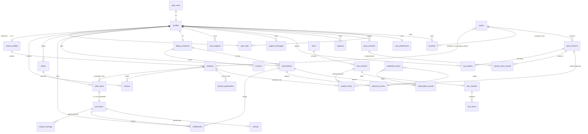

# 03 — Modelo de datos

> **Propósito:** Definir el esquema completo de la base de datos PostgreSQL que vivirá en Supabase. Cada tabla se justifica, no se copia mecánicamente. El SQL ejecutable está en `sql/001-schema.sql`.

---

## 0. Convenciones

| Convención | Valor |
|---|---|
| Motor | PostgreSQL 15+ (gestionado por Supabase) |
| Esquema | `public` (por simplicidad para principiantes) |
| IDs | `uuid` con `gen_random_uuid()` (no usamos IDs secuenciales para no filtrar cardinalidad) |
| Timestamps | `timestamptz` en UTC. La app muestra en zona del usuario. |
| Nombres de tabla | `snake_case`, plural (`poses`, `tours`) |
| Nombres de columna | `snake_case` |
| Claves foráneas | siempre con `ON DELETE` explícito |
| Soft delete | booleano `archived_at timestamptz` (NULL = activo) |
| Auditoría | `created_at`, `updated_at` en toda tabla mutable |
| Convención de signos del renderer | Ver apéndice A |

---

## 1. Diagrama ERD (Mermaid)



> El diagrama omite `admin_audit_log` (tabla aislada de auditoría) para no saturar. Se detalla más abajo.

---

## 2. Clasificación de los datos

Antes de definir tablas, es crítico distinguir cinco categorías de contenido. Mezclarlas es el origen de bugs de seguridad clásicos.

| Categoría | Qué es | Quién puede leer | Quién puede escribir | Ejemplo |
|---|---|---|---|---|
| **Oficial global** | Contenido curado por el equipo PoseArt, disponible para todos los usuarios autenticados (o incluso anónimos) | Todos (incl. anónimos según RLS) | Solo `administrador` o `moderador` | Las 745 poses originales, los tours oficiales |
| **Privado de usuario** | Contenido creado por un usuario para sí mismo, no compartido | Solo el dueño | Solo el dueño | Pose personal, tour personal, captura, favorito |
| **Borrador (draft)** | Contenido de creador en preparación, no visible en marketplace | Solo el creador dueño | Solo el creador dueño | Pack en edición antes de publicar |
| **Publicado** | Contenido de creador visible en marketplace | Todos los autenticados | Solo el creador dueño (y moderador para archivar) | Pack publicado en marketplace |
| **Archivado** | Contenido retirado del marketplace pero conservado para quienes ya lo compraron | Solo quienes tenían entitlement antes del archivo | Solo moderador/admin | Pack retirado |
| **Comprado (entitlement)** | Registro de que un usuario adquirió acceso a un producto | El dueño del entitlement | Solo el sistema (vía webhook/Edge Function) | Línea en `entitlements` |

Estas categorías se materializan con combinaciones de columnas:

- `poses.visibility ∈ {'public', 'private'}` + `poses.owner_id`
- `products.publication_status ∈ {'draft', 'in_review', 'published', 'rejected', 'archived'}`
- `entitlements` (tabla aparte) — NO se consulta `products` para saber si alguien compró algo

---

## 3. Listado de tablas

### 3.1 Identidad y acceso

#### 3.1.1 `profiles`

**Propósito:** Extender `auth.users` (gestionado por Supabase) con datos de la aplicación. Supabase no permite modificar `auth.users` directamente, así que creamos una tabla 1:1.

**Justificación:** Necesitamos guardar `selected_goal`, `onboarding_completed`, preferencias básicas y datos de display. Sin esta tabla, no hay dónde colgar los metadatos de la app.

**Columnas:**

| Columna | Tipo | Constraints | Descripción |
|---|---|---|---|
| `id` | `uuid` | PK, FK → `auth.users(id) ON DELETE CASCADE` | Igual al ID del usuario en Supabase Auth |
| `username` | `text` | UNIQUE, NOT NULL, CHECK length 3..32 | Nombre público visible (modificable, único) |
| `display_name` | `text` | NULL | Nombre opcional más largo |
| `avatar_url` | `text` | NULL | URL (Storage pública o externa) |
| `selected_goal` | `text` | NULL, CHECK in ('figure','portrait','boudoir','fashion','couple','other') | Objetivo elegido en onboarding |
| `onboarding_completed` | `boolean` | NOT NULL DEFAULT false | Si completó onboarding |
| `onboarding_completed_at` | `timestamptz` | NULL | Cuándo |
| `created_at` | `timestamptz` | NOT NULL DEFAULT now() | |
| `updated_at` | `timestamptz` | NOT NULL DEFAULT now() | Trigger `set_updated_at` |

**Ownership:** Cada fila pertenece al usuario cuyo `id` coincide con `auth.uid()`.
**Retención:** Mientras la cuenta exista. Borrado en cascada cuando se elimina el usuario de `auth.users`.

---

#### 3.1.2 `user_roles`

**Propósito:** Asignar un rol a cada usuario. Solo un rol por usuario (MVP).

**Justificación:** Necesitamos diferenciar `usuario`, `creador`, `moderador`, `administrador`. Lo hacemos en tabla aparte (no en `profiles.role`) para poder auditar cambios y, en el futuro, soportar multirol.

**Columnas:**

| Columna | Tipo | Constraints | Descripción |
|---|---|---|---|
| `user_id` | `uuid` | PK, FK → `auth.users(id) ON DELETE CASCADE` | |
| `role` | `text` | NOT NULL, CHECK in ('usuario','creador','moderador','administrador') | |
| `granted_by` | `uuid` | FK → `auth.users(id)`, NULL | Quién concedió el rol (NULL = autoasignado al registro) |
| `granted_at` | `timestamptz` | NOT NULL DEFAULT now() | |
| `reason` | `text` | NULL | Motivo (p. ej. "solicitud aprobada en tick #123") |

**Ownership:** La fila la concede un admin (o el sistema al registro inicial con rol `usuario`). El usuario dueño puede leer su propio rol pero no modificarlo.
**Retención:** Mientras la cuenta exista.

---

#### 3.1.3 `admin_audit_log`

**Propósito:** Registro inmutable de acciones administrativas (cambios de rol, archivado de contenido, reembolsos forzados, etc.).

**Justificación:** Si un moderador archiva un pack o un admin concede rol `creador`, necesitamos un rastro auditable. Esta tabla **no se actualiza ni se borra** (solo inserta).

**Columnas:**

| Columna | Tipo | Constraints | Descripción |
|---|---|---|---|
| `id` | `uuid` | PK DEFAULT gen_random_uuid() | |
| `actor_id` | `uuid` | FK → `auth.users(id)`, NOT NULL | Quién ejecutó la acción |
| `action` | `text` | NOT NULL | P. ej. 'role.grant', 'product.archive', 'refund.force' |
| `target_type` | `text` | NOT NULL | 'user', 'product', 'pose', etc. |
| `target_id` | `uuid` | NULL | ID del objeto afectado (si aplica) |
| `before` | `jsonb` | NULL | Estado anterior (snapshot) |
| `after` | `jsonb` | NULL | Estado nuevo (snapshot) |
| `reason` | `text` | NULL | Justificación de free text |
| `ip` | `inet` | NULL | IP del actor (si la Edge Function la propaga) |
| `created_at` | `timestamptz` | NOT NULL DEFAULT now() | |

**Ownership:** Solo lectura para `administrador`. Escritura solo desde Edge Function con `service_role`.
**Retención:** 2 años (recomendación). Luego, archivo en Storage frío. [VERIFICA política legal aplicable según tu jurisdicción]

---

### 3.2 Facturación y suscripciones

#### 3.2.1 `billing_customers`

**Propósito:** Vincular un usuario Supabase con un Customer de Stripe.

**Justificación:** Stripe identifica por `customer_id` (cus_...). Necesitamos saber a qué usuario corresponde cada customer para procesar webhooks.

**Columnas:**

| Columna | Tipo | Constraints | Descripción |
|---|---|---|---|
| `user_id` | `uuid` | PK, FK → `auth.users(id) ON DELETE CASCADE` | |
| `stripe_customer_id` | `text` | UNIQUE, NOT NULL | cus_... |
| `created_at` | `timestamptz` | NOT NULL DEFAULT now() | |
| `updated_at` | `timestamptz` | NOT NULL DEFAULT now() | |

**Ownership:** El usuario puede leer su propio customer. No puede modificarlo (lo gestiona Stripe vía webhook).
**Retención:** Mientras la cuenta exista. Si se borra el usuario, también se borra el customer en Stripe (vía Edge Function) — [VERIFICA proceso de borrado en Stripe: https://docs.stripe.com/api/customers/delete].

---

#### 3.2.2 `subscriptions`

**Propósito:** Estado **actual** de la suscripción de un usuario. Una fila por usuario como máximo en estado activo.

**Justificación:** Necesitamos una consulta rápida "¿este usuario está suscrito?" sin recorrer eventos. Esta tabla es un **cache derivado** de `subscription_events`; en cualquier momento se puede reconstruir desde eventos.

**Columnas:**

| Columna | Tipo | Constraints | Descripción |
|---|---|---|---|
| `id` | `uuid` | PK DEFAULT gen_random_uuid() | |
| `user_id` | `uuid` | FK → `auth.users(id) ON DELETE CASCADE`, NOT NULL | |
| `stripe_subscription_id` | `text` | UNIQUE, NOT NULL | sub_... |
| `stripe_price_id` | `text` | NOT NULL | price_... |
| `status` | `text` | NOT NULL, CHECK in ('active','past_due','canceled','paused','trialing') | Estado según Stripe |
| `current_period_start` | `timestamptz` | NOT NULL | Inicio del periodo facturado actual |
| `current_period_end` | `timestamptz` | NOT NULL | Fin del periodo facturado actual |
| `cancel_at_period_end` | `boolean` | NOT NULL DEFAULT false | Si se cancelará al final del periodo |
| `canceled_at` | `timestamptz` | NULL | Si se canceló, cuándo |
| `current_subscription_started_at` | `timestamptz` | NOT NULL | Inicio del **tramo continuo actual** (ver §4) |
| `first_subscription_started_at` | `timestamptz` | NULL | Primera vez que el usuario tuvo suscripción activa (ver §4) |
| `lifetime_subscribed_days` | `integer` | NOT NULL DEFAULT 0 | Suma de días suscrito a lo largo de la vida (ver §4) |
| `current_subscription_streak_days` | `integer` | NOT NULL DEFAULT 0 | Días consecutivos actuales (ver §4) |
| `created_at` | `timestamptz` | NOT NULL DEFAULT now() | |
| `updated_at` | `timestamptz` | NOT NULL DEFAULT now() | |

**Ownership:** El usuario puede leer la suya. Escritura solo desde Edge Function (webhook handler).
**Retención:** Mientras la cuenta exista. Los campos `lifetime_*` y `first_subscription_started_at` se conservan incluso si la suscripción se cancela (son históricos).

---

#### 3.2.3 `subscription_events`

**Propósito:** Log **append-only** de todos los eventos de suscripción (created, renewed, past_due, canceled, etc.).

**Justificación:** Es la **fuente de verdad** para reconstruir `current_subscription_started_at`, `lifetime_subscribed_days` y `current_subscription_streak_days`. Si un día se corrompe la tabla `subscriptions`, se reconstruye desde aquí.

**Columnas:**

| Columna | Tipo | Constraints | Descripción |
|---|---|---|---|
| `id` | `uuid` | PK DEFAULT gen_random_uuid() | |
| `subscription_id` | `uuid` | FK → `subscriptions(id) ON DELETE RESTRICT`, NOT NULL | |
| `stripe_event_id` | `text` | UNIQUE, NOT NULL | evt_... (idempotencia) |
| `event_type` | `text` | NOT NULL | P. ej. 'subscription.created', 'subscription.renewed', 'subscription.canceled', 'subscription.past_due', 'subscription.reactivated' |
| `effective_at` | `timestamptz` | NOT NULL | Momento en que el evento es efectivo (puede diferir de `created_at` en reordenamientos) |
| `payload` | `jsonb` | NOT NULL | Snapshot completo del evento Stripe |
| `created_at` | `timestamptz` | NOT NULL DEFAULT now() | |

**Ownership:** El usuario puede leer los suyos (transparencia). Escritura solo desde webhook handler.
**Retención:** Indefinida (son el histórico). Si hay requisito legal de borrado, anonimizar `payload` pero conservar `event_type` y `effective_at`.

---

#### 3.2.4 `invoices`

**Propósito:** Registro de facturas emitidas por Stripe.

**Justificación:** Para historial de pagos, descargas PDF y conciliación contable.

**Columnas:**

| Columna | Tipo | Constraints | Descripción |
|---|---|---|---|
| `id` | `uuid` | PK DEFAULT gen_random_uuid() | |
| `user_id` | `uuid` | FK → `auth.users(id) ON DELETE CASCADE`, NOT NULL | |
| `stripe_invoice_id` | `text` | UNIQUE, NOT NULL | in_... |
| `stripe_subscription_id` | `text` | NULL | sub_... (si viene de suscripción) |
| `amount_due` | `integer` | NOT NULL | En centavos |
| `currency` | `text` | NOT NULL, CHECK length = 3 | ISO 4217 (USD, EUR...) |
| `status` | `text` | NOT NULL, CHECK in ('draft','open','paid','uncollectible','void') | |
| `paid_at` | `timestamptz` | NULL | |
| `hosted_invoice_url` | `text` | NULL | URL al PDF en Stripe |
| `created_at` | `timestamptz` | NOT NULL DEFAULT now() | |
| `updated_at` | `timestamptz` | NOT NULL DEFAULT now() | |

**Ownership:** El usuario puede leer las suyas. Escritura solo desde webhook handler.
**Retención:** 7 años (requisito fiscal habitual — [VERIFICA según tu jurisdicción: https://docs.stripe.com/invoicing/compliance]).

---

#### 3.2.5 `payment_events`

**Propósito:** Registro de eventos de pago (payment_intent.succeeded, payment_intent.payment_failed, charge.refunded, etc.).

**Justificación:** Distinto de `invoices` porque no todos los pagos generan factura (p. ej. un charge fallido). Es el log detallado de dinero.

**Columnas:**

| Columna | Tipo | Constraints | Descripción |
|---|---|---|---|
| `id` | `uuid` | PK DEFAULT gen_random_uuid() | |
| `user_id` | `uuid` | FK → `auth.users(id) ON DELETE CASCADE`, NOT NULL | |
| `stripe_event_id` | `text` | UNIQUE, NOT NULL | evt_... (idempotencia) |
| `stripe_payment_intent_id` | `text` | NULL | pi_... |
| `stripe_charge_id` | `text` | NULL | ch_... |
| `event_type` | `text` | NOT NULL | P. ej. 'payment_intent.succeeded', 'charge.refunded' |
| `amount` | `integer` | NOT NULL | En centavos (positivo o negativo para reembolsos) |
| `currency` | `text` | NOT NULL, CHECK length = 3 | |
| `status` | `text` | NOT NULL | Estado reportado por Stripe |
| `payload` | `jsonb` | NOT NULL | |
| `created_at` | `timestamptz` | NOT NULL DEFAULT now() | |

**Ownership:** El usuario puede leer los suyos. Escritura solo desde webhook handler.
**Retención:** 7 años (fiscal).

---

#### 3.2.6 `entitlements`

**Propósito:** Registrar qué productos/suscripciones tiene derecho a usar un usuario.

**Justificación:** **Esta es la tabla que consulta la app para saber si mostrar contenido Pro.** No hay campo `is_pro` en `profiles`: el "Pro" se **deriva** de la existencia de un entitlement activo.

**Columnas:**

| Columna | Tipo | Constraints | Descripción |
|---|---|---|---|
| `id` | `uuid` | PK DEFAULT gen_random_uuid() | |
| `user_id` | `uuid` | FK → `auth.users(id) ON DELETE CASCADE`, NOT NULL | |
| `source` | `text` | NOT NULL, CHECK in ('subscription','purchase','gift','admin_grant') | Origen del derecho |
| `source_id` | `uuid` | NULL | FK lógica a `subscriptions.id` o `purchases.id` (sin constraint, depende de `source`) |
| `product_id` | `uuid` | FK → `products(id)`, NULL | Si aplica a un producto concreto (purchase) |
| `scope` | `text` | NOT NULL, CHECK in ('all_pro_content','single_product','creator_catalog') | Qué cubre |
| `starts_at` | `timestamptz` | NOT NULL DEFAULT now() | |
| `ends_at` | `timestamptz` | NULL | NULL = sin caducidad |
| `active` | `boolean` | NOT NULL DEFAULT true | Si sigue vigente |
| `created_at` | `timestamptz` | NOT NULL DEFAULT now() | |
| `updated_at` | `timestamptz` | NOT NULL DEFAULT now() | |

**Ownership:** El usuario puede leer los suyos. Escritura solo desde webhook handler o admin.
**Retención:** Mientras la cuenta exista (incluso si `active=false`, son históricos).

> **Regla de oro:** para responder "¿el usuario X es Pro?" ejecutamos:
> ```sql
> SELECT EXISTS(SELECT 1 FROM entitlements
>               WHERE user_id = $1 AND active = true
>                 AND (ends_at IS NULL OR ends_at > now())
>                 AND scope = 'all_pro_content');
> ```
> Esto es lo único que la app cliente debe consultar. Jamás leer `subscriptions.status` para decidir UI.

---

#### 3.2.7 `webhook_events`

**Propósito:** Tabla de **idempotencia** para webhooks de Stripe.

**Justificación:** Stripe reenvía eventos si no recibe 200. Sin esta tabla procesaríamos dos veces `checkout.session.completed` y crearíamos entitlements duplicados.

**Columnas:**

| Columna | Tipo | Constraints | Descripción |
|---|---|---|---|
| `id` | `uuid` | PK DEFAULT gen_random_uuid() | |
| `stripe_event_id` | `text` | UNIQUE, NOT NULL | evt_... |
| `event_type` | `text` | NOT NULL | |
| `received_at` | `timestamptz` | NOT NULL DEFAULT now() | |
| `processed_at` | `timestamptz` | NULL | NULL = en proceso o falló |
| `status` | `text` | NOT NULL DEFAULT 'pending', CHECK in ('pending','processed','failed','ignored') | |
| `payload` | `jsonb` | NOT NULL | Raw body del evento |
| `error` | `text` | NULL | Si status='failed', mensaje de error |

**Ownership:** Solo admin puede leer (contiene datos sensibles). Escritura solo desde webhook handler con `service_role`.
**Retención:** 90 días (suficiente para reintentos de Stripe). Luego, purga.

---

### 3.3 Contenido (poses y tours)

#### 3.3.1 `poses`

**Propósito:** Registro principal de una pose. Contiene metadatos y un puntero a la versión actual publicada.

**Justificación:** Una pose puede evolucionar (corrección de joints, nueva metadata) sin perder el historial. La fila en `poses` es el "concepto" de la pose; las versiones viven en `pose_versions`.

**Columnas:**

| Columna | Tipo | Constraints | Descripción |
|---|---|---|---|
| `id` | `uuid` | PK DEFAULT gen_random_uuid() | |
| `slug` | `text` | UNIQUE, NOT NULL | URL-friendly: 'standing-front-001' |
| `name` | `text` | NOT NULL | 'Standing Front 001' |
| `category` | `text` | NOT NULL, CHECK in ('standing','seated','lying','boudoir','fashion','couple','other') | |
| `owner_id` | `uuid` | FK → `auth.users(id) ON DELETE SET NULL`, NULL | NULL = oficial global |
| `visibility` | `text` | NOT NULL DEFAULT 'private', CHECK in ('public','private') | |
| `current_version_id` | `uuid` | FK → `pose_versions(id)`, NULL | Última versión publicada (NULL si solo hay draft) |
| `archived_at` | `timestamptz` | NULL | Soft delete |
| `created_at` | `timestamptz` | NOT NULL DEFAULT now() | |
| `updated_at` | `timestamptz` | NOT NULL DEFAULT now() | |

**Ownership:**
- Si `owner_id IS NULL`: oficial global (solo admin/moderador escribe).
- Si `owner_id = X`: propiedad de X.
**Retención:** Privadas: mientras el usuario no las borre. Oficiales: indefinida (archivado, no borrado).

---

#### 3.3.2 `pose_versions`

**Propósito:** Versiones inmutables de los datos de la pose (joints, parámetros de renderer).

**Justificación:** Append-only. Si un usuario compra un pack que referencia `pose_versions.id = V1`, y luego el creador publica V2 con joints corregidos, el comprador sigue pudiendo renderizar V1 (lo que pagó). Esto es crítico para no romper el contrato de compra.

**Columnas:**

| Columna | Tipo | Constraints | Descripción |
|---|---|---|---|
| `id` | `uuid` | PK DEFAULT gen_random_uuid() | |
| `pose_id` | `uuid` | FK → `poses(id) ON DELETE CASCADE`, NOT NULL | |
| `version_number` | `integer` | NOT NULL | 1, 2, 3... incremental por pose |
| `joints` | `jsonb` | NOT NULL | Estructura de joints (ver apéndice A) |
| `renderer_params` | `jsonb` | NOT NULL DEFAULT '{}' | Parámetros adicionales del renderer |
| `changelog` | `text` | NULL | Qué cambió respecto a la versión anterior |
| `created_by` | `uuid` | FK → `auth.users(id)`, NOT NULL | |
| `created_at` | `timestamptz` | NOT NULL DEFAULT now() | |
| `UNIQUE` | | `(pose_id, version_number)` | |

**Ownership:** Quien pueda editar `poses` puede crear versiones. Una vez creada, **inmutable** (RLS niega UPDATE y DELETE).
**Retención:** Indefinida. Si `poses` se archiva, las versiones se conservan para entitlements existentes.

> **Regla de oro:** las compras referencian `pose_versions.id`, no `poses.id`. Esto garantiza que un comprador vea siempre la misma pose que pagó.

---

#### 3.3.3 `tours`

**Propósito:** Registro principal de un tour (secuencia de poses).

**Justificación:** Igual que `poses`: metadata + puntero a versión actual.

**Columnas:**

| Columna | Tipo | Constraints | Descripción |
|---|---|---|---|
| `id` | `uuid` | PK DEFAULT gen_random_uuid() | |
| `slug` | `text` | UNIQUE, NOT NULL | |
| `name` | `text` | NOT NULL | |
| `description` | `text` | NULL | |
| `owner_id` | `uuid` | FK → `auth.users(id) ON DELETE SET NULL`, NULL | NULL = oficial |
| `visibility` | `text` | NOT NULL DEFAULT 'private', CHECK in ('public','private') | |
| `current_version_id` | `uuid` | FK → `tour_versions(id)`, NULL | |
| `archived_at` | `timestamptz` | NULL | |
| `created_at` | `timestamptz` | NOT NULL DEFAULT now() | |
| `updated_at` | `timestamptz` | NOT NULL DEFAULT now() | |

**Ownership:** Igual que `poses`.

---

#### 3.3.4 `tour_versions`

**Propósito:** Versión inmutable de un tour.

**Columnas:**

| Columna | Tipo | Constraints | Descripción |
|---|---|---|---|
| `id` | `uuid` | PK DEFAULT gen_random_uuid() | |
| `tour_id` | `uuid` | FK → `tours(id) ON DELETE CASCADE`, NOT NULL | |
| `version_number` | `integer` | NOT NULL | |
| `changelog` | `text` | NULL | |
| `created_by` | `uuid` | FK → `auth.users(id)`, NOT NULL | |
| `created_at` | `timestamptz` | NOT NULL DEFAULT now() | |
| `UNIQUE` | | `(tour_id, version_number)` | |

**Ownership:** Igual que `pose_versions`.

> **Nota:** las secciones y items NO van aquí. Van en `tour_sections` y `tour_items`, **referenciando a `tour_versions.id`**. Esto permite que dos versiones del mismo tour tengan secciones distintas.

---

#### 3.3.5 `tour_sections`

**Propósito:** Secciones (capítulos) dentro de una versión de tour.

**Columnas:**

| Columna | Tipo | Constraints | Descripción |
|---|---|---|---|
| `id` | `uuid` | PK DEFAULT gen_random_uuid() | |
| `tour_version_id` | `uuid` | FK → `tour_versions(id) ON DELETE CASCADE`, NOT NULL | |
| `name` | `text` | NOT NULL | |
| `description` | `text` | NULL | |
| `sort_order` | `integer` | NOT NULL DEFAULT 0 | |
| `created_at` | `timestamptz` | NOT NULL DEFAULT now() | |

**Ownership:** Hereda de la versión del tour.

---

#### 3.3.6 `tour_items`

**Propósito:** Poses (versiones concretas) dentro de una sección.

**Columnas:**

| Columna | Tipo | Constraints | Descripción |
|---|---|---|---|
| `id` | `uuid` | PK DEFAULT gen_random_uuid() | |
| `tour_section_id` | `uuid` | FK → `tour_sections(id) ON DELETE CASCADE`, NOT NULL | |
| `pose_version_id` | `uuid` | FK → `pose_versions(id) ON DELETE RESTRICT`, NOT NULL | **RESTRICT**: no borrar versión si se usa en tour |
| `sort_order` | `integer` | NOT NULL DEFAULT 0 | |
| `hold_seconds` | `integer` | NULL | Tiempo sugerido en la pose (NULL = sin sugerencia) |
| `created_at` | `timestamptz` | NOT NULL DEFAULT now() | |

**Ownership:** Hereda del tour.

> `ON DELETE RESTRICT` en `pose_version_id` evita borrar una versión de pose si está referenciada por un tour. Es una protección de integridad para no romper tours comprados.

---

### 3.4 Marketplace

#### 3.4.1 `creator_profiles`

**Propósito:** Perfil público de un creador (visible en marketplace).

**Justificación:** Distinto de `profiles` porque es público y solo se llena si el usuario es creador. Permite separar "datos de cuenta" de "marca de creador".

**Columnas:**

| Columna | Tipo | Constraints | Descripción |
|---|---|---|---|
| `user_id` | `uuid` | PK, FK → `auth.users(id) ON DELETE CASCADE` | |
| `creator_name` | `text` | NOT NULL, UNIQUE | Nombre de marca |
| `bio` | `text` | NULL | |
| `avatar_url` | `text` | NULL | |
| `links` | `jsonb` | NOT NULL DEFAULT '[]' | Array de {type, url} |
| `verified_at` | `timestamptz` | NULL | Si pasó verificación (manual por admin) |
| `archived_at` | `timestamptz` | NULL | |
| `created_at` | `timestamptz` | NOT NULL DEFAULT now() | |
| `updated_at` | `timestamptz` | NOT NULL DEFAULT now() | |

**Ownership:** El creador lee y edita el suyo. El público lee filas no archivadas.
**Retención:** Mientras el creador exista.

---

#### 3.4.2 `products`

**Propósito:** Producto vendible en marketplace (pack de poses, tour, suscripción).

**Justificación:** Necesitamos un contenedor de "lo que se vende". Los items concretos van en `product_items`.

**Columnas:**

| Columna | Tipo | Constraints | Descripción |
|---|---|---|---|
| `id` | `uuid` | PK DEFAULT gen_random_uuid() | |
| `slug` | `text` | UNIQUE, NOT NULL | 'mp-boudoir-classic' |
| `creator_id` | `uuid` | FK → `creator_profiles.user_id) ON DELETE SET NULL`, NULL | NULL = oficial |
| `name` | `text` | NOT NULL | |
| `description` | `text` | NULL | |
| `kind` | `text` | NOT NULL, CHECK in ('pack','tour','subscription') | Tipo de producto |
| `price_cents` | `integer` | NOT NULL, CHECK >= 0 | Precio en centavos. 0 = gratis |
| `currency` | `text` | NOT NULL DEFAULT 'USD', CHECK length = 3 | |
| `stripe_price_id` | `text` | NULL | price_... (NULL si es gratis) |
| `publication_status` | `text` | NOT NULL DEFAULT 'draft', CHECK in ('draft','in_review','published','rejected','archived') | |
| `published_at` | `timestamptz` | NULL | |
| `archived_at` | `timestamptz` | NULL | |
| `cover_image_url` | `text` | NULL | |
| `created_at` | `timestamptz` | NOT NULL DEFAULT now() | |
| `updated_at` | `timestamptz` | NOT NULL DEFAULT now() | |

**Ownership:**
- Si `creator_id = X`: el creador X es dueño.
- Si `creator_id IS NULL`: oficial.
- `publication_status` solo lo cambia el creador (draft↔in_review) o moderador/admin (in_review→published/rejected, published→archived).

**Retención:** Indefinida. Archivado, no borrado (para preservar entitlements).

---

#### 3.4.3 `product_items`

**Propósito:** Items que componen un producto (referencias a `pose_versions` o `tour_versions`).

**Justificación:** Un pack "Boudoir Classic" puede tener 12 poses. Cada una referencia una versión concreta. **Cuando un usuario compra, los items se "congelan" como snapshot en `purchases.snapshot_items`** (ver §3.5.3).

**Columnas:**

| Columna | Tipo | Constraints | Descripción |
|---|---|---|---|
| `id` | `uuid` | PK DEFAULT gen_random_uuid() | |
| `product_id` | `uuid` | FK → `products(id) ON DELETE CASCADE`, NOT NULL | |
| `item_type` | `text` | NOT NULL, CHECK in ('pose_version','tour_version') | |
| `pose_version_id` | `uuid` | FK → `pose_versions(id) ON DELETE RESTRICT`, NULL | NOT NULL si item_type='pose_version' |
| `tour_version_id` | `uuid` | FK → `tour_versions(id) ON DELETE RESTRICT`, NULL | NOT NULL si item_type='tour_version' |
| `sort_order` | `integer` | NOT NULL DEFAULT 0 | |
| `created_at` | `timestamptz` | NOT NULL DEFAULT now() | |
| `CHECK` | | `(item_type='pose_version' AND pose_version_id IS NOT NULL AND tour_version_id IS NULL) OR (item_type='tour_version' AND tour_version_id IS NOT NULL AND pose_version_id IS NULL)` | |

**Ownership:** Hereda del producto.

---

#### 3.4.4 `product_publications`

**Propósito:** Ciclo de vida de publicación de un producto.

**Justificación:** Necesitamos rastrear quién solicitó publicación, quién la aprobó, quién la rechazó y por qué. Es el histórico de decisiones editoriales.

**Columnas:**

| Columna | Tipo | Constraints | Descripción |
|---|---|---|---|
| `id` | `uuid` | PK DEFAULT gen_random_uuid() | |
| `product_id` | `uuid` | FK → `products(id) ON DELETE CASCADE`, NOT NULL | |
| `from_status` | `text` | NOT NULL | Estado anterior |
| `to_status` | `text` | NOT NULL | Estado nuevo |
| `actor_id` | `uuid` | FK → `auth.users(id)`, NOT NULL | |
| `actor_role` | `text` | NOT NULL | Rol del actor en el momento |
| `notes` | `text` | NULL | Comentarios (p. ej. "rechazado por contenido") |
| `created_at` | `timestamptz` | NOT NULL DEFAULT now() | |

**Ownership:** El creador del producto y moderadores/admins pueden leer. Escritura desde Edge Function con autorización estricta.

---

#### 3.4.5 `reviews`

**Propósito:** Reseñas de usuarios sobre productos comprados.

**Columnas:**

| Columna | Tipo | Constraints | Descripción |
|---|---|---|---|
| `id` | `uuid` | PK DEFAULT gen_random_uuid() | |
| `product_id` | `uuid` | FK → `products(id) ON DELETE CASCADE`, NOT NULL | |
| `user_id` | `uuid` | FK → `auth.users(id) ON DELETE CASCADE`, NOT NULL | |
| `rating` | `smallint` | NOT NULL, CHECK between 1 and 5 | |
| `comment` | `text` | NULL | |
| `hidden_at` | `timestamptz` | NULL | Si moderador la oculta |
| `created_at` | `timestamptz` | NOT NULL DEFAULT now() | |
| `updated_at` | `timestamptz` | NOT NULL DEFAULT now() | |
| `UNIQUE` | | `(product_id, user_id)` | Una reseña por usuario por producto |

**Ownership:** El autor lee y edita (comentario/rating) su reseña. Todos leen reseñas no ocultas. Moderador puede ocultar.
**Restricción de creación:** solo si el usuario tiene entitlement activo del producto (se valida en Edge Function o trigger).

---

### 3.5 Comercio

#### 3.5.1 `orders`

**Propósito:** Registro de una intención de compra (Checkout Session creada).

**Justificación:** Necesitamos saber qué se intentó comprar, por quién y en qué estado quedó (pending/paid/failed/refunded).

**Columnas:**

| Columna | Tipo | Constraints | Descripción |
|---|---|---|---|
| `id` | `uuid` | PK DEFAULT gen_random_uuid() | |
| `user_id` | `uuid` | FK → `auth.users(id) ON DELETE CASCADE`, NOT NULL | |
| `stripe_checkout_session_id` | `text` | UNIQUE, NOT NULL | cs_... |
| `stripe_payment_intent_id` | `text` | NULL | pi_... (se completa al pagar) |
| `status` | `text` | NOT NULL DEFAULT 'pending', CHECK in ('pending','paid','failed','refunded','partially_refunded') | |
| `currency` | `text` | NOT NULL, CHECK length = 3 | |
| `total_cents` | `integer` | NOT NULL, CHECK >= 0 | Suma de order_items |
| `paid_at` | `timestamptz` | NULL | |
| `created_at` | `timestamptz` | NOT NULL DEFAULT now() | |
| `updated_at` | `timestamptz` | NOT NULL DEFAULT now() | |

**Ownership:** El usuario lee las suyas. Escritura solo desde Edge Function.

---

#### 3.5.2 `order_items`

**Propósito:** Líneas de una orden (un producto por línea).

**Columnas:**

| Columna | Tipo | Constraints | Descripción |
|---|---|---|---|
| `id` | `uuid` | PK DEFAULT gen_random_uuid() | |
| `order_id` | `uuid` | FK → `orders(id) ON DELETE CASCADE`, NOT NULL | |
| `product_id` | `uuid` | FK → `products(id) ON DELETE RESTRICT`, NOT NULL | |
| `product_snapshot` | `jsonb` | NOT NULL | Copia de name, description, cover_image_url en el momento de compra |
| `price_cents` | `integer` | NOT NULL, CHECK >= 0 | Precio en el momento de compra |
| `currency` | `text` | NOT NULL, CHECK length = 3 | |
| `created_at` | `timestamptz` | NOT NULL DEFAULT now() | |

> `product_snapshot` congela metadatos visibles para que si el creador cambia el nombre después, el histórico de la orden siga diciendo lo que el usuario compró.

---

#### 3.5.3 `purchases`

**Propósito:** Registro de una compra **confirmada** (pago completado). Genera entitlements.

**Justificación:** Distinto de `order_items` porque un `order_item` puede no convertirse en purchase (si el pago falla). Compra = transacción exitosa.

**Columnas:**

| Columna | Tipo | Constraints | Descripción |
|---|---|---|---|
| `id` | `uuid` | PK DEFAULT gen_random_uuid() | |
| `order_id` | `uuid` | FK → `orders(id) ON DELETE RESTRICT`, NOT NULL | |
| `order_item_id` | `uuid` | FK → `order_items(id) ON DELETE RESTRICT`, NOT NULL, UNIQUE | 1:1 con order_item si succeeded |
| `user_id` | `uuid` | FK → `auth.users(id) ON DELETE CASCADE`, NOT NULL | |
| `product_id` | `uuid` | FK → `products(id) ON DELETE RESTRICT`, NOT NULL | |
| `snapshot_items` | `jsonb` | NOT NULL | Array de {item_type, pose_version_id/tour_version_id, name} |
| `price_cents` | `integer` | NOT NULL | |
| `currency` | `text` | NOT NULL, CHECK length = 3 | |
| `purchased_at` | `timestamptz` | NOT NULL DEFAULT now() | |
| `refunded_at` | `timestamptz` | NULL | Si se reembolsó completamente |
| `refunded_amount_cents` | `integer` | NOT NULL DEFAULT 0 | |

> **`snapshot_items` es la clave del contrato de compra.** Contiene los IDs exactos de `pose_versions` y `tour_versions` que el usuario compró. Aunque el creador publique nuevas versiones, el comprador siempre accederá a las del snapshot.

**Ownership:** El usuario lee las suyas. Escritura solo desde webhook handler.

---

#### 3.5.4 `refunds`

**Propósito:** Registro de reembolsos parciales o totales.

**Columnas:**

| Columna | Tipo | Constraints | Descripción |
|---|---|---|---|
| `id` | `uuid` | PK DEFAULT gen_random_uuid() | |
| `purchase_id` | `uuid` | FK → `purchases(id) ON DELETE RESTRICT`, NOT NULL | |
| `user_id` | `uuid` | FK → `auth.users(id) ON DELETE CASCADE`, NOT NULL | |
| `amount_cents` | `integer` | NOT NULL, CHECK > 0 | |
| `currency` | `text` | NOT NULL, CHECK length = 3 | |
| `reason` | `text` | NULL | |
| `stripe_refund_id` | `text` | UNIQUE, NOT NULL | re_... |
| `refunded_by` | `uuid` | FK → `auth.users(id)`, NOT NULL | Admin o sistema |
| `created_at` | `timestamptz` | NOT NULL DEFAULT now() | |

**Ownership:** El usuario lee los suyos. Escritura solo desde admin o webhook.

---

#### 3.5.5 `creator_earnings` (documentado, NO implementado en MVP)

**Propósito:** Registro de la porción (70%) que corresponde al creador por cada venta.

**Justificación:** Documenta la regla 70/30 del negocio. Pero **no se implementa en MVP** porque requiere Stripe Connect (onboarding KYC de creadores, obligaciones fiscales).

**Columnas (propuesta, no crear tabla en MVP):**

| Columna | Tipo | Constraints | Descripción |
|---|---|---|---|
| `id` | `uuid` | PK | |
| `purchase_id` | `uuid` | FK → `purchases(id)` | |
| `creator_id` | `uuid` | FK → `creator_profiles.user_id` | |
| `gross_cents` | `integer` | NOT NULL | Importe bruto de la venta |
| `platform_fee_cents` | `integer` | NOT NULL | 30% |
| `creator_earnings_cents` | `integer` | NOT NULL | 70% |
| `currency` | `text` | NOT NULL | |
| `status` | `text` | CHECK in ('accruing','due','paid','canceled') | |
| `paid_at` | `timestamptz` | NULL | |
| `created_at` | `timestamptz` | NOT NULL DEFAULT now() | |

> ⚠️ Esta tabla **no se crea** en `001-schema.sql`. Se documenta aquí para que el modelo no necesite refactor destructivo cuando se implemente Connect.

---

### 3.6 Datos de usuario

#### 3.6.1 `favorites`

**Propósito:** Poses marcadas como favoritas por el usuario.

**Columnas:**

| Columna | Tipo | Constraints | Descripción |
|---|---|---|---|
| `user_id` | `uuid` | PK, FK → `auth.users(id) ON DELETE CASCADE` | |
| `pose_id` | `uuid` | PK, FK → `poses(id) ON DELETE CASCADE` | |
| `created_at` | `timestamptz` | NOT NULL DEFAULT now() | |

**Ownership:** El usuario. PK compuesta (user_id, pose_id) → una fila por par.

---

#### 3.6.2 `user_preferences`

**Propósito:** Preferencias de la app (timer, sensitivity, etc.). Viene de `poseart_sessionOptions`.

**Columnas:**

| Columna | Tipo | Constraints | Descripción |
|---|---|---|---|
| `user_id` | `uuid` | PK, FK → `auth.users(id) ON DELETE CASCADE` | |
| `timer_seconds` | `integer` | NULL, CHECK between 5 and 600 | |
| `sensitivity` | `real` | NULL, CHECK between 0 and 1 | |
| `auto_capture` | `boolean` | NOT NULL DEFAULT false | |
| `show_skeleton_overlay` | `boolean` | NOT NULL DEFAULT true | |
| `extra` | `jsonb` | NOT NULL DEFAULT '{}' | Para futuras prefs sin migrar esquema |
| `updated_at` | `timestamptz` | NOT NULL DEFAULT now() | |

---

#### 3.6.3 `pose_sessions`

**Propósito:** Registro de una sesión de práctica.

**Columnas:**

| Columna | Tipo | Constraints | Descripción |
|---|---|---|---|
| `id` | `uuid` | PK DEFAULT gen_random_uuid() | |
| `user_id` | `uuid` | FK → `auth.users(id) ON DELETE CASCADE`, NOT NULL | |
| `tour_id` | `uuid` | FK → `tours(id) ON DELETE SET NULL`, NULL | Si fue una sesión de tour |
| `tour_version_id` | `uuid` | FK → `tour_versions(id) ON DELETE SET NULL`, NULL | Versión específica del tour |
| `started_at` | `timestamptz` | NOT NULL DEFAULT now() | |
| `ended_at` | `timestamptz` | NULL | NULL = en curso |
| `duration_seconds` | `integer` | NULL | Calculado al cerrar |
| `captured_count` | `integer` | NOT NULL DEFAULT 0 | |
| `avg_score` | `real` | NULL | Promedio de scores |
| `created_at` | `timestamptz` | NOT NULL DEFAULT now() | |

---

#### 3.6.4 `session_pose_results`

**Propósito:** Resultado por pose dentro de una sesión.

**Columnas:**

| Columna | Tipo | Constraints | Descripción |
|---|---|---|---|
| `id` | `uuid` | PK DEFAULT gen_random_uuid() | |
| `session_id` | `uuid` | FK → `pose_sessions(id) ON DELETE CASCADE`, NOT NULL | |
| `pose_version_id` | `uuid` | FK → `pose_versions(id) ON DELETE RESTRICT`, NOT NULL | Versión específica intentada |
| `score` | `real` | NULL, CHECK between 0 and 1 | |
| `duration_seconds` | `integer` | NULL | |
| `attempted_at` | `timestamptz` | NOT NULL DEFAULT now() | |

---

#### 3.6.5 `captures`

**Propósito:** Metadatos de fotos capturadas. La foto misma puede ir a Storage privado (opcional) o quedarse en localStorage (MVP).

**Justificación:** Aunque las fotos no se suban en MVP, los metadatos (qué pose, en qué sesión, score) sí se sincronizan para no perder el progreso al cambiar de dispositivo.

**Columnas:**

| Columna | Tipo | Constraints | Descripción |
|---|---|---|---|
| `id` | `uuid` | PK DEFAULT gen_random_uuid() | |
| `user_id` | `uuid` | FK → `auth.users(id) ON DELETE CASCADE`, NOT NULL | |
| `session_id` | `uuid` | FK → `pose_sessions(id) ON DELETE SET NULL`, NULL | |
| `pose_version_id` | `uuid` | FK → `pose_versions(id) ON DELETE RESTRICT`, NOT NULL | |
| `storage_path` | `text` | NULL | Ruta en Supabase Storage (si se subió) |
| `is_favorite` | `boolean` | NOT NULL DEFAULT false | |
| `filters` | `jsonb` | NOT NULL DEFAULT '{}' | Filtros aplicados |
| `score` | `real` | NULL | |
| `captured_at` | `timestamptz` | NOT NULL DEFAULT now() | |
| `deleted_at` | `timestamptz` | NULL | Soft delete |

> Si `storage_path IS NULL`, la foto solo existe en el navegador del usuario (modo legacy). Si no, la foto está en Storage privado y RLS protege el acceso.

---

#### 3.6.6 `user_progress`

**Propósito:** Agregados de progreso del usuario (sesiones totales, capturas totales, racha de días).

**Justificación:** Consultas rápidas para el dashboard. Reconstruible desde `pose_sessions`.

**Columnas:**

| Columna | Tipo | Constraints | Descripción |
|---|---|---|---|
| `user_id` | `uuid` | PK, FK → `auth.users(id) ON DELETE CASCADE` | |
| `total_sessions` | `integer` | NOT NULL DEFAULT 0 | |
| `total_captures` | `integer` | NOT NULL DEFAULT 0 | |
| `total_minutes_practiced` | `integer` | NOT NULL DEFAULT 0 | |
| `current_streak_days` | `integer` | NOT NULL DEFAULT 0 | Días consecutivos con ≥1 sesión |
| `longest_streak_days` | `integer` | NOT NULL DEFAULT 0 | |
| `last_session_at` | `timestamptz` | NULL | |
| `updated_at` | `timestamptz` | NOT NULL DEFAULT now() | |

---

#### 3.6.7 `bug_reports`

**Propósito:** Reportes de bugs enviados por el usuario desde el editor.

**Justificación:** En la app actual viven solo en `window._bugReports` (memoria). Hay que persistirlos.

**Columnas:**

| Columna | Tipo | Constraints | Descripción |
|---|---|---|---|
| `id` | `uuid` | PK DEFAULT gen_random_uuid() | |
| `user_id` | `uuid` | FK → `auth.users(id) ON DELETE SET NULL`, NULL | NULL si lo envía anónimo |
| `pose_version_id` | `uuid` | FK → `pose_versions(id) ON DELETE SET NULL`, NULL | |
| `joints_snapshot` | `jsonb` | NULL | Estado del editor al reportar |
| `description` | `text` | NOT NULL | |
| `user_agent` | `text` | NULL | |
| `app_version` | `text` | NULL | |
| `status` | `text` | NOT NULL DEFAULT 'open', CHECK in ('open','in_progress','resolved','wont_fix') | |
| `created_at` | `timestamptz` | NOT NULL DEFAULT now() | |

---

#### 3.6.8 `support_messages`

**Propósito:** Mensajes de soporte (tickets).

**Columnas:**

| Columna | Tipo | Constraints | Descripción |
|---|---|---|---|
| `id` | `uuid` | PK DEFAULT gen_random_uuid() | |
| `user_id` | `uuid` | FK → `auth.users(id) ON DELETE CASCADE`, NOT NULL | |
| `subject` | `text` | NOT NULL | |
| `body` | `text` | NOT NULL | |
| `category` | `text` | NULL, CHECK in ('billing','bug','feature_request','other') | |
| `status` | `text` | NOT NULL DEFAULT 'open', CHECK in ('open','answered','closed') | |
| `assigned_to` | `uuid` | FK → `auth.users(id)`, NULL | Admin asignado |
| `created_at` | `timestamptz` | NOT NULL DEFAULT now() | |
| `updated_at` | `timestamptz` | NOT NULL DEFAULT now() | |

---

## 4. Cálculo de streak y suscripción

Esta sección es **crítica**. Define cómo se interpretan los campos de `subscriptions`.

### 4.1 Definiciones precisas

| Campo | Definición precisa |
|---|---|
| `current_subscription_started_at` | Timestamp del **inicio del tramo continuo actual** de suscripción activa. Se resetea a `now()` cuando: (a) el usuario se suscribe por primera vez, (b) el usuario reactiva tras una cancelación efectiva. **No** se resetea al renovar mensualmente dentro del mismo tramo activo. |
| `first_subscription_started_at` | Timestamp de la **primera vez** en la historia del usuario que tuvo una suscripción activa. **Inmutable**. Una vez fijado, no cambia aunque la suscripción se cancele y reactive. |
| `lifetime_subscribed_days` | Suma de **todos los días** en los que el usuario tuvo una suscripción activa, contando todos los tramos (pasados y presente). Se actualiza al procesar cada `subscription_event`. |
| `current_subscription_streak_days` | Número de días consecutivos (hasta hoy) que el usuario lleva **sin interrupción** en su suscripción activa. Es igual a `now() - current_subscription_started_at` (redondeado a días completos). |

### 4.2 ¿Por qué es reconstructable desde eventos?

La tabla `subscription_events` es **append-only** y registra todos los cambios. Cada evento tiene:

- `effective_at`: cuándo surte efecto
- `event_type`: qué pasó

Los tipos relevantes:

- `subscription.created` → marca inicio de un tramo activo
- `subscription.renewed` → continúa el tramo (no reinicia `current_subscription_started_at`)
- `subscription.past_due` → **sigue contando** como activo (periodo de gracia), no rompe streak
- `subscription.canceled` → marca fin del tramo activo (cuando la cancelación es efectiva, no cuando se solicita `cancel_at_period_end`)
- `subscription.reactivated` → marca inicio de nuevo tramo (reinicia `current_subscription_started_at`)

#### Algoritmo de reconstrucción

```sql
-- Pseudocódigo SQL (no es una función real, solo ilustración)
WITH events AS (
  SELECT
    effective_at,
    event_type,
    LAG(event_type) OVER (ORDER BY effective_at) AS prev_event
  FROM subscription_events
  WHERE subscription_id = $1
  ORDER BY effective_at
),
tramos AS (
  -- Un tramo empieza en created o reactivated, termina en canceled
  SELECT
    effective_at AS tramo_start,
    LEAD(effective_at) OVER (ORDER BY effective_at) AS tramo_end
  FROM events
  WHERE event_type IN ('subscription.created', 'subscription.reactivated')
)
SELECT
  -- first_subscription_started_at
  MIN(tramo_start) AS first_subscription_started_at,

  -- current_subscription_started_at (último tramo abierto)
  (SELECT tramo_start FROM tramos WHERE tramo_end IS NULL
   ORDER BY tramo_start DESC LIMIT 1) AS current_subscription_started_at,

  -- lifetime_subscribed_days
  COALESCE(SUM(
    EXTRACT(EPOCH FROM COALESCE(tramo_end, now()) - tramo_start) / 86400
  ), 0)::int AS lifetime_subscribed_days,

  -- current_subscription_streak_days
  COALESCE((
    SELECT EXTRACT(EPOCH FROM now() - tramo_start) / 86400
    FROM tramos WHERE tramo_end IS NULL
    ORDER BY tramo_start DESC LIMIT 1
  ), 0)::int AS current_subscription_streak_days
FROM tramos;
```

#### Consecuencia práctica

- Aunque la tabla `subscriptions` se corrompa o se borre, **podemos reconstruir** los cuatro campos desde `subscription_events`.
- Los campos en `subscriptions` son **cache**: optimizan consultas frecuentes, no son fuente de verdad.
- El webhook handler actualiza ambos (la tabla de eventos y la de suscripciones) en una transacción atómica.

### 4.3 Diferencia clave entre "cancel_at_period_end" y "canceled"

| Estado Stripe | Evento emitido | Efecto en nuestro modelo |
|---|---|---|
| Usuario solicita cancelación (sigue con acceso hasta fin de periodo) | `customer.subscription.updated` con `cancel_at_period_end=true` | NO rompe streak. Solo marcamos `subscriptions.cancel_at_period_end = true`. |
| Periodo termina y la suscripción pasa a `canceled` | `customer.subscription.deleted` | SÍ rompe streak. Emitimos `subscription.canceled` con `effective_at = current_period_end`. |

> Esto significa que un usuario que solicita cancelar pero luego se arrepiente **antes** del fin de periodo mantiene su streak intacto.

---

## 5. Políticas de retención (resumen)

| Tabla | Retención | Acción al expirar |
|---|---|---|
| `profiles`, `user_roles` | Mientras la cuenta exista | Borrado en cascada al eliminar usuario |
| `admin_audit_log` | 2 años | Archivo a Storage frío |
| `billing_customers` | Mientras la cuenta exista | Borrado en cascada; borrar customer en Stripe |
| `subscriptions` | Mientras la cuenta exista | Conservar campos históricos aunque se cancele |
| `subscription_events` | Indefinida (o legal mínimo) | Anonimizar `payload` si requisito legal |
| `invoices`, `payment_events` | 7 años (fiscal) | Archivar |
| `entitlements` | Mientras la cuenta exista | Conservar inactivos como histórico |
| `webhook_events` | 90 días | Purga programada |
| `poses`, `pose_versions`, `tours`, `tour_versions` | Indefinida (oficial) / mientras usuario (privada) | Archivado, no borrado |
| `products`, `product_items`, `product_publications` | Indefinida | Archivado, no borrado |
| `reviews` | Mientras el producto exista | Soft delete (hidden_at) |
| `orders`, `order_items`, `purchases`, `refunds` | 7 años (fiscal) | Archivar |
| `favorites`, `user_preferences` | Mientras la cuenta exista | Borrado en cascada |
| `pose_sessions`, `session_pose_results`, `captures` | Mientras la cuenta exista | Borrado en cascada (o purga a los 12 meses configurable) |
| `user_progress` | Mientras la cuenta exista | Borrado en cascada |
| `bug_reports`, `support_messages` | 12 meses | Purga programada |

> ⚠️ Estas políticas son **recomendaciones técnicas**. La retención legal obligatoria depende de tu jurisdicción (GDPR, CCPA, LFPDPPP, etc.). [VERIFICA con asesor legal antes de aplicar en producción.]

---

## 6. Apéndice A: Convención de signos del renderer

> ⚠️ Esta convención se verificó empíricamente en el código actual de `js/pose-skeleton-3d.js`. Los comentarios originales del código **están invertidos** en varios casos. Esta tabla es la **fuente de verdad** para el modelo de datos y para futuras correcciones del código.

| Parámetro | Signo `+` | Signo `-` | Comentario original | Estado |
|---|---|---|---|---|
| `spine` | Inclinación adelante (forward lean) | Arqueo atrás (backward arch) | "forward lean" | ✅ Correcto |
| `shoulderFwdL` / `shoulderFwdR` | Brazo **detrás** (behind) | Brazo **adelante** (forward) | "forward" | ❌ Invertido |
| `hipAbductL` / `hipAbductR` | Aducción (hacia dentro) | Abducción (hacia fuera) | "abduction outward" | ❌ Invertido |
| `globalTilt` | +90 = PRONO (boca abajo) | -90 = SUPINO (boca arriba) | "+90 supine" | ❌ Invertido |
| `neck` | Cabeza inclinada a la **derecha** de la figura | Cabeza a la **izquierda** | "tilt left" | ❌ Invertido |

**Implicación para el modelo:** al guardar `pose_versions.joints` como JSON, no reinterpretes ni normalices los signos. Guarda el JSON tal cual lo produce el editor, para que el renderer reproduzca la pose exacta. Documenta la convención correcta en el código del renderer en paralelo (es una deuda técnica de documentación, no de datos).

---

## 7. Apéndice B: Trigger de `updated_at`

Toda tabla con `updated_at` necesita un trigger que lo actualice automáticamente en cada UPDATE. Se define una sola función y se reutiliza:

```sql
CREATE OR REPLACE FUNCTION public.set_updated_at()
RETURNS trigger
LANGUAGE plpgsql
AS $$
BEGIN
  NEW.updated_at = now();
  RETURN NEW;
END;
$$;
```

Y por cada tabla:

```sql
CREATE TRIGGER set_updated_at BEFORE UPDATE ON profiles
  FOR EACH ROW EXECUTE FUNCTION public.set_updated_at();
```

(Incluido en `sql/001-schema.sql`.)

---

## 8. Apéndice C: Índices recomendados

Aparte de las PK y UNIQUE, crear índices en:

| Tabla | Columnas | Razón |
|---|---|---|
| `subscriptions` | `(user_id)` | Consulta "¿está suscrito X?" |
| `subscription_events` | `(subscription_id, effective_at)` | Reconstrucción de streak |
| `entitlements` | `(user_id, active)` | Consulta de "Pro?" en cada render |
| `poses` | `(visibility, owner_id)` | Listado de mis poses |
| `pose_versions` | `(pose_id, version_number)` | Ya UNIQUE, sirve |
| `products` | `(publication_status, kind)` | Listado de marketplace |
| `product_items` | `(product_id)` | Detalle de pack |
| `orders` | `(user_id, status)` | Historial de usuario |
| `purchases` | `(user_id, product_id)` | ¿Ya compró X? |
| `entitlements` | `(user_id, product_id, active)` | Validación de acceso a producto |
| `favorites` | `(user_id)` | Ya PK compuesta |
| `pose_sessions` | `(user_id, started_at DESC)` | Historial |
| `captures` | `(user_id, captured_at DESC)` | Galería |
| `webhook_events` | `(stripe_event_id)` | Ya UNIQUE |
| `admin_audit_log` | `(actor_id, created_at DESC)` | Auditoría |

---

## 9. Apéndice D: Resumen de tablas y orden de creación

El archivo `sql/001-schema.sql` crea las tablas en este orden (respetando dependencias de FK):

1. `profiles`
2. `user_roles`
3. `admin_audit_log`
4. `billing_customers`
5. `subscriptions`
6. `subscription_events`
7. `invoices`
8. `payment_events`
9. `webhook_events`
10. `entitlements`
11. `poses`
12. `pose_versions`
13. `tours`
14. `tour_versions`
15. `tour_sections`
16. `tour_items`
17. `creator_profiles`
18. `products`
19. `product_items`
20. `product_publications`
21. `reviews`
22. `orders`
23. `order_items`
24. `purchases`
25. `refunds`
26. `favorites`
27. `user_preferences`
28. `pose_sessions`
29. `session_pose_results`
30. `captures`
31. `user_progress`
32. `bug_reports`
33. `support_messages`

> `creator_earnings` **no se crea** en el MVP (ver §3.5.5).

---

## 10. Siguiente paso

Abrir `sql/001-schema.sql` para ver el SQL ejecutable, o `04-AUTH-AND-RLS.md` para las políticas de seguridad que protegen estas tablas.

---

## 11. Fuentes oficiales

| Recurso | URL |
|---|---|
| Supabase schema reference | https://supabase.com/docs/guides/database/tables |
| PostgreSQL data types | https://www.postgresql.org/docs/current/datatype.html |
| PostgreSQL constraints | https://www.postgresql.org/docs/current/ddl-constraints.html |
| PostgreSQL triggers | https://www.postgresql.org/docs/current/triggers.html |
| Supabase generated columns | https://supabase.com/docs/guides/database/json#unescaped-json-data |
| Stripe subscriptions | https://docs.stripe.com/billing/subscriptions/overview |
| Stripe webhook events | https://docs.stripe.com/api/events |
