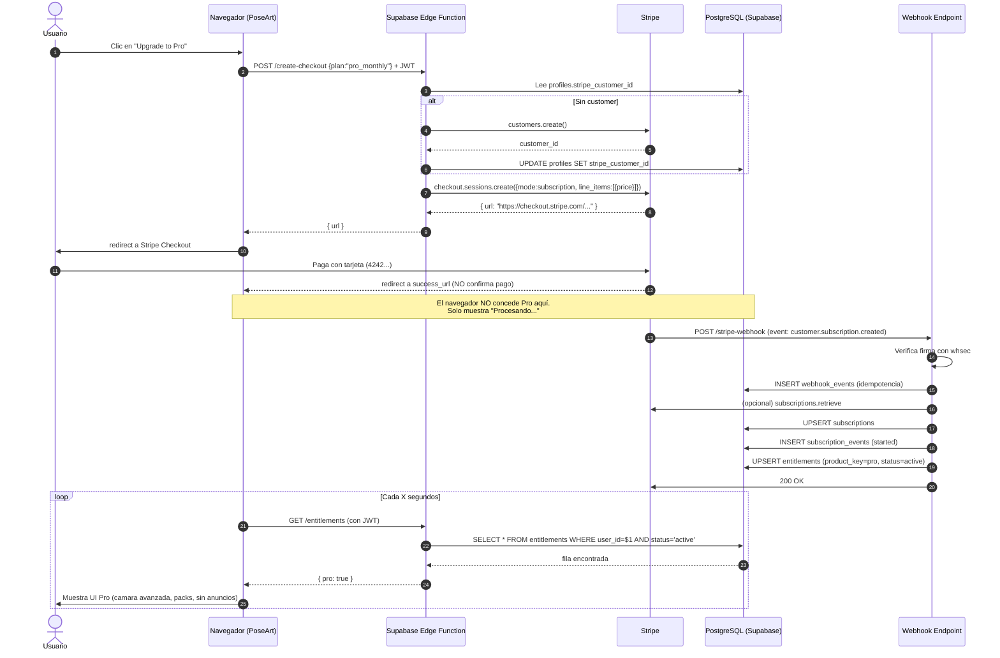

# 07 — Facturación y suscripciones (Stripe)

> **Propósito:** Convertir las compras simuladas (`setTimeout` en `js/app.js:2389`) y los flags `poseart_ownedPacks` manipulables en un sistema real de suscripciones Pro con Stripe, donde el servidor —no el navegador— decide quién tiene acceso.
>
> **Audiencia:** Desarrollador que ya completó `04-AUTH-AND-RLS.md` (auth Supabase + RLS funcionando) y `03-DATA-MODEL.md` (tablas creadas).
>
> **Tiempo estimado:** 3-4 horas.
>
> **Modo:** Stripe en **test mode** durante TODA la implementación. No se activa live mode hasta pasar `11-TESTING-AND-SECURITY-CHECKLIST.md`.

---

## 0. Reglas críticas (léeles antes de escribir una línea de código)

> ⚠️ **REGLA 1 — El entitlement es la única fuente de verdad.**
> El navegador nunca decide si un usuario es Pro. El navegador **pregunta** al servidor y el servidor responde. Si el navegador dice "Pro" y el servidor dice "no", gana el servidor.

> ⚠️ **REGLA 2 — NUNCA confíes en el retorno de la URL de éxito de Checkout.**
> Stripe Checkout redirige a `success_url` **incluso si el pago falló después de la redirección**, o si el usuario abandona el pago y vuelve manualmente. La única prueba de pago es el **webhook firmado por Stripe y verificado en el servidor**.

> ⚠️ **REGLA 3 — El precio viene del servidor, nunca del cliente.**
> La Edge Function lee `price_id` de una tabla o variable de entorno. El navegador envía **qué** quiere comprar (product_id), no **a qué precio**.

> ⚠️ **REGLA 4 — Idempotencia obligatoria.**
> Cada webhook se registra en `webhook_events` con `stripe_event_id` único. Antes de procesar, se comprueba si ya se procesó. Stripe **reenvía** eventos si no recibe `200 OK` en tiempo.

> ⚠️ **REGLA 5 — Modo test hasta el final.**
> Usa claves `sk_test_*` y `pk_test_*`. Tarjetas de prueba: `4242 4242 4242 4242` (éxito), `4000 0027 6000 3184` (requiere 3DS), `4000 0000 0000 9995` (fondos insuficientes). Lista completa: [Stripe test cards](https://docs.stripe.com/testing).

---

## 1. Conceptos clave

| Concepto | Qué es | Dónde vive |
|---|---|---|
| **Product (Stripe)** | Lo que vendes (ej. "PoseArt Pro"). | Stripe Dashboard |
| **Price (Stripe)** | Una variante de pago (Pro mensual USD 9.99/mes, Pro anual USD 99.99/año). | Stripe Dashboard |
| **Customer (Stripe)** | El usuario que paga. Se enlaza 1:1 con `auth.users.id` de Supabase vía `profiles.stripe_customer_id`. | Stripe + tabla `profiles` |
| **Subscription (Stripe)**| La suscripción activa del customer a un price recurrente. | Stripe + tabla `subscriptions` (réplica) |
| **Checkout Session** | Página hosted de Stripe donde el usuario mete tarjeta. | Se crea on-demand desde Edge Function |
| **Customer Portal** | Página hosted de Stripe donde el usuario gestiona su suscripción (cancelar, cambiar plan, ver facturas). | Se crea on-demand desde Edge Function |
| **Webhook** | POST HTTP que Stripe envía a tu Edge Function cuando pasa algo (pago, cancelación, fallo). | Edge Function `stripe-webhook` |
| **Entitlement** | Registro en tu base de datos que dice "este usuario tiene derecho a X". Es tu fuente de verdad. | Tabla `entitlements` |
| **Idempotency** | Procesar cada evento una sola vez, aunque llegue duplicado. | Tabla `webhook_events` |

### ¿Por qué necesitamos una tabla `subscriptions` local si Stripe ya tiene los datos?

Porque:
1. **Latencia:** Consultar la API de Stripe en cada carga de página es lento (~200-500 ms).
2. **Coste:** La API de Stripe tiene rate limits.
3. **Querying:** No puedes hacer `JOIN` contra la API de Stripe. Quieres listar "todos los usuarios Pro" en tu dashboard sin llamar a Stripe 1000 veces.
4. **Resiliencia:** Si Stripe tiene un incidente, tu app sigue funcionando con la última réplica conocida.

La tabla local es **réplica** de Stripe, no fuente de verdad. La fuente de verdad sigue siendo Stripe; tú la sincronizas vía webhooks y reconciliación periódica.

---

## 2. Productos y precios en Stripe (modo test)

### Objetivo
Crear tres productos en Stripe con sus precios, en modo test, para que las Edge Functions puedan referenciarlos por `price_id`.

### Por qué se necesita
Stripe requiere que existan productos y precios antes de crear Checkout Sessions. El `price_id` (`price_xxx`) es el identificador estable que pasas a la API.

### Prerrequisitos
- Cuenta en Stripe creada (puedes usarla en modo test sin verificar negocio).
- Estar en **test mode** (el toggle de arriba a la derecha del Dashboard dice "Test mode").

### Dónde ejecutar
Stripe Dashboard → https://dashboard.stripe.com/test/products → "Add product".

### Acción exacta

Crea **tres** productos (uno por plan). En el MVP no necesitas más.

| Producto | Nombre a mostrar | Tipo | Precio | Moneda | Intervalo |
|---|---|---|---|---|---|
| 1 | `PoseArt Free` | **No se crea en Stripe** (no requiere pago) | — | — | — |
| 2 | `PoseArt Pro (Monthly)` | Recurring | 9.99 | USD | mensual |
| 3 | `PoseArt Pro (Annual)` | Recurring | 99.99 | USD | anual |

> ℹ️ **Free no se crea en Stripe.** Free no es una suscripción: es la ausencia de entitlement Pro. El usuario Free es el que **no tiene** una fila activa en `entitlements` para `pro`.

> ⚠️ **Los precios exactos son una suposición.** Ajusta a tu estrategia comercial. Los valores 9.99 / 99.99 son ejemplos. **Sin verificar** con estudios de mercado; decide tú.

### Resultado esperado
Tres `price_id` en formato `price_xxx` (ej. `price_1Q8xYy2eZvKYlo2Cabc123`). Guárdalos.

### Cómo verificar
- En el Dashboard → Products: aparecen dos productos con sus precios.
- Con la CLI de Stripe:
  ```bash
  stripe products list --limit 10
  stripe prices list --limit 10
  ```
  Ambos comandos deben mostrar los productos y precios que creaste.

### Errores comunes
| Error | Causa | Solución |
|---|---|---|
| `InvalidRequestError: No such price` | Usaste un `price_id` de live mode en test o viceversa. | Verifica el toggle "Test mode" en el Dashboard. |
| Creaste precio en EUR en vez de USD | Moneda por defecto de tu cuenta. | Selecciona USD al crear el precio. |
| Olvidaste marcar "recurring" | Creaste precio "one_time". | Edita o recrea como recurring. |

### Cómo revertir
- Archiva el producto desde el Dashboard (botón "Archive"). **No lo borres** si ya tiene suscripciones asociadas (Stripe no permite borrar productos con suscripciones activas).
- Si no tiene suscripciones, puedes archivarlo y crear uno nuevo.

### Fuente oficial
- [Stripe: Create products and prices](https://docs.stripe.com/products-prices/how-products-and-prices-work)
- [Stripe CLI: products list](https://docs.stripe.com/cli/products/list)

---

## 3. Instalar la CLI de Stripe (para webhooks locales)

### Objetivo
Tener `stripe` CLI disponible para reenviar webhooks a tu entorno local durante el desarrollo.

### Por qué se necesita
En local, Stripe no puede llamar a `http://localhost:54321/functions/v1/stripe-webhook` (no es público). La CLI crea un túnel y reenvía eventos de test a tu Edge Function local.

### Prerrequisitos
- Stripe CLI: https://docs.stripe.com/stripe-cli
- Cuenta de Stripe (test mode).

### Dónde ejecutar
Terminal local.

### Acción exacta
```bash
# 1. Instalar (macOS con Homebrew):
brew install stripe/stripe-cli/stripe

# 2. Login (abre navegador, autoriza):
stripe login

# 3. Escuchar y reenviar a tu Edge Function local (Supabase CLI sirve en 54321):
stripe listen --forward-to http://localhost:54321/functions/v1/stripe-webhook
```

### Resultado esperado
La CLI imprime algo como:
```
> Ready! Your webhook signing secret is whsec_xxxxxxxxxxxxxxxxxxxxx (^C to quit)
```

Ese `whsec_xxx` es tu **webhook signing secret** para local. Guárdalo en `.env` local (NO en el repo).

### Cómo verificar
- En otra terminal, dispara un evento de prueba:
  ```bash
  stripe trigger checkout.session.completed
  ```
- La terminal donde escucha la CLI debe mostrar `2025-XX-XX HH:MM:SS  --> checkout.session.completed [evt_xxx]`.
- Tu Edge Function debe recibir la petición (mira sus logs).

### Errores comunes
| Error | Causa | Solución |
|---|---|---|
| `error: command not found: stripe` | No instalaste la CLI. | Sigue https://docs.stripe.com/stripe-cli |
| `connection refused` al reenviar | Tu Edge Function local no está corriendo. | Arranca `supabase functions serve` primero. |
| `invalid signature error` | El `whsec_` configurado no coincide con el del túnel actual. | Cada vez que reinicias `stripe listen`, el secret cambia. Actualiza tu `.env`. |

### Cómo revertir
- `Ctrl+C` en la terminal de `stripe listen` detiene el túnel. No hay cambios que revertir.

### Fuente oficial
- [Stripe CLI: Install](https://docs.stripe.com/stripe-cli)
- [Stripe CLI: Listen to webhooks locally](https://docs.stripe.com/webhooks#test-webhook)

---

## 4. Variables de entorno (secreto vs público)

### Objetivo
Declarar claramente qué claves viven en el servidor y cuáles en el navegador.

### Por qué se necesita
Poner `sk_test_*` en el navegador = pérdida de la cuenta. Poner `pk_test_*` solo en el servidor = no puedes usar Stripe.js.

### Prerrequisitos
- Haber leído `00-READ-ME-FIRST.md` (sección "Advertencias críticas").

### Dónde ejecutar
- **Servidor (Supabase Edge Functions):** `supabase/functions/.env` (local) y Dashboard → Edge Functions → Secrets (producción).
- **Cliente (HTML/JS):** Inyectado en tiempo de build o cargado desde un endpoint público `/config`.

### Tabla de claves

| Clave | Dónde vive | Quién la lee | Qué permite |
|---|---|---|---|
| `STRIPE_SECRET_KEY` (`sk_test_...`) | Solo servidor | Edge Functions | Crear Checkouts, recuperar subscriptions, etc. |
| `STRIPE_WEBHOOK_SECRET` (`whsec_...`) | Solo servidor | Edge Function `stripe-webhook` | Verificar firma de webhooks. |
| `STRIPE_PUBLISHABLE_KEY` (`pk_test_...`) | Cliente | `Stripe.js` en el navegador | Inicializar Stripe.js (no es secreto). |
| `STRIPE_PRICE_PRO_MONTHLY` (`price_...`) | Solo servidor | Edge Function `create-checkout` | Pasar el price_id correcto. |
| `STRIPE_PRICE_PRO_ANNUAL` (`price_...`) | Solo servidor | Edge Function `create-checkout` | Pasar el price_id correcto. |
| `SUPABASE_URL`, `SUPABASE_SERVICE_ROLE_KEY` | Solo servidor | Edge Functions | Escribir en la BD sin RLS (el webhook no tiene sesión de usuario). |
| `SUPABASE_URL`, `SUPABASE_ANON_KEY` | Cliente | `supabase-js` en el navegador | Llamar a Edge Functions y a la BD con RLS. |

### Acción exacta (local)
```bash
# supabase/functions/.env  (NUNCA en git)
STRIPE_SECRET_KEY=sk_test_xxxxxxxxxxxxx
STRIPE_WEBHOOK_SECRET=whsec_xxxxxxxxxxxxx
STRIPE_PRICE_PRO_MONTHLY=price_xxxxxxxxxxxxx
STRIPE_PRICE_PRO_ANNUAL=price_xxxxxxxxxxxxx
SUPABASE_URL=http://localhost:54321
SUPABASE_SERVICE_ROLE_KEY=eyJhbGciOi...(la de tu proyecto local)
```

```bash
# .gitignore — confirmar que incluye:
supabase/functions/.env
.env
.env.local
```

### Resultado esperado
`git status` no muestra `.env`. La Edge Function lee `Deno.env.get("STRIPE_SECRET_KEY")` correctamente.

### Cómo verificar
```bash
# Verificar que .env NO está en git:
git ls-files | grep -i env
# No debe mostrar .env

# Verificar que la Edge Function lee la variable:
supabase functions secret list
```

### Errores comunes
| Error | Causa | Solución |
|---|---|---|
| `ReferenceError: STRIPE_SECRET_KEY is not defined` | Usaste variable global en vez de `Deno.env.get()`. | Usa `Deno.env.get("STRIPE_SECRET_KEY")`. |
| `.env` commitado por accidente | Falta en `.gitignore`. | `git rm --cached supabase/functions/.env`, añade a `.gitignore`, **rota la clave en Stripe Dashboard** inmediatamente. |

### Cómo revertir
Si comprometes `sk_test_*`:
1. Stripe Dashboard → Developers → API keys → "Roll key".
2. Actualiza `.env` y los secrets de producción.
3. Audita webhooks recibidos durante el periodo de exposición.

### Fuente oficial
- [Stripe: API keys](https://docs.stripe.com/keys)
- [Supabase: Edge Function secrets](https://supabase.com/docs/guides/functions/secrets)

---

## 5. Tablas SQL necesarias

### Objetivo
Crear las tablas que guardan customers, subscriptions, entitlements, eventos de webhook y eventos de suscripción (para reconstruir el streak).

### Por qué se necesita
Sin estas tablas no tienes dónde persistir el estado reconciliado de Stripe.

### Prerrequisitos
- `03-DATA-MODEL.md` desplegado (esquema base, `profiles` existe).
- `04-AUTH-AND-RLS.md` (auth.users → trigger → profiles funciona).

### Dónde ejecutar
Supabase SQL Editor o `supabase migration up` desde local.

### Esquema (resumido — el SQL completo va en `03-DATA-MODEL.md`)

```sql
-- 1) Perfil: añadir stripe_customer_id
ALTER TABLE profiles
  ADD COLUMN IF NOT EXISTS stripe_customer_id TEXT UNIQUE;

-- 2) Subscriptions: réplica local de Stripe
CREATE TABLE IF NOT EXISTS subscriptions (
  id UUID PRIMARY KEY DEFAULT gen_random_uuid(),
  user_id UUID NOT NULL REFERENCES auth.users(id) ON DELETE CASCADE,
  stripe_subscription_id TEXT UNIQUE NOT NULL,
  stripe_customer_id TEXT NOT NULL,
  stripe_price_id TEXT NOT NULL,
  status TEXT NOT NULL,  -- active, past_due, canceled, incomplete, trialing
  current_period_start TIMESTAMPTZ NOT NULL,
  current_period_end TIMESTAMPTZ NOT NULL,
  cancel_at_period_end BOOLEAN NOT NULL DEFAULT false,
  trial_end TIMESTAMPTZ,
  created_at TIMESTAMPTZ NOT NULL DEFAULT now(),
  updated_at TIMESTAMPTZ NOT NULL DEFAULT now()
);
CREATE INDEX idx_subscriptions_user ON subscriptions(user_id);
CREATE INDEX idx_subscriptions_status ON subscriptions(status);

-- 3) Entitlements: la fuente de verdad para "quién tiene acceso a qué"
CREATE TABLE IF NOT EXISTS entitlements (
  id UUID PRIMARY KEY DEFAULT gen_random_uuid(),
  user_id UUID NOT NULL REFERENCES auth.users(id) ON DELETE CASCADE,
  product_key TEXT NOT NULL,           -- 'pro', 'pack:mp-boudoir-classic', etc.
  source TEXT NOT NULL,                 -- 'stripe_subscription', 'stripe_payment', 'manual'
  source_id TEXT,                       -- subscription_id, payment_id, etc.
  status TEXT NOT NULL,                 -- 'active', 'revoked', 'expired'
  granted_at TIMESTAMPTZ NOT NULL DEFAULT now(),
  revoked_at TIMESTAMPTZ,
  metadata JSONB,
  UNIQUE (user_id, product_key, source_id)
);
CREATE INDEX idx_entitlements_user_active ON entitlements(user_id) WHERE status = 'active';

-- 4) Webhook events: idempotencia
CREATE TABLE IF NOT EXISTS webhook_events (
  stripe_event_id TEXT PRIMARY KEY,
  event_type TEXT NOT NULL,
  received_at TIMESTAMPTZ NOT NULL DEFAULT now(),
  processed_at TIMESTAMPTZ,
  payload JSONB NOT NULL,
  error TEXT
);

-- 5) Subscription events: log para reconstruir streak
CREATE TABLE IF NOT EXISTS subscription_events (
  id BIGSERIAL PRIMARY KEY,
  user_id UUID NOT NULL REFERENCES auth.users(id) ON DELETE CASCADE,
  stripe_subscription_id TEXT NOT NULL,
  event_type TEXT NOT NULL,  -- 'started', 'renewed', 'canceled', 'past_due', 'reactivated'
  occurred_at TIMESTAMPTZ NOT NULL,
  metadata JSONB
);
CREATE INDEX idx_sub_events_user_time ON subscription_events(user_id, occurred_at);
```

### RLS mínima
```sql
ALTER TABLE subscriptions ENABLE ROW LEVEL SECURITY;
ALTER TABLE entitlements ENABLE ROW LEVEL SECURITY;
ALTER TABLE webhook_events ENABLE ROW LEVEL SECURITY;
ALTER TABLE subscription_events ENABLE ROW LEVEL SECURITY;

-- Usuario solo puede leer SUS suscripciones y SUS entitlements activos
CREATE POLICY "user reads own subscriptions"
  ON subscriptions FOR SELECT
  TO authenticated USING (user_id = auth.uid());

CREATE POLICY "user reads own entitlements"
  ON entitlements FOR SELECT
  TO authenticated USING (user_id = auth.uid());

-- webhook_events y subscription_events: SOLO service_role puede escribir.
-- El usuario no debe poder escribir eventos de pago.
-- No crear policy INSERT para authenticated.
```

### Resultado esperado
Las 5 tablas existen, RLS activo, y un usuario solo puede leer sus propias filas.

### Cómo verificar
```sql
-- En Supabase SQL Editor (como service_role):
SELECT tablename FROM pg_tables WHERE schemaname='public' AND tablename IN
  ('subscriptions','entitlements','webhook_events','subscription_events');
-- Debe devolver 4 filas.

-- Como usuario autenticado (anon o normal):
SELECT * FROM subscriptions;
-- Solo debe devolver las filas del usuario actual.
```

### Errores comunes
| Error | Causa | Solución |
|---|---|---|
| `permission denied for table webhook_events` | Creaste una policy INSERT para authenticated. | `DROP POLICY` y no la recrees. Solo service_role escribe ahí. |
| `duplicate key value violates unique constraint` en `stripe_customer_id` | Dos usuarios con el mismo customer. Bug: no creaste un customer nuevo por usuario. | Verifica la Edge Function `create-checkout` (sección 6). |

### Cómo revertir
```sql
-- Solo si algo salió muy mal y quieres empezar de cero:
DROP TABLE IF EXISTS subscription_events, webhook_events, entitlements, subscriptions;
ALTER TABLE profiles DROP COLUMN IF EXISTS stripe_customer_id;
```
> ⚠️ No ejecutes esto en producción con datos reales.

### Fuente oficial
- [Supabase: Row Level Security](https://supabase.com/docs/guides/database/postgres/row-level-security)
- [PostgreSQL: CREATE TABLE](https://www.postgresql.org/docs/current/sql-createtable.html)

---

## 6. Edge Function: `create-checkout`

### Objetivo
Crear una Checkout Session de Stripe del lado del servidor, con el `price_id` venido de variables de entorno (no del cliente).

### Por qué se necesita
- El cliente no debe conocer precios (Regla 3).
- El cliente no debe poder elegir su propio `customer_id` (impersonación).
- La `success_url` y `cancel_url` deben ser controladas por el servidor.

### Prerrequisitos
- Secciones 2, 4 y 5 completadas.
- Supabase CLI instalado y `supabase functions serve` funcionando.

### Dónde ejecutar
- Crear archivo en `supabase/functions/create-checkout/index.ts`.
- Desplegar con `supabase functions deploy create-checkout`.

### Acción exacta

```typescript
// supabase/functions/create-checkout/index.ts
import { createClient } from "https://esm.sh/@supabase/supabase-js@2";
import Stripe from "https://esm.sh/stripe@17?target=denonext";

const stripe = new Stripe(Deno.env.get("STRIPE_SECRET_KEY")!, {
  apiVersion: "2024-12-18.acacia",
});

const supabase = createClient(
  Deno.env.get("SUPABASE_URL")!,
  Deno.env.get("SUPABASE_SERVICE_ROLE_KEY")!,
);

const ALLOWED_PLANS = {
  pro_monthly: Deno.env.get("STRIPE_PRICE_PRO_MONTHLY")!,
  pro_annual:  Deno.env.get("STRIPE_PRICE_PRO_ANNUAL")!,
};

const APP_BASE_URL = Deno.env.get("APP_BASE_URL") ?? "http://localhost:8080";

Deno.serve(async (req: Request) => {
  if (req.method !== "POST") {
    return new Response("Method Not Allowed", { status: 405 });
  }

  // 1) Autorización: extraer el JWT del usuario
  const authHeader = req.headers.get("Authorization") ?? "";
  const token = authHeader.replace("Bearer ", "");
  if (!token) return new Response("Unauthorized", { status: 401 });

  const { data: { user }, error: authError } = await supabase.auth.getUser(token);
  if (authError || !user) return new Response("Unauthorized", { status: 401 });

  // 2) Leer plan del body (NO leer precio del body)
  const body = await req.json().catch(() => ({}));
  const plan = body?.plan;
  const priceId = ALLOWED_PLANS[plan];
  if (!priceId) return new Response("Invalid plan", { status: 400 });

  // 3) Obtener o crear customer en Stripe
  const { data: profile } = await supabase
    .from("profiles")
    .select("stripe_customer_id, email")
    .eq("id", user.id)
    .single();

  let customerId = profile?.stripe_customer_id;
  if (!customerId) {
    const customer = await stripe.customers.create({
      email: user.email ?? undefined,
      metadata: { supabase_user_id: user.id },
    });
    customerId = customer.id;
    await supabase
      .from("profiles")
      .update({ stripe_customer_id: customerId })
      .eq("id", user.id);
  }

  // 4) Crear Checkout Session (modo: subscription)
  const session = await stripe.checkout.sessions.create({
    mode: "subscription",
    customer: customerId,
    line_items: [{ price: priceId, quantity: 1 }],
    success_url: `${APP_BASE_URL}/?checkout=success&session_id={CHECKOUT_SESSION_ID}`,
    cancel_url:  `${APP_BASE_URL}/?checkout=cancel`,
    client_reference_id: user.id,   // útil en el webhook
    metadata: { supabase_user_id: user.id, plan },
  });

  // 5) Devolver SOLO la URL al cliente. El cliente NO recibe el price_id.
  return new Response(
    JSON.stringify({ url: session.url }),
    { headers: { "Content-Type": "application/json" } },
  );
});
```

### Resultado esperado
POST a `/functions/v1/create-checkout` con `{ "plan": "pro_monthly" }` y un Bearer JWT válido devuelve `{ "url": "https://checkout.stripe.com/c/pay/cs_test_..." }`.

### Cómo verificar
```bash
# 1) Inicia el servidor local de funciones:
supabase functions serve

# 2) En otra terminal, con un JWT real (lo obtienes haciendo login en Supabase Auth):
curl -X POST http://localhost:54321/functions/v1/create-checkout \
  -H "Authorization: Bearer $YOUR_JWT" \
  -H "Content-Type: application/json" \
  -d '{"plan":"pro_monthly"}'

# Respuesta esperada:
# {"url":"https://checkout.stripe.com/c/pay/cs_test_xxx..."}
```
Abre la URL en el navegador, paga con `4242 4242 4242 4242`, fecha futura cualquiera, CVC cualquiera.

### Errores comunes
| Error | Causa | Solución |
|---|---|---|
| `Invalid plan` | El cliente envió `plan: "pro"` en vez de `pro_monthly` o `pro_annual`. | Documenta los valores exactos. |
| `No such customer` | `stripe_customer_id` apunta a un customer borrado. | Si falla, recrear customer. Añadir try/catch que limpie el campo y reintente. |
| `401 Unauthorized` | El JWT expiró o no se envió. | Cliente refresca el token antes de llamar. |
| `CORS error` desde el navegador | Falta configurar CORS en la Edge Function. | Añade headers `Access-Control-Allow-Origin`. Ver `04-AUTH-AND-RLS.md`. |

### Cómo revertir
- Si una sesión quedó abierta sin pagar, expira sola a las 24h (Stripe Checkout Session default).
- Archiva o cancela desde el Dashboard → Sessions.
- Si creaste customers de prueba por error, puedes eliminarlos con `stripe customers delete cus_xxx` (solo en test mode).

### Fuente oficial
- [Stripe: Create Checkout Session](https://docs.stripe.com/api/checkout/sessions/create)
- [Stripe: Checkout subscription mode](https://docs.stripe.com/payments/checkout/subscription-pricing)
- [Supabase: Edge Functions](https://supabase.com/docs/guides/functions)

---

## 7. Edge Function: `stripe-webhook` (firmas + idempotencia)

### Objetivo
Recibir webhooks de Stripe, verificar firma, procesar eventos de forma idempotente, y crear/actualizar entitlements.

### Por qué se necesita
- Es la **única** prueba de pago (Regla 2).
- Stripe reenvía eventos; sin idempotencia, el mismo pago puede activar Pro dos veces.
- Sin verificar firma, cualquiera puede hacer POST a tu endpoint y regalarse Pro.

### Prerrequisitos
- Sección 5 (tablas) y 6 (create-checkout) listas.
- `STRIPE_WEBHOOK_SECRET` configurado (de `stripe listen` en local o del Dashboard en prod).

### Dónde ejecutar
- Archivo: `supabase/functions/stripe-webhook/index.ts`.
- Configurar endpoint en Stripe Dashboard (producción): Developers → Webhooks → Add endpoint → URL `https://<tu-proyecto>.supabase.co/functions/v1/stripe-webhook` → events a escuchar.

### Eventos a escuchar (mínimo)

| Evento | Qué haces |
|---|---|
| `checkout.session.completed` | Marca orden como pagada, crea entitlement si es suscripción. |
| `customer.subscription.created` | Inserta fila en `subscriptions` y `subscription_events` (started). |
| `customer.subscription.updated` | Actualiza `subscriptions` (cambio de plan, trial→active, cancel_at_period_end). |
| `customer.subscription.deleted` | Marca subscription `canceled`, revoca entitlement (al final del periodo). |
| `invoice.payment_succeeded` | Renovación exitosa → `subscription_events` (renewed). |
| `invoice.payment_failed` | Marca subscription `past_due` → `subscription_events` (past_due). |
| `charge.refunded` | Si es reembolso total, revoca entitlement. |

### Acción exacta

```typescript
// supabase/functions/stripe-webhook/index.ts
import { createClient } from "https://esm.sh/@supabase/supabase-js@2";
import Stripe from "https://esm.sh/stripe@17?target=denonext";

const stripe = new Stripe(Deno.env.get("STRIPE_SECRET_KEY")!, {
  apiVersion: "2024-12-18.acacia",
});

const supabase = createClient(
  Deno.env.get("SUPABASE_URL")!,
  Deno.env.get("SUPABASE_SERVICE_ROLE_KEY")!,
);

const WEBHOOK_SECRET = Deno.env.get("STRIPE_WEBHOOK_SECRET")!;

Deno.serve(async (req: Request) => {
  const signature = req.headers.get("stripe-signature");
  if (!signature) return new Response("Missing signature", { status: 400 });

  const rawBody = await req.text();

  // 1) Verificar firma — NUNCA procesar sin esto
  let event: Stripe.Event;
  try {
    event = await stripe.webhooks.constructEventAsync(
      rawBody,
      signature,
      WEBHOOK_SECRET,
    );
  } catch (err) {
    console.error("Webhook signature verification failed:", err);
    return new Response(`Invalid signature: ${err.message}`, { status: 400 });
  }

  // 2) Idempotencia — insertar primero, si falla por conflicto, ya estaba procesado
  const { error: insertError } = await supabase
    .from("webhook_events")
    .insert({
      stripe_event_id: event.id,
      event_type: event.type,
      payload: event,
    });

  if (insertError) {
    // Si ya existe (PK = stripe_event_id), es duplicado: respondemos 200 y no procesamos
    if (insertError.code === "23505") {
      console.log(`Duplicate event ${event.id}, skipping`);
      return new Response("OK (duplicate)", { status: 200 });
    }
    console.error("Failed to insert webhook event:", insertError);
    return new Response("Internal error", { status: 500 });
  }

  // 3) Procesar evento
  try {
    await processEvent(event);
    await supabase
      .from("webhook_events")
      .update({ processed_at: new Date().toISOString() })
      .eq("stripe_event_id", event.id);
    return new Response("OK", { status: 200 });
  } catch (err) {
    await supabase
      .from("webhook_events")
      .update({ error: String(err) })
      .eq("stripe_event_id", event.id);
    console.error("Processing failed:", err);
    // 500 → Stripe reintenta
    return new Response("Processing error", { status: 500 });
  }
});

async function processEvent(event: Stripe.Event) {
  switch (event.type) {
    case "checkout.session.completed": {
      const session = event.data.object as Stripe.Checkout.Session;
      // Solo creamos el entitlement cuando el webhook de subscription confirme.
      // Aquí solo marcamos la sesión como completada (opcional, para trazabilidad).
      break;
    }
    case "customer.subscription.created": {
      const sub = event.data.object as Stripe.Subscription;
      await upsertSubscription(sub);
      await logSubEvent(sub, "started");
      await grantEntitlement(sub, "pro");
      break;
    }
    case "customer.subscription.updated": {
      const sub = event.data.object as Stripe.Subscription;
      await upsertSubscription(sub);
      await logSubEvent(sub, "updated");
      if (sub.status === "active" || sub.status === "trialing") {
        await grantEntitlement(sub, "pro");
      }
      break;
    }
    case "customer.subscription.deleted": {
      const sub = event.data.object as Stripe.Subscription;
      await upsertSubscription(sub);
      await logSubEvent(sub, "canceled");
      await revokeEntitlement(sub);
      break;
    }
    case "invoice.payment_succeeded": {
      const inv = event.data.object as Stripe.Invoice;
      const sub = await stripe.subscriptions.retrieve(inv.subscription as string);
      await logSubEvent(sub, "renewed");
      break;
    }
    case "invoice.payment_failed": {
      const inv = event.data.object as Stripe.Invoice;
      const sub = await stripe.subscriptions.retrieve(inv.subscription as string);
      await logSubEvent(sub, "past_due");
      break;
    }
    case "charge.refunded": {
      const charge = event.data.object as Stripe.Charge;
      // Si reembolso total, revocar entitlements asociados a esa charge
      if (charge.refunded && charge.amount_refunded === charge.amount) {
        await revokeEntitlementsByCharge(charge.id);
      }
      break;
    }
    default:
      console.log(`Unhandled event type: ${event.type}`);
  }
}

async function upsertSubscription(sub: Stripe.Subscription) {
  const userId = sub.metadata?.supabase_user_id
    ?? (await getUserIdFromCustomer(sub.customer as string));

  await supabase.from("subscriptions").upsert({
    stripe_subscription_id: sub.id,
    user_id: userId,
    stripe_customer_id: sub.customer as string,
    stripe_price_id: sub.items.data[0]?.price.id,
    status: sub.status,
    current_period_start: new Date(sub.current_period_start * 1000).toISOString(),
    current_period_end:   new Date(sub.current_period_end * 1000).toISOString(),
    cancel_at_period_end: sub.cancel_at_period_end,
    trial_end: sub.trial_end ? new Date(sub.trial_end * 1000).toISOString() : null,
    updated_at: new Date().toISOString(),
  }, { onConflict: "stripe_subscription_id" });
}

async function grantEntitlement(sub: Stripe.Subscription, productKey: string) {
  const userId = sub.metadata?.supabase_user_id
    ?? (await getUserIdFromCustomer(sub.customer as string));

  // Solo si está en estado "activo" para el usuario
  if (!["active", "trialing"].includes(sub.status)) return;

  await supabase.from("entitlements").upsert({
    user_id: userId,
    product_key: productKey,
    source: "stripe_subscription",
    source_id: sub.id,
    status: "active",
    granted_at: new Date().toISOString(),
    revoked_at: null,
  }, { onConflict: "user_id,product_key,source_id" });
}

async function revokeEntitlement(sub: Stripe.Subscription) {
  await supabase
    .from("entitlements")
    .update({ status: "revoked", revoked_at: new Date().toISOString() })
    .eq("source_id", sub.id)
    .eq("source", "stripe_subscription");
}

async function logSubEvent(sub: Stripe.Subscription, eventType: string) {
  const userId = sub.metadata?.supabase_user_id
    ?? (await getUserIdFromCustomer(sub.customer as string));
  await supabase.from("subscription_events").insert({
    user_id: userId,
    stripe_subscription_id: sub.id,
    event_type: eventType,
    occurred_at: new Date().toISOString(),
    metadata: { status: sub.status },
  });
}

async function getUserIdFromCustomer(customerId: string): Promise<string> {
  const { data, error } = await supabase
    .from("profiles")
    .select("id")
    .eq("stripe_customer_id", customerId)
    .single();
  if (error || !data) throw new Error(`No user for customer ${customerId}`);
  return data.id;
}

async function revokeEntitlementsByCharge(chargeId: string) {
  // En MVP: si tienes marketplace (ver 08), busca entitlements por source_id = chargeId
  // Para suscripciones Pro normalmente no aplica (no se reembolsan parciales)
}
```

### Resultado esperado
- Stripe envía webhook → tu función verifica firma → inserta en `webhook_events` → procesa → marca `processed_at`.
- Si Stripe reenvía el mismo evento → 200 OK sin reprocesar.
- Si la firma es inválida → 400 y no se inserta nada.

### Cómo verificar
```bash
# En local con stripe listen corriendo:
stripe trigger checkout.session.completed
# → Tu función recibe el evento
# → webhook_events tiene una fila con processed_at != NULL

# Verificar en BD:
SELECT stripe_event_id, event_type, processed_at, error
FROM webhook_events ORDER BY received_at DESC LIMIT 5;
```

### Errores comunes
| Error | Causa | Solución |
|---|---|---|
| `signature verification failed` | `STRIPE_WEBHOOK_SECRET` incorrecto (cambió al reiniciar `stripe listen`). | Copia el secret actual de la salida de `stripe listen`. |
| Evento se procesa dos veces | No implementaste idempotencia o el INSERT falló silenciosamente. | Verifica que la PK de `webhook_events` sea `stripe_event_id`. |
| `500` y Stripe reintenta indefinidamente | Bug en tu código. Cada reintento vuelve a fallar. | Mira `webhook_events.error`. Corrige el bug. Responde 200 manualmente si el evento es irrecuperable. |
| Eventos no llegan en prod | URL del endpoint mal configurada o no verificada en Stripe. | Dashboard → Webhooks → tu endpoint → "Send test webhook". |

### Cómo revertir
- Si procesaste eventos mal, puedes borrar filas de `entitlements`, `subscriptions`, `webhook_events` y `subscription_events` para esos `user_id`. **Antes** de borrar, archiva los webhooks correspondientes en Stripe Dashboard para que no se reenvíen.
- Si quieres parar el webhook en prod: Dashboard → Webhooks → Disable.

### Fuente oficial
- [Stripe: Webhook signatures](https://docs.stripe.com/webhooks/signatures)
- [Stripe: Webhook handling best practices](https://docs.stripe.com/webhooks/best-practices)
- [Stripe: Subscription statuses](https://docs.stripe.com/billing/subscriptions/overview#subscription-statuses)
- [Supabase: Edge Functions](https://supabase.com/docs/guides/functions)

---

## 8. Edge Function: `create-portal-session` (Customer Portal)

### Objetivo
Permitir al usuario gestionar su suscripción (cambiar plan, cancelar, ver facturas, actualizar tarjeta) sin tocar la BD directamente.

### Por qué se necesita
- Cumple requisitos legales de gestión de suscripción.
- Reduce carga de soporte.
- Stripe maneja la validación; tú solo rediriges.

### Prerrequisitos
- Customer Portal configurado en Stripe Dashboard → Settings → Billing → Customer Portal.
- El usuario tiene ya un `stripe_customer_id` (tras su primer checkout).

### Dónde ejecutar
- Archivo: `supabase/functions/create-portal-session/index.ts`.

### Acción exacta

```typescript
// supabase/functions/create-portal-session/index.ts
import { createClient } from "https://esm.sh/@supabase/supabase-js@2";
import Stripe from "https://esm.sh/stripe@17?target=denonext";

const stripe = new Stripe(Deno.env.get("STRIPE_SECRET_KEY")!, {
  apiVersion: "2024-12-18.acacia",
});
const supabase = createClient(
  Deno.env.get("SUPABASE_URL")!,
  Deno.env.get("SUPABASE_SERVICE_ROLE_KEY")!,
);
const APP_BASE_URL = Deno.env.get("APP_BASE_URL") ?? "http://localhost:8080";

Deno.serve(async (req: Request) => {
  if (req.method !== "POST") return new Response("Method Not Allowed", { status: 405 });

  const token = (req.headers.get("Authorization") ?? "").replace("Bearer ", "");
  if (!token) return new Response("Unauthorized", { status: 401 });
  const { data: { user }, error } = await supabase.auth.getUser(token);
  if (error || !user) return new Response("Unauthorized", { status: 401 });

  const { data: profile } = await supabase
    .from("profiles")
    .select("stripe_customer_id")
    .eq("id", user.id)
    .single();

  if (!profile?.stripe_customer_id) {
    return new Response("No customer found", { status: 404 });
  }

  const session = await stripe.billingPortal.sessions.create({
    customer: profile.stripe_customer_id,
    return_url: `${APP_BASE_URL}/?portal=return`,
  });

  return new Response(
    JSON.stringify({ url: session.url }),
    { headers: { "Content-Type": "application/json" } },
  );
});
```

### Resultado esperado
POST `/functions/v1/create-portal-session` devuelve `{ "url": "https://billing.stripe.com/p/session/..." }`. El usuario es redirigido al Portal, gestiona su suscripción, y vuelve a tu app.

### Cómo verificar
- Llama a la función con un JWT de un usuario que ya tenga `stripe_customer_id`.
- Abre la URL. Deberías poder: cambiar plan, cancelar, ver facturas, actualizar método de pago.

### Errores comunes
| Error | Causa | Solución |
|---|---|---|
| `No customer found` | El usuario nunca compró. | En la UI, solo muestra el botón "Manage subscription" si tiene entitlement Pro activo. |
| `Invalid customer` | `stripe_customer_id` borrado en Stripe. | Recrea el customer en `create-checkout` si falta. |

### Cómo revertir
La sesión del portal expira sola (~5 min). No hay cambios que revertir.

### Fuente oficial
- [Stripe: Customer Portal](https://docs.stripe.com/customer-management/portal)
- [Stripe: Create portal session](https://docs.stripe.com/api/customer_portal/sessions)

---

## 9. Estados de suscripción (cómo reaccionan)

### Objetivo
Documentar cada estado de Stripe y qué hace tu código en cada uno.

### Por qué se necesita
Un `status` mal interpretado puede dar Pro a alguien que no pagó o quitárselo a alguien que sí.

### Tabla de estados

| Status (Stripe) | Significado | ¿Usuario es Pro? | Acción en tu código |
|---|---|---|---|
| `incomplete` | Pago inicial pendiente (3DS, etc.) | **No** | Esperar. No crear entitlement. |
| `incomplete_expired` | `incomplete` tras 23h sin completar. | **No** | Limpiar registro local. |
| `trialing` | En periodo de prueba. | **Sí** (con fecha fin = `trial_end`) | Crear entitlement activo. Marcar fecha de fin del trial. |
| `active` | Suscripción vigente, pago al día. | **Sí** | Crear entitlement activo. |
| `past_due` | Renovación falló pero Stripe reintenta (grace period). | **Sí** durante el grace (configurable). Default: **Sí**. | NO revocar inmediatamente. Notificar al usuario. Marcar `subscription_events` past_due. |
| `canceled` | Cancelada (por usuario o por Stripe tras fallos). | **No** desde el momento de cancelación | Revocar entitlement. |
| `unpaid` | Tras varios reintentos fallidos y sin `subscription_settings.default_behavior = cancel`. | **No** | Revocar entitlement. |

> ℹ️ **`cancel_at_period_end = true`** NO es un estado. Es un flag. La suscripción sigue `active` hasta `current_period_end`, cuando pasa a `canceled`. El usuario sigue teniendo Pro durante el periodo que ya pagó. **No revoques antes.**

### Resultado esperado
Tu función `processEvent` (sección 7) maneja cada estado según esta tabla.

### Cómo verificar
Crea suscripciones de prueba con cada escenario:
```bash
# Trial que termina en 1 minuto:
stripe trigger customer.subscription.updated  # y edita el payload

# Tarjeta con fondos insuficientes para forzar past_due:
stripe trigger invoice.payment_failed
```
Comprueba en `entitlements` y `subscription_events` que el estado refleja la acción correcta.

### Errores comunes
| Error | Causa | Solución |
|---|---|---|
| Usuario se queja: "Pagué pero no soy Pro" | Creaste entitlement en `success_url` en vez de en webhook. | Quita cualquier lógica de Pro de la página de éxito. El webhook es la única fuente. |
| Usuario cancela y pierde Pro inmediatamente | Confundiste `cancel_at_period_end` con cancelación. | Lee `current_period_end`. Mantén entitlement hasta esa fecha. |

### Cómo revertir
Si revocaste Pro por error a un usuario activo:
```sql
-- Añadir manualmente el entitlement si tienes prueba de pago
INSERT INTO entitlements (user_id, product_key, source, source_id, status, granted_at)
VALUES ('<user-uuid>', 'pro', 'manual', 'manual-recovery-<fecha>', 'active', now());
```
> Documenta el motivo en `metadata`.

### Fuente oficial
- [Stripe: Subscription statuses](https://docs.stripe.com/billing/subscriptions/overview#subscription-statuses)
- [Stripe: Manage past-due subscriptions](https://docs.stripe.com/billing/subscriptions/past-due)

---

## 10. Streak (racha de días suscrito) — reconstruible

### Objetivo
Calcular `current_subscription_started_at`, `lifetime_subscribed_days` y `current_subscription_streak_days` a partir de `subscription_events`, sin guardarlos como estado.

### Por qué se necesita
- Guardar días como estado te obliga a mantener un cron job que los incremente cada día (frágil).
- Si guardas el estado y se corrompe, no hay forma de reconstruirlo.
- Si guardas los **eventos**, el estado se calcula con una query SQL pura, determinista y auditable.

### Definiciones

| Métrica | Definición |
|---|---|
| `current_subscription_started_at` | Fecha del evento `started` o `reactivated` más reciente que precede a un estado activo actual. Si la suscripción está cancelada, es `NULL`. |
| `current_subscription_streak_days` | `now() - current_subscription_started_at`, en días enteros. Si la suscripción está cancelada, es `0`. |
| `lifetime_subscribed_days` | Suma de todos los periodos activos: para cada par (started/reactivated → canceled), `canceled - started`. Si está activo ahora, añade `now() - last_started`. |

### Query SQL (vista materializada o función)

```sql
-- Vista: estado actual del usuario
CREATE OR REPLACE VIEW v_subscription_state AS
WITH latest AS (
  SELECT DISTINCT ON (user_id)
    user_id,
    event_type,
    occurred_at
  FROM subscription_events
  ORDER BY user_id, occurred_at DESC
)
SELECT
  l.user_id,
  CASE WHEN l.event_type IN ('started','renewed','reactivated','updated')
       THEN l.occurred_at END AS current_subscription_started_at,
  CASE WHEN l.event_type IN ('started','renewed','reactivated','updated')
       THEN EXTRACT(EPOCH FROM (now() - l.occurred_at))::bigint / 86400
       ELSE 0 END AS current_subscription_streak_days
FROM latest l;

-- lifetime_subscribed_days: requiere una función que sume intervalos
CREATE OR REPLACE FUNCTION f_lifetime_subscribed_days(p_user_id UUID)
RETURNS INT LANGUAGE sql STABLE AS $$
  WITH intervals AS (
    SELECT
      occurred_at AS start_at,
      LEAD(occurred_at) OVER (PARTITION BY user_id ORDER BY occurred_at) AS next_at,
      LEAD(event_type) OVER (PARTITION BY user_id ORDER BY occurred_at) AS next_type,
      event_type
    FROM subscription_events
    WHERE user_id = p_user_id
  ),
  periods AS (
    -- Un periodo activo va desde started/reactivated hasta canceled
    SELECT start_at, COALESCE(
      CASE WHEN next_type = 'canceled' THEN next_at END,
      now()
    ) AS end_at
    FROM intervals
    WHERE event_type IN ('started', 'reactivated')
  )
  SELECT COALESCE(SUM(EXTRACT(EPOCH FROM (end_at - start_at))::bigint / 86400), 0)::INT
  FROM periods;
$$;
```

> ⚠️ **Sin verificar en producción.** Esta query es una propuesta de implementación. Pruébala con datos sintéticos antes de confiar en ella para mostrar al usuario. Considera casos: eventos duplicados (por webhook reintentado), eventos desordenados, usuarios con múltiples suscripciones históricas.

### Resultado esperado
- Usuario activo hace 30 días → `current_subscription_streak_days = 30`.
- Usuario que se dio de baja tras 60 días y reactivó hace 10 → `current_subscription_streak_days = 10`, `lifetime_subscribed_days = 70`.

### Cómo verificar
```sql
SELECT * FROM v_subscription_state WHERE user_id = '<uuid>';
SELECT f_lifetime_subscribed_days('<uuid>');
```

### Errores comunes
| Error | Causa | Solución |
|---|---|---|
| Streak negativo | Reloj del servidor desincronizado. | Usa `now()` del servidor (Supabase), no del cliente. |
| Días cuentan doble | Webhook duplicado insertó dos `started`. | Idempotencia en `webhook_events` debe prevenirlo. Verifica. |

### Cómo revertir
- Borrar `subscription_events` de un usuario → la query devuelve 0. Solo hazlo si la tabla está corrupta y puedes recargarla desde Stripe (`stripe events list --type customer.subscription.*`).

### Fuente oficial
- [PostgreSQL: Window functions](https://www.postgresql.org/docs/current/tutorial-window.html) (LEAD/OVER)
- [PostgreSQL: CREATE FUNCTION](https://www.postgresql.org/docs/current/sql-createfunction.html)

---

## 11. Trials, grace periods, cancelaciones, fallos, reactivaciones, reembolsos

### Objetivo
Documentar el comportamiento esperado en cada caso del ciclo de vida de la suscripción.

### Por qué se necesita
Cada caso tiene una semántica distinta. Implementarlos mal = usuarios pagando sin acceso, o usuarios con acceso sin pagar.

### Caso por caso

#### Trials (periodo de prueba)
- **Cómo se activa:** Se configura en el `price` de Stripe (ej. "7 days free trial") o al crear la Checkout Session con `subscription_data: { trial_period_days: 7 }`.
- **Estado durante el trial:** `trialing`.
- **Entitlement:** **Sí, activo.** El usuario es Pro durante el trial.
- **Cuando termina:** Stripe crea un `invoice.payment_succeeded` si cobró bien → `active`. Si no → `past_due` o `canceled`.
- **Acción en tu código:** No revocar durante `trialing`.

#### Grace periods (periodo de gracia tras fallo)
- **Qué es:** Stripe reintenta el cobro varias veces (configurable: 1, 3, 5 días entre reintentos) antes de cancelar.
- **Estado durante el grace:** `past_due`.
- **Entitlement:** Por defecto, **sigue activo** durante el grace. Tú decides si revocar antes (más estricto).
- **Acción recomendada:** No revocar. Mostrar banner en la UI: "Tu pago falló, actualiza tu método de pago."
- **Cuando termina:** Si todos los reintentos fallan → `canceled` o `unpaid`.

#### Cancel at period end ("Cancelar al final del periodo")
- **Qué pasa:** Usuario cancela en el Customer Portal. `cancel_at_period_end = true`.
- **Estado:** Sigue `active` hasta `current_period_end`.
- **Entitlement:** **Sigue activo.** El usuario ya pagó ese periodo.
- **Cuando termina:** Stripe emite `customer.subscription.deleted` → tú revocas.

#### Cancel immediately ("Cancelar ahora mismo")
- **Qué pasa:** Si lo permites en el Portal, Stripe cancela al instante y emite `customer.subscription.deleted`.
- **Entitlement:** Revocado en el webhook.
- **Prorrata:** Stripe reembolsa o no según configuración (`proration_behavior`).

#### Failed payments (cobros fallidos)
- Stripe emite `invoice.payment_failed` → tú guardas `subscription_events` (past_due).
- Si tienes `subscriptions_settings.failure_behavior = cancel` (Stripe Dashboard), pasa a `canceled` tras los reintentos.
- Si es `leave_as_unpaid`, pasa a `unpaid`.

#### Reactivaciones
- Usuario canceló con `cancel_at_period_end=true` (aún no termina el periodo) → va al Portal y "reactiva".
- Stripe emite `customer.subscription.updated` con `cancel_at_period_end=false`.
- **Acción:** Vuelve a poner entitlement activo (ya lo estaba, pero verifica).
- Usuario cancelado hace meses (suscripción `canceled`): inicia un **nuevo checkout**. Stripe crea una `subscription` nueva. Trátalo como `started`.

#### Refunds (reembolsos)
- **Solo desde el Dashboard de Stripe** (o API admin). El usuario no puede pedirse un reembolso a sí mismo.
- Stripe emite `charge.refunded`.
- Si reembolso total → revocas el entitlement asociado (en `08-MARKETPLACE-AND-PURCHASES.md` es más relevante; en suscripciones Pro normalmente solo reembolsas facturas puntuales).
- Si reembolso parcial → normalmente no revocas (sigue siendo Pro).

### Fuente oficial
- [Stripe: Trials](https://docs.stripe.com/billing/subscriptions/trials)
- [Stripe: Cancel subscriptions](https://docs.stripe.com/billing/subscriptions/cancel)
- [Stripe: Past-due subscriptions](https://docs.stripe.com/billing/subscriptions/past-due)
- [Stripe: Refunds](https://docs.stripe.com/payments/refunds)

---

## 12. Reconciliación entre Stripe y base de datos

### Objetivo
Detectar y corregir desincronizaciones entre Stripe y tu base de datos (webhooks perdidos, fallos de red, etc.).

### Por qué se necesita
Los webhooks pueden fallar (tu servidor caído, errores 500). Sin reconciliación, un usuario puede haber pagado y no tener entitlement.

### Cómo

#### Job programado (cron)
- **Frecuencia:** Diaria (ej. 02:00 UTC) + tras cada deploy.
- **Qué hace:** Para cada `subscription` en BD con `status != canceled`, llama a `stripe.subscriptions.retrieve()`, compara campos, y actualiza si difieren.
- **También:** Lista las subscriptions en Stripe (`stripe.subscriptions.list`) que no existen en tu BD (huérfanas) y decide qué hacer (importarlas o archivarlas).

#### Script de ejemplo (esqueleto)
```typescript
// supabase/functions/reconcile-subscriptions/index.ts (esqueleto)
import Stripe from "https://esm.sh/stripe@17?target=denonext";
const stripe = new Stripe(Deno.env.get("STRIPE_SECRET_KEY")!, { apiVersion: "2024-12-18.acacia" });
// ... supabase client ...

async function reconcile() {
  const { data: localSubs } = await supabase
    .from("subscriptions")
    .select("*")
    .neq("status", "canceled");

  for (const local of localSubs ?? []) {
    try {
      const remote = await stripe.subscriptions.retrieve(local.stripe_subscription_id);
      if (remote.status !== local.status
          || remote.current_period_end !== local.current_period_end.getTime()/1000) {
        // Reaplica la misma lógica que el webhook
        await upsertSubscription(remote);
        if (["active","trialing"].includes(remote.status)) {
          await grantEntitlement(remote, "pro");
        } else if (remote.status === "canceled") {
          await revokeEntitlement(remote);
        }
        console.log(`Reconciled ${local.stripe_subscription_id}`);
      }
    } catch (err) {
      console.error(`Failed for ${local.stripe_subscription_id}:`, err);
    }
  }
}
```

#### Trigger manual
Un admin con rol `service_role` puede ejecutarlo desde el Dashboard de Supabase → Functions → Invoke.

### Resultado esperado
Tras ejecutar, las tablas `subscriptions` y `entitlements` coinciden con la realidad de Stripe.

### Cómo verificar
- Cuenta de subscriptions activas en BD == cuenta en Stripe Dashboard.
- Cuenta de entitlements Pro activos == cuenta de subscriptions activas (en MVP, 1:1).

### Errores comunes
| Error | Causa | Solución |
|---|---|---|
| Rate limit de Stripe | Hiciste 1000 requests por minuto. | Pagina con `for await ... of stripe.subscriptions.list()`. Límite: ~100 req/s en test, 1000/s en live (sin verificar). |
| Webhook huérfano (evento viejo nunca procesado) | `webhook_events` con `processed_at = NULL`. | En la reconciliación, también lista `webhook_events` sin procesar y reintenta. |

### Cómo revertir
Si la reconciliación cambia datos que no debía: restaura desde el backup diario (ver `12-OPERATIONS-PRIVACY-AND-BACKUPS.md`).

### Fuente oficial
- [Stripe: List subscriptions](https://docs.stripe.com/api/subscriptions/list)
- [Supabase: Scheduled Functions (cron)](https://supabase.com/docs/guides/functions/schedule-functions)

---

## 13. Diagrama de secuencia — "Upgrade to Pro"



> ℹ️ **Detalle clave del diagrama:** entre el paso 9 (redirect a `success_url`) y el paso 13 (webhook confirmado), puede haber segundos o minutos. En ese intervalo, el navegador **no** debe mostrar "Pro". Debe mostrar "Estamos confirmando tu pago..." y reintentar `/entitlements` cada 3-5 segundos hasta 1 minuto. Si pasado 1 minuto no hay confirmación, ofrecer "Contacta soporte".

---

## 14. Cliente: cómo decide la UI si mostrar Pro

### Objetivo
Implementar en el navegador un patrón donde la UI **pregunta** al servidor, no decide.

### Por qué se necesita
Es la implementación práctica de la REGLA 1.

### Acción exacta (resumen — el detalle va en `10-LOCALSTORAGE-MIGRATION.md`)

```javascript
// js/billing.js (esqueleto)
async function getEntitlements() {
  const { data: { session } } = await supabase.auth.getSession();
  if (!session) return { pro: false };

  const res = await fetch(`${SUPABASE_URL}/functions/v1/get-entitlements`, {
    headers: { Authorization: `Bearer ${session.access_token}` },
  });
  if (!res.ok) return { pro: false, error: true };
  return await res.json();  // { pro: boolean }
}

// Cada vez que la UI se renderiza:
async function refreshProState() {
  const ent = await getEntitlements();
  document.body.classList.toggle('is-pro', ent.pro === true);
  // El CSS decide qué mostrar según .is-pro
}

// Tras volver de Checkout:
async function onCheckoutReturn(urlParams) {
  if (urlParams.get('checkout') === 'success') {
    // NO asumir Pro. Sondear.
    let attempts = 0;
    const interval = setInterval(async () => {
      attempts++;
      const ent = await getEntitlements();
      if (ent.pro) {
        clearInterval(interval);
        refreshProState();
        showToast('¡Bienvenido a Pro! 🎉');
      } else if (attempts > 20) {
        clearInterval(interval);
        showToast('Tu pago se está procesando. Revisa más tarde.');
      }
    }, 3000);
  }
}
```

### Resultado esperado
- Usuario paga → ve "Procesando..." → entre 3 y 60 segundos después → UI cambia a Pro sin recargar.
- Si el usuario manipula DevTools y añade una clase `is-pro` manualmente → la próxima llamada a `getEntitlements` la quita.

### Fuente oficial
- [Stripe: Fulfillment with webhooks](https://docs.stripe.com/payments/checkout/fulfill-orders)

---

## 15. Checklist final (antes de avanzar a `08-MARKETPLACE-AND-PURCHASES.md`)

- [ ] Stripe CLI instalada y `stripe login` funciona.
- [ ] Productos Pro Monthly y Pro Annual creados en test mode.
- [ ] `.env` con `sk_test_*`, `whsec_*`, `price_*` (NO en git).
- [ ] Tablas `subscriptions`, `entitlements`, `webhook_events`, `subscription_events` creadas con RLS.
- [ ] Edge Function `create-checkout` desplegada y responde con una URL.
- [ ] Edge Function `stripe-webhook` desplegada, verifica firma, es idempotente.
- [ ] Edge Function `create-portal-session` desplegada.
- [ ] `stripe trigger checkout.session.completed` deja rastro en `webhook_events`.
- [ ] Pago con `4242 4242 4242 4242` activa `entitlements` para `pro`.
- [ ] Cancelar desde el Customer Portal revoca el entitlement al final del periodo.
- [ ] Reconciliación (manual o cron) ejecutada al menos una vez sin errores.
- [ ] **NINGÚN** flag de Pro se lee desde `localStorage`. El navegador siempre pregunta al servidor.

---

## 16. Siguientes pasos

- `08-MARKETPLACE-AND-PURCHASES.md` — Compras puntuales de packs (checkout one-time).
- `09-ANALYTICS-AND-OBSERVABILITY.md` — Tracking de eventos de pago en PostHog.
- `11-TESTING-AND-SECURITY-CHECKLIST.md` — Pruebas de seguridad para pagos.

---

## 17. Fuentes oficiales (resumen)

| Tema | URL |
|---|---|
| Stripe Checkout | https://docs.stripe.com/payments/checkout |
| Stripe Customer Portal | https://docs.stripe.com/customer-management/portal |
| Stripe Webhooks | https://docs.stripe.com/webhooks |
| Stripe Webhook signatures | https://docs.stripe.com/webhooks/signatures |
| Stripe Subscription statuses | https://docs.stripe.com/billing/subscriptions/overview#subscription-statuses |
| Stripe Idempotent requests | https://docs.stripe.com/api/idempotent_requests |
| Stripe Test cards | https://docs.stripe.com/testing |
| Stripe Trials | https://docs.stripe.com/billing/subscriptions/trials |
| Stripe Cancel subscriptions | https://docs.stripe.com/billing/subscriptions/cancel |
| Stripe Past-due | https://docs.stripe.com/billing/subscriptions/past-due |
| Stripe Refunds | https://docs.stripe.com/payments/refunds |
| Supabase Edge Functions | https://supabase.com/docs/guides/functions |
| Supabase RLS | https://supabase.com/docs/guides/database/postgres/row-level-security |
| PostgreSQL Window functions | https://www.postgresql.org/docs/current/tutorial-window.html |
