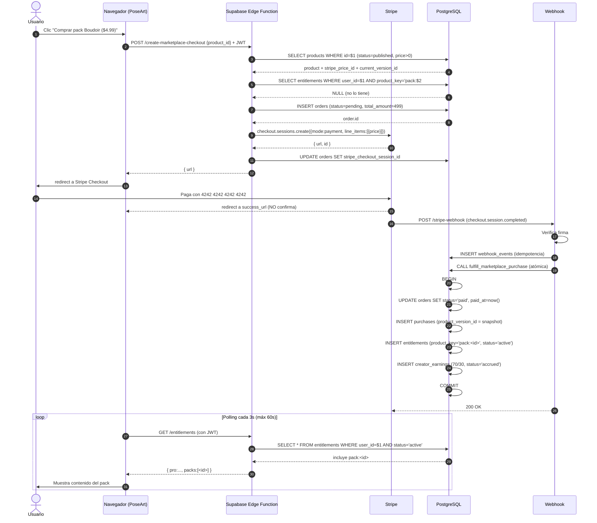

# 08 — Marketplace y compras

> **Propósito:** Convertir el marketplace simulado de PoseArt (`js/app.js:2281` y la función `purchasePack` con `setTimeout` en `js/app.js:2389`) en un sistema real de compras puntuales (one-time payments), con creadores, versiones de producto, reseñas verificadas y reembolsos.
>
> **Audiencia:** Desarrollador que ya completó `07-BILLING-AND-SUBSCRIPTIONS.md` (Stripe Checkout + webhooks + tabla `entitlements` funcionando).
>
> **Tiempo estimado:** 2-3 horas.
>
> **Modo:** Stripe en **test mode** durante TODA la implementación.

---

## 0. Reglas críticas

> ⚠️ **REGLA 1 — El navegador nunca concede acceso.**
> Hoy en `js/app.js:2389`, "comprar" hace `setTimeout` y luego `_ownedPacks.push(packId)`. Esa línea debe desaparecer. El navegador pide al servidor crear una Checkout Session, y solo cuando el webhook confirma, el servidor crea el entitlement.

> ⚠️ **REGLA 2 — El precio y el contenido vienen del servidor.**
> El cliente envía `product_id`. El servidor lee de la tabla `products` cuál es el `price_id` de Stripe y cuál es el contenido. Nunca confíes en el `pack.price` que viene de localStorage.

> ⚠️ **REGLA 3 — Una compra = un snapshot de versión.**
> Si el creador actualiza el pack después de que tú lo compraste, **no** recibes los cambios automáticamente. Tu compra apunta a `product_version_id` específico. Decidir si actualizas es tu elección (ver sección 7).

> ⚠️ **REGLA 4 — Solo compradores reseñan.**
> Una reseña requiere un `entitlement` activo para ese producto. Sin compra, no hay reseña.

> ⚠️ **REGLA 5 — La regla 70/30 se documenta, NO se implementa en el MVP.**
> No se configura Stripe Connect. El 100% del pago va a la cuenta de PoseArt. La deuda del 70% al creador se anota contablemente y se paga manualmente cuando haya obligaciones legales claras (ver sección 9).

> ⚠️ **REGLA 6 — Operación atómica.**
> Crear `order` + `purchase` + `entitlement` en una sola transacción SQL. Si una falla, ninguna se crea. Sin transacción, un fallo a mitad deja al usuario pagando sin acceso o con acceso sin registro.

---

## 1. Conceptos clave

| Concepto | Qué es | Tabla |
|---|---|---|
| **Product** | Cosa vendible: pose, pack (varias poses), o tour. | `products` |
| **Product version** | Snapshot inmutable del producto en el momento de publicación o actualización. | `product_versions` |
| **Creator** | Usuario que publica productos. Cualquier usuario autenticado puede ser creator. | `profiles` (+ campo `is_creator`) |
| **Order** | Una compra de un usuario. Contiene 1+ items (MVP: 1 item por order). | `orders` |
| **Purchase** | Línea dentro de la order: 1 product comprado, apuntando a su `version_id`. | `purchases` |
| **Entitlement** | "Este usuario tiene derecho a usar este product". La UI lo lee para mostrar contenido. | `entitlements` (misma tabla que Pro) |
| **Review** | Reseña de un comprador sobre un product. | `reviews` |
| **Refund** | Reembolso de una order. Revoca el entitlement. | `refunds` |

### Diferencia con suscripciones (ver `07-BILLING-AND-SUBSCRIPTIONS.md`)
- Suscripción: pago recurrente, entitlement activo mientras la suscripción esté `active`.
- Compra marketplace: pago **one-time**, entitlement activo **para siempre** (hasta reembolso).

---

## 2. Tipos de producto

### Objetivo
Definir qué tipos de productos vende PoseArt.

### Definición

| Tipo (`product_type`) | Descripción | Ejemplo | Contenido |
|---|---|---|---|
| `pose` | Una pose individual. | "Pose de ballet clásica" | `joints`, metadatos de esqueleto |
| `pack` | Conjunto de poses. | "Boudoir Classic — 12 poses" | Array de `pose_id` o poses embebidas |
| `tour` | Secuencia guiada de poses. | "Tour editorial de 30 min" | `sections: [{poseIds, durations, ...}]` |

### Por qué se necesita
El tipo determina cómo se serializa el contenido, cómo se valida, y cómo se muestra en la UI.

### Prerrequisitos
- Haber leído `01-CURRENT-STATE-AUDIT.md` (conoces la estructura actual de `_marketplacePacks`, `_tours` y `editorCustomPoses`).

### Dónde ejecutar
- SQL: definir `product_type` como enum en PostgreSQL.
- JS: el frontend envía el tipo al crear un producto, no lo infiere.

### Acción exacta
```sql
CREATE TYPE product_type AS ENUM ('pose', 'pack', 'tour');
CREATE TYPE product_visibility AS ENUM ('private', 'unlisted', 'published');
CREATE TYPE product_status AS ENUM ('draft', 'published', 'withdrawn');
```

### Fuente oficial
- [PostgreSQL: CREATE TYPE](https://www.postgresql.org/docs/current/sql-createtype.html)

---

## 3. Gratis vs pagado

### Objetivo
Distinguir productos gratuitos (`price_amount = 0`) de pagados.

### Por qué se necesita
- Productos gratis NO pasan por Stripe. Se "adquieren" directamente (creando entitlement sin orden de pago).
- Pero el flujo sigue siendo **server-side**: el cliente llama a una Edge Function `claim-free-product`, no modifica localStorage.

### Prerrequisitos
- Tabla `products` con `price_amount` y `price_currency`.

### Acción exacta
```sql
ALTER TABLE products
  ADD COLUMN IF NOT EXISTS price_amount INTEGER NOT NULL DEFAULT 0,  -- en centavos
  ADD COLUMN IF NOT EXISTS price_currency TEXT NOT NULL DEFAULT 'usd',
  ADD COLUMN IF NOT EXISTS stripe_price_id TEXT;  -- NULL si es gratis
```

> ℹ️ **Centavos, no dólares.** Stripe requiere cantidades en la unidad mínima (centavos para USD/EUR). $4.99 = 499.

### Edge Function `claim-free-product`
```typescript
// supabase/functions/claim-free-product/index.ts (esqueleto)
Deno.serve(async (req) => {
  const { user } = await authenticate(req);
  const { product_id } = await req.json();

  const { data: product } = await supabase
    .from("products").select("id, price_amount, current_version_id")
    .eq("id", product_id).single();
  if (!product) return new Response("Not found", { status: 404 });
  if (product.price_amount !== 0) return new Response("Not free", { status: 400 });

  // Atomic: crear order + purchase + entitlement en una transacción
  await grantMarketplaceEntitlement({
    user_id: user.id,
    product_id: product.id,
    version_id: product.current_version_id,
    source: "free_claim",
    source_id: crypto.randomUUID(),
  });

  return new Response(JSON.stringify({ ok: true }), { headers: { "Content-Type": "application/json" } });
});
```

### Fuente oficial
- [Stripe: Zero-decimal currencies](https://docs.stripe.com/currencies#zero-decimal) (sobre centavos)

---

## 4. Tablas SQL necesarias

### Objetivo
Crear las tablas de marketplace.

### Por qué se necesita
Sin estas tablas no hay dónde guardar productos, versiones, órdenes, compras, reseñas y reembolsos.

### Prerrequisitos
- `03-DATA-MODEL.md` desplegado (perfiles y poses base existen).
- `07-BILLING-AND-SUBSCRIPTIONS.md` (tabla `entitlements` ya existe).

### Dónde ejecutar
Supabase SQL Editor o migration local.

### Acción exacta

```sql
-- 1) Products
CREATE TABLE IF NOT EXISTS products (
  id UUID PRIMARY KEY DEFAULT gen_random_uuid(),
  creator_id UUID NOT NULL REFERENCES auth.users(id) ON DELETE CASCADE,
  slug TEXT NOT NULL,
  name TEXT NOT NULL,
  description TEXT,
  product_type product_type NOT NULL,
  visibility product_visibility NOT NULL DEFAULT 'private',
  status product_status NOT NULL DEFAULT 'draft',
  price_amount INTEGER NOT NULL DEFAULT 0,
  price_currency TEXT NOT NULL DEFAULT 'usd',
  stripe_price_id TEXT,
  current_version_id UUID,  -- FK a product_versions (se setea tras publicar)
  created_at TIMESTAMPTZ NOT NULL DEFAULT now(),
  updated_at TIMESTAMPTZ NOT NULL DEFAULT now(),
  UNIQUE (creator_id, slug)
);
CREATE INDEX idx_products_published ON products(status, visibility) WHERE status = 'published';

-- 2) Product versions (snapshots inmutables)
CREATE TABLE IF NOT EXISTS product_versions (
  id UUID PRIMARY KEY DEFAULT gen_random_uuid(),
  product_id UUID NOT NULL REFERENCES products(id) ON DELETE CASCADE,
  version_number INTEGER NOT NULL,
  content JSONB NOT NULL,  -- el snapshot completo: poses, metadata, etc.
  changelog TEXT,
  created_at TIMESTAMPTZ NOT NULL DEFAULT now(),
  UNIQUE (product_id, version_number)
);

ALTER TABLE products
  ADD CONSTRAINT fk_current_version
  FOREIGN KEY (current_version_id) REFERENCES product_versions(id);

-- 3) Orders
CREATE TABLE IF NOT EXISTS orders (
  id UUID PRIMARY KEY DEFAULT gen_random_uuid(),
  user_id UUID NOT NULL REFERENCES auth.users(id) ON DELETE CASCADE,
  stripe_checkout_session_id TEXT UNIQUE,
  stripe_payment_intent_id TEXT,
  status TEXT NOT NULL DEFAULT 'pending',  -- pending, paid, refunded, partially_refunded
  total_amount INTEGER NOT NULL,
  currency TEXT NOT NULL DEFAULT 'usd',
  created_at TIMESTAMPTZ NOT NULL DEFAULT now(),
  paid_at TIMESTAMPTZ
);
CREATE INDEX idx_orders_user ON orders(user_id);

-- 4) Purchases (líneas de orden)
CREATE TABLE IF NOT EXISTS purchases (
  id UUID PRIMARY KEY DEFAULT gen_random_uuid(),
  order_id UUID NOT NULL REFERENCES orders(id) ON DELETE CASCADE,
  user_id UUID NOT NULL REFERENCES auth.users(id) ON DELETE CASCADE,
  product_id UUID NOT NULL REFERENCES products(id),
  product_version_id UUID NOT NULL REFERENCES product_versions(id),
  amount INTEGER NOT NULL,
  currency TEXT NOT NULL DEFAULT 'usd',
  created_at TIMESTAMPTZ NOT NULL DEFAULT now()
);
CREATE INDEX idx_purchases_user ON purchases(user_id);
CREATE INDEX idx_purchases_product ON purchases(product_id);

-- 5) Reviews
CREATE TABLE IF NOT EXISTS reviews (
  id UUID PRIMARY KEY DEFAULT gen_random_uuid(),
  product_id UUID NOT NULL REFERENCES products(id) ON DELETE CASCADE,
  user_id UUID NOT NULL REFERENCES auth.users(id) ON DELETE CASCADE,
  rating SMALLINT NOT NULL CHECK (rating BETWEEN 1 AND 5),
  title TEXT,
  body TEXT,
  created_at TIMESTAMPTZ NOT NULL DEFAULT now(),
  updated_at TIMESTAMPTZ NOT NULL DEFAULT now(),
  UNIQUE (product_id, user_id)  -- 1 reseña por usuario por producto
);
CREATE INDEX idx_reviews_product ON reviews(product_id);

-- 6) Refunds
CREATE TABLE IF NOT EXISTS refunds (
  id UUID PRIMARY KEY DEFAULT gen_random_uuid(),
  order_id UUID NOT NULL REFERENCES orders(id) ON DELETE CASCADE,
  stripe_refund_id TEXT UNIQUE,
  amount INTEGER NOT NULL,
  reason TEXT,
  created_at TIMESTAMPTZ NOT NULL DEFAULT now(),
  created_by TEXT NOT NULL  -- 'admin', 'system'
);
```

### RLS

```sql
ALTER TABLE products ENABLE ROW LEVEL SECURITY;
ALTER TABLE product_versions ENABLE ROW LEVEL SECURITY;
ALTER TABLE orders ENABLE ROW LEVEL SECURITY;
ALTER TABLE purchases ENABLE ROW LEVEL SECURITY;
ALTER TABLE reviews ENABLE ROW LEVEL SECURITY;
ALTER TABLE refunds ENABLE ROW LEVEL SECURITY;

-- Products: cualquier autenticado puede ver published. Solo creator edita los suyos.
CREATE POLICY "products: read published"
  ON products FOR SELECT TO authenticated
  USING (status = 'published' OR creator_id = auth.uid());

CREATE POLICY "products: creator inserts own"
  ON products FOR INSERT TO authenticated
  WITH CHECK (creator_id = auth.uid());

CREATE POLICY "products: creator updates own"
  ON products FOR UPDATE TO authenticated
  USING (creator_id = auth.uid());

-- Product versions: el público lee versiones de productos publicados.
CREATE POLICY "versions: read if product published"
  ON product_versions FOR SELECT TO authenticated
  USING (
    product_id IN (SELECT id FROM products WHERE status = 'published')
    OR product_id IN (SELECT id FROM products WHERE creator_id = auth.uid())
  );

-- Orders: el usuario solo ve sus propias órdenes.
CREATE POLICY "orders: read own"
  ON orders FOR SELECT TO authenticated
  USING (user_id = auth.uid());

-- Purchases: el usuario solo ve sus propias compras.
CREATE POLICY "purchases: read own"
  ON purchases FOR SELECT TO authenticated
  USING (user_id = auth.uid());

-- Reviews: cualquiera autenticado lee. Solo el autor escribe las suyas.
CREATE POLICY "reviews: read all"
  ON reviews FOR SELECT TO authenticated USING (true);

CREATE POLICY "reviews: insert own"
  ON reviews FOR INSERT TO authenticated
  WITH CHECK (user_id = auth.uid());

CREATE POLICY "reviews: update own"
  ON reviews FOR UPDATE TO authenticated
  USING (user_id = auth.uid());

-- Refunds: SOLO service_role. El usuario no ve ni crea reembolsos.
-- (No crear policy SELECT para authenticated.)
```

### Resultado esperado
Seis tablas con RLS. El usuario solo ve y edita lo que le corresponde.

### Cómo verificar
```sql
-- Como usuario autenticado:
SELECT * FROM orders;        -- Solo tus órdenes
SELECT * FROM refunds;       -- Vacío (no tienes permiso)
SELECT * FROM products;      -- Solo published + los tuyos propios
```

### Errores comunes
| Error | Causa | Solución |
|---|---|---|
| Usuario ve refunds de otros | Olvidaste omitir policy SELECT en `refunds`. | `DROP POLICY` que permita SELECT a authenticated en `refunds`. |
| Comprador no puede ver su `purchase` | Falta el JOIN correcto o la policy. | Verifica `purchases: read own` existe. |

### Cómo revertir
```sql
DROP TABLE IF EXISTS refunds, reviews, purchases, orders, product_versions, products CASCADE;
DROP TYPE IF EXISTS product_type, product_visibility, product_status;
```

### Fuente oficial
- [Supabase RLS](https://supabase.com/docs/guides/database/postgres/row-level-security)
- [PostgreSQL CHECK constraints](https://www.postgresql.org/docs/current/ddl-constraints.html)

---

## 5. Perfiles de creador y flujo de publicación

### Objetivo
Permitir que un usuario publique sus poses/packs/tours al marketplace.

### Por qué se necesita
- Sin publicación, no hay producto vendible.
- Sin perfil de creador, no hay a quién atribuir el producto ni a quién pagar (cuando se implemente Stripe Connect).

### Prerrequisitos
- Tablas de la sección 4 creadas.
- `profiles` existe (de `03-DATA-MODEL.md`).

### Dónde ejecutar
- SQL: añadir campos a `profiles`.
- Edge Function: `publish-product`.

### Acción exacta

```sql
ALTER TABLE profiles
  ADD COLUMN IF NOT EXISTS is_creator BOOLEAN NOT NULL DEFAULT false,
  ADD COLUMN IF NOT EXISTS creator_display_name TEXT,
  ADD COLUMN IF NOT EXISTS creator_bio TEXT,
  ADD COLUMN IF NOT EXISTS creator_avatar_url TEXT;

-- RLS: cualquier autenticado puede ver perfiles de creadores públicos
CREATE POLICY "profiles: read creators"
  ON profiles FOR SELECT TO authenticated
  USING (is_creator = true OR id = auth.uid());
```

### Flujo de publicación (Edge Function `publish-product`)

```typescript
// supabase/functions/publish-product/index.ts (esqueleto)
Deno.serve(async (req) => {
  const { user } = await authenticate(req);
  const { product_id } = await req.json();

  // 1) Cargar el producto (debe ser del usuario)
  const { data: product, error } = await supabase
    .from("products").select("*").eq("id", product_id).single();
  if (error || !product || product.creator_id !== user.id) {
    return new Response("Forbidden", { status: 403 });
  }

  // 2) Crear nueva versión (snapshot inmutable)
  const content = await buildProductContent(product); // Lee poses, tours, etc.
  const { data: version } = await supabase
    .from("product_versions").insert({
      product_id: product.id,
      version_number: await nextVersionNumber(product.id),
      content,
      changelog: "Initial publish",
    }).select().single();

  // 3) Si es pagado y no tiene stripe_price_id, crear en Stripe
  if (product.price_amount > 0 && !product.stripe_price_id) {
    const stripePrice = await stripe.prices.create({
      unit_amount: product.price_amount,
      currency: product.price_currency,
      product_data: { name: product.name, metadata: { poseart_product_id: product.id } },
    });
    await supabase.from("products").update({
      stripe_price_id: stripePrice.id, status: "published", current_version_id: version.id,
    }).eq("id", product.id);
  } else {
    await supabase.from("products").update({
      status: "published", current_version_id: version.id,
    }).eq("id", product.id);
  }

  return new Response(JSON.stringify({ ok: true, version_id: version.id }));
});
```

### Resultado esperado
- Producto pasa de `draft` a `published`.
- Se crea una `product_version` con el snapshot del contenido.
- Si es pagado, se crea un `stripe_price_id` en Stripe.

### Cómo verificar
```sql
SELECT id, status, current_version_id, stripe_price_id FROM products WHERE creator_id = '<uuid>';
```

### Errores comunes
| Error | Causa | Solución |
|---|---|---|
| `price` ya existe con ese nombre en Stripe | Creaste el producto dos veces. | Reusa el `stripe_price_id` existente; no recrees. |
| `current_version_id` es NULL | Saltaste el paso de crear la versión. | Verifica el orden: insert version → update product.current_version_id. |

### Cómo revertir
- Producto: `UPDATE products SET status='draft' WHERE id='...'`. Archiva el `price` en Stripe si lo creaste.
- Versión: no la borres, es inmutable. Si necesitas "ocultar", cambia `products.status` a `withdrawn`.

### Fuente oficial
- [Stripe: Create price](https://docs.stripe.com/api/prices/create)

---

## 6. Flujo de compra (servidor crea Checkout, webhook confirma)

### Objetivo
Implementar el flujo correcto de compra: el cliente pide, el servidor crea Checkout, el usuario paga en Stripe, el webhook confirma y crea atómicamente `order` + `purchase` + `entitlement`.

### Por qué se necesita
Sustituye al `setTimeout` falso. Garantiza que solo pagadores reales reciben el producto.

### Prerrequisitos
- Secciones 4 y 5 listas.
- `07-BILLING-AND-SUBSCRIPTIONS.md` (webhook handler base).

### Dónde ejecutar
- Edge Function nueva: `create-marketplace-checkout`.
- Extender `stripe-webhook` (o crear `stripe-webhook-marketplace`).

### Acción exacta

#### 6.1 Edge Function `create-marketplace-checkout`

```typescript
// supabase/functions/create-marketplace-checkout/index.ts (esqueleto)
Deno.serve(async (req) => {
  const { user } = await authenticate(req);
  const { product_id } = await req.json();

  // 1) Cargar producto y verificar que es pagado y publicado
  const { data: product } = await supabase
    .from("products").select("id, name, price_amount, price_currency, stripe_price_id, status, current_version_id")
    .eq("id", product_id).single();
  if (!product) return new Response("Not found", { status: 404 });
  if (product.status !== "published") return new Response("Not available", { status: 400 });
  if (product.price_amount === 0) return new Response("Use /claim-free-product", { status: 400 });

  // 2) ¿Ya lo tiene? Evitar doble compra (a menos que quieras regalar)
  const { data: existing } = await supabase
    .from("entitlements").select("id")
    .eq("user_id", user.id)
    .eq("product_key", `pack:${product.id}`)
    .eq("status", "active").maybeSingle();
  if (existing) return new Response("Already owned", { status: 409 });

  // 3) Crear order pendiente
  const { data: order } = await supabase.from("orders").insert({
    user_id: user.id,
    status: "pending",
    total_amount: product.price_amount,
    currency: product.price_currency,
  }).select().single();

  // 4) Crear Checkout Session en Stripe (one_time, no subscription)
  const session = await stripe.checkout.sessions.create({
    mode: "payment",
    line_items: [{ price: product.stripe_price_id, quantity: 1 }],
    success_url: `${APP_BASE_URL}/?checkout=success&order=${order.id}`,
    cancel_url: `${APP_BASE_URL}/?checkout=cancel&order=${order.id}`,
    client_reference_id: user.id,
    metadata: {
      supabase_user_id: user.id,
      product_id: product.id,
      product_version_id: product.current_version_id,
      order_id: order.id,
    },
  });

  await supabase.from("orders").update({ stripe_checkout_session_id: session.id }).eq("id", order.id);

  return new Response(JSON.stringify({ url: session.url }), { headers: { "Content-Type": "application/json" } });
});
```

#### 6.2 Manejo en `stripe-webhook`

```typescript
// Añadir case al switch de processEvent:
case "checkout.session.completed": {
  const session = event.data.object as Stripe.Checkout.Session;
  const metadata = session.metadata ?? {};
  if (metadata.product_id && metadata.product_version_id && metadata.order_id) {
    // Es una compra de marketplace (no de suscripción Pro)
    await fulfillMarketplacePurchase({
      order_id: metadata.order_id,
      user_id: metadata.supabase_user_id,
      product_id: metadata.product_id,
      version_id: metadata.product_version_id,
      payment_intent_id: session.payment_intent as string,
      amount: session.amount_total ?? 0,
    });
  }
  break;
}
case "charge.refunded": {
  const charge = event.data.object as Stripe.Charge;
  if (charge.amount_refunded === charge.amount) {
    await revokeMarketplaceEntitlementsByCharge(charge.id);
  }
  break;
}
```

#### 6.3 Transacción atómica en PostgreSQL

```typescript
// supabase/functions/_lib/fulfill.ts
async function fulfillMarketplacePurchase(params: {
  order_id: string; user_id: string; product_id: string; version_id: string;
  payment_intent_id: string; amount: number;
}) {
  // Llamar a una RPC que hace todo en una transacción
  const { error } = await supabase.rpc("fulfill_marketplace_purchase", {
    p_order_id: params.order_id,
    p_user_id: params.user_id,
    p_product_id: params.product_id,
    p_version_id: params.version_id,
    p_payment_intent_id: params.payment_intent_id,
    p_amount: params.amount,
  });
  if (error) throw error;
}
```

```sql
-- RPC atómica
CREATE OR REPLACE FUNCTION fulfill_marketplace_purchase(
  p_order_id UUID,
  p_user_id UUID,
  p_product_id UUID,
  p_version_id UUID,
  p_payment_intent_id TEXT,
  p_amount INTEGER
) RETURNS VOID LANGUAGE plpgsql SECURITY DEFINER AS $$
BEGIN
  -- 1) Actualizar order a paid
  UPDATE orders
    SET status = 'paid', paid_at = now(), stripe_payment_intent_id = p_payment_intent_id
    WHERE id = p_order_id AND user_id = p_user_id AND status = 'pending';

  IF NOT FOUND THEN
    RAISE EXCEPTION 'Order % not found or already processed', p_order_id;
  END IF;

  -- 2) Crear purchase (apunta a la versión comprada)
  INSERT INTO purchases (order_id, user_id, product_id, product_version_id, amount, currency)
  SELECT p_order_id, p_user_id, p_product_id, p_version_id, p_amount, currency
  FROM orders WHERE id = p_order_id;

  -- 3) Crear entitlement (la UI lo lee para mostrar el contenido)
  INSERT INTO entitlements (user_id, product_key, source, source_id, status, metadata)
  VALUES (
    p_user_id,
    'pack:' || p_product_id,
    'stripe_payment',
    p_payment_intent_id,
    'active',
    jsonb_build_object('version_id', p_version_id, 'order_id', p_order_id, 'product_id', p_product_id)
  )
  ON CONFLICT (user_id, product_key, source_id) DO NOTHING;
END;
$$;
```

### Resultado esperado
- Usuario compra pack de $4.99.
- Stripe crea `charge.succeeded` y `checkout.session.completed`.
- Tu webhook llama a la RPC atómica.
- En BD: `orders.status = 'paid'`, existe `purchases`, existe `entitlements` con `product_key = 'pack:<id>'`.
- Si la RPC falla, **nada** se crea. Stripe reintenta el webhook.

### Cómo verificar
```bash
# Comprar un pack de prueba:
curl -X POST http://localhost:54321/functions/v1/create-marketplace-checkout \
  -H "Authorization: Bearer $JWT" -H "Content-Type: application/json" \
  -d '{"product_id":"<uuid>"}'
# Abrir URL, pagar con 4242...

# En BD:
SELECT * FROM orders WHERE user_id='<uuid>' ORDER BY created_at DESC LIMIT 1;
SELECT * FROM purchases WHERE user_id='<uuid>';
SELECT * FROM entitlements WHERE product_key LIKE 'pack:%' AND user_id='<uuid>';
```

### Errores comunes
| Error | Causa | Solución |
|---|---|---|
| RPC falla: `Order already processed` | Webhook duplicado. | La RPC usa `WHERE status='pending'`, así que el segundo intento no encuentra la fila y la RPC falla. El webhook responde 500 → Stripe reintenta → vuelve a fallar → bucle infinito. Solución: antes de llamar la RPC, comprobar idempotencia en `webhook_events` (ya hecho en `07-BILLING-AND-SUBSCRIPTIONS.md` sección 7). |
| `purchases` duplicados | Insert sin `ON CONFLICT`. | Añade constraint UNIQUE en `(order_id, product_id)`. |
| Usuario no puede ver el pack tras pagar | Webhook tardó más de 60s. | El cliente hace polling de `entitlements` tras checkout (igual que en `07`). |

### Cómo revertir
- Si la orden falló pero el pago se cobró: reembolsa en Stripe Dashboard. El webhook `charge.refunded` revoca el entitlement.
- Si necesitas anular la orden manualmente:
  ```sql
  UPDATE orders SET status = 'refunded' WHERE id = '<uuid>';
  UPDATE entitlements SET status = 'revoked', revoked_at = now()
    WHERE metadata->>'order_id' = '<uuid>';
  ```

### Fuente oficial
- [Stripe: One-time payments with Checkout](https://docs.stripe.com/payments/checkout/accept-a-payment)
- [Supabase: RPC (stored procedures)](https://supabase.com/docs/guides/database/functions)
- [PostgreSQL: SECURITY DEFINER](https://www.postgresql.org/docs/current/sql-createfunction.html)

---

## 7. Version snapshots — qué pasa al actualizar, retirar o reembolsar

### Objetivo
Definir el contrato: cuando compras un producto, **compras una versión específica**. Las actualizaciones del creador no te afectan automáticamente.

### Por qué se necesita
- **Justicia:** el creador sube el precio después de tu compra — no puedes pagar de más.
- **Calidad:** el creador cambia una pose por una peor — tu versión comprada sigue siendo la buena.
- **Trazabilidad:** una denuncia DMCA requiere saber qué versión exacta tenía cada comprador.

### Escenarios

#### Escenario A: creador actualiza el producto tras tu compra
1. Creador edita el producto (cambia poses, descripción, etc.).
2. Al publicar la nueva versión, se crea un **nuevo `product_version`**. `products.current_version_id` apunta a la nueva.
3. **Tu `purchase.product_version_id` no cambia.** Sigues apuntando a la versión antigua.
4. Tu `entitlement` sigue activo.
5. La UI puede ofrecerte: "Hay una nueva versión disponible. ¿Actualizar?" — esa es una decisión de producto, no obligatoria.
   - **Recomendación MVP:** no ofrecer actualización automática. El usuario tiene lo que compró.
   - **Si quieres actualizar gratis:** el creador marca la nueva versión como `update_kind = 'minor'` y permites a compradores existentes reclamarla. Documenta esto claramente.

#### Escenario B: creador retira el producto
1. Creador cambia `products.status` a `withdrawn`.
2. **Compradores existentes conservan su `entitlement`.** El producto ya no aparece en el marketplace público, pero los que lo compraron siguen accediendo a su versión.
3. La UI del comprador muestra el producto desde `purchases.product_version_id` (no desde `products`).
4. El creador no puede borrar el `product_versions` (RLS + constraint con purchases).

#### Escenario C: reembolso
1. Admin o sistema emite reembolso en Stripe.
2. Stripe envía `charge.refunded`.
3. Tu webhook revoca el `entitlement` (cambia `status` a `revoked`, setea `revoked_at`).
4. El `purchase` sigue existiendo (para histórico). Solo el `entitlement` se revoca.
5. La UI del usuario deja de mostrar el contenido.

### Acción exacta (implementación del escenario C)
```typescript
async function revokeMarketplaceEntitlementsByCharge(chargeId: string) {
  // Buscar la orden por payment_intent (charge.payment_intent)
  // Revoke entitlements con metadata->>order_id = orden.id
  await supabase.rpc("revoke_entitlements_by_charge", { p_charge_id: chargeId });
}
```

```sql
CREATE OR REPLACE FUNCTION revoke_entitlements_by_charge(p_charge_id TEXT)
RETURNS VOID LANGUAGE plpgsql SECURITY DEFINER AS $$
DECLARE
  v_order_id UUID;
BEGIN
  SELECT id INTO v_order_id FROM orders WHERE stripe_payment_intent_id = p_charge_id;
  IF v_order_id IS NULL THEN RETURN; END IF;

  UPDATE entitlements SET status = 'revoked', revoked_at = now()
    WHERE (metadata->>'order_id')::UUID = v_order_id
      AND source = 'stripe_payment';

  UPDATE orders SET status = 'refunded' WHERE id = v_order_id;
END;
$$;
```

### Resultado esperado
- Compra → versión inmutable → acceso permanente.
- Actualización del creador → nueva versión, no afecta compradores previos.
- Retirada → producto oculto del marketplace pero compradores mantienen acceso.
- Reembolso → entitlement revocado, orden marcada como `refunded`.

### Cómo verificar
```sql
-- Comprueba que un comprador antiguo sigue con la versión que compró:
SELECT p.product_id, p.product_version_id, v.version_number, e.status
FROM purchases p
JOIN product_versions v ON v.id = p.product_version_id
JOIN entitlements e ON e.metadata->>'order_id'::text = p.order_id::text
WHERE p.user_id = '<uuid>';
```

### Errores comunes
| Error | Causa | Solución |
|---|---|---|
| Usuario ve contenido nuevo sin haber actualizado | La UI carga `products.current_version_id` en vez de `purchases.product_version_id`. | Carga desde purchases, no desde products. |
| Reembolso no revoca | El webhook no mapea `charge.payment_intent` a `orders.stripe_payment_intent_id`. | Verifica que guardaste el payment_intent en la orden. |

### Cómo revertir
- Reembolso revertido: si anulas el reembolso en Stripe (rarísimo), el webhook no se envía. Tendrías que restaurar manualmente:
  ```sql
  UPDATE entitlements SET status = 'active', revoked_at = NULL
    WHERE (metadata->>'order_id')::UUID = '<order-uuid>';
  UPDATE orders SET status = 'paid' WHERE id = '<order-uuid>';
  ```

### Fuente oficial
- [Stripe: Refunds](https://docs.stripe.com/payments/refunds)
- [PostgreSQL: JSONB operators](https://www.postgresql.org/docs/current/functions-json.html)

---

## 8. Reseñas y ratings (solo compradores)

### Objetivo
Permitir que compradores verificados dejen reseñas, y que la media de ratings sea correcta.

### Por qué se necesita
- Sin verificación, cualquiera puede inflar o hundir un producto con reseñas falsas.
- El cálculo de rating medio debe ser eficiente (no recalcular en cada request).

### Prerrequisitos
- Tabla `reviews` (sección 4) creada.
- Tabla `entitlements` con `product_key = 'pack:<id>'`.

### Dónde ejecutar
- Edge Function `submit-review`.
- SQL: trigger para actualizar `products.rating_avg` y `rating_count`.

### Acción exacta

#### 8.1 Edge Function `submit-review`
```typescript
// supabase/functions/submit-review/index.ts (esqueleto)
Deno.serve(async (req) => {
  const { user } = await authenticate(req);
  const { product_id, rating, title, body } = await req.json();

  if (!rating || rating < 1 || rating > 5) return new Response("Invalid rating", { status: 400 });

  // Verificar que el usuario compró el producto (entitlement activo)
  const { data: ent } = await supabase
    .from("entitlements").select("id")
    .eq("user_id", user.id)
    .eq("product_key", `pack:${product_id}`)
    .eq("status", "active").maybeSingle();
  if (!ent) return new Response("Must purchase to review", { status: 403 });

  // Upsert review (UNIQUE product_id+user_id)
  const { error } = await supabase.from("reviews").upsert({
    product_id, user_id: user.id, rating, title, body, updated_at: new Date().toISOString(),
  }, { onConflict: "product_id, user_id" });

  if (error) return new Response("Error", { status: 500 });
  return new Response(JSON.stringify({ ok: true }));
});
```

#### 8.2 Trigger SQL para mantener `products.rating_avg`
```sql
ALTER TABLE products
  ADD COLUMN IF NOT EXISTS rating_avg NUMERIC(3,2) DEFAULT 0,
  ADD COLUMN IF NOT EXISTS rating_count INTEGER DEFAULT 0;

CREATE OR REPLACE FUNCTION update_product_rating() RETURNS TRIGGER AS $$
BEGIN
  UPDATE products SET
    rating_avg = (SELECT AVG(rating)::NUMERIC(3,2) FROM reviews WHERE product_id = COALESCE(NEW.product_id, OLD.product_id)),
    rating_count = (SELECT COUNT(*) FROM reviews WHERE product_id = COALESCE(NEW.product_id, OLD.product_id))
  WHERE id = COALESCE(NEW.product_id, OLD.product_id);
  RETURN COALESCE(NEW, OLD);
END;
$$ LANGUAGE plpgsql;

CREATE TRIGGER trg_review_changes
  AFTER INSERT OR UPDATE OR DELETE ON reviews
  FOR EACH ROW EXECUTE FUNCTION update_product_rating();
```

### Resultado esperado
- POST `/submit-review` con `product_id`, `rating`, etc. + JWT de un comprador → crea/actualiza review.
- `products.rating_avg` y `rating_count` se actualizan automáticamente.
- Usuario sin compra → 403.

### Cómo verificar
```bash
# Como comprador:
curl -X POST .../submit-review -H "Authorization: Bearer $JWT" \
  -d '{"product_id":"<uuid>","rating":5,"title":"Great","body":"Loved it"}'
# → 200 OK

# Como NO comprador:
curl -X POST .../submit-review -H "Authorization: Bearer $JWT_NO_BUYER" \
  -d '{"product_id":"<uuid>","rating":1}'
# → 403 Must purchase to review

# En BD:
SELECT name, rating_avg, rating_count FROM products WHERE id='<uuid>';
```

### Errores comunes
| Error | Causa | Solución |
|---|---|---|
| Rating promedio no se actualiza | Trigger no creado o con bug. | `SELECT * FROM pg_trigger WHERE tgrelid='reviews'::regclass;` |
| Reseña duplicada | Upsert sin `onConflict`. | Verifica la constraint UNIQUE `(product_id, user_id)`. |
| Usuario reembolsado puede seguir reseñando | Tu policy permite UPDATE a `user_id = auth.uid()` aunque el entitlement esté revoked. | Aceptable: la reseña histórica se mantiene. Si quieres impedir editar tras reembolso, añade lógica en la Edge Function. |

### Cómo revertir
- Borrar todas las reviews de un producto: `DELETE FROM reviews WHERE product_id = '<uuid>';`. El trigger actualiza `rating_avg = 0`.
- Borrar el trigger: `DROP TRIGGER trg_review_changes ON reviews;`

### Fuente oficial
- [PostgreSQL: Triggers](https://www.postgresql.org/docs/current/trigger-definition.html)
- [Supabase: Upsert](https://supabase.com/docs/reference/javascript/upsert)

---

## 9. Regla 70/30 — documentada, NO implementada en MVP

### Objetivo
Dejar constancia de la regla de negocio 70% creador / 30% plataforma, sin programar Stripe Connect todavía.

### Por qué se documenta y NO se implementa
- **Fiscalidad:** pagar a creadores implica obligaciones legales (1099-K en EE.UU., modelo 111 en España, IVA, etc.). Sin consultoría fiscal, no implementes esto.
- **Volumen:** Stripe Connect tiene costes y complejidad. Si hay <50 creadores activos, la contabilidad manual es suficiente.
- **Riesgo:** si repartes automáticamente y la regla fiscal cambia, tienes que devolver dinero.

### Cómo se registra la deuda (sin pagar)

#### Tabla `creator_earnings` (solo contable)
```sql
CREATE TABLE IF NOT EXISTS creator_earnings (
  id UUID PRIMARY KEY DEFAULT gen_random_uuid(),
  creator_id UUID NOT NULL REFERENCES auth.users(id) ON DELETE CASCADE,
  purchase_id UUID NOT NULL REFERENCES purchases(id) ON DELETE CASCADE,
  gross_amount INTEGER NOT NULL,        -- lo que pagó el comprador
  platform_fee INTEGER NOT NULL,        -- 30% por defecto
  creator_share INTEGER NOT NULL,       -- 70% por defecto
  currency TEXT NOT NULL DEFAULT 'usd',
  status TEXT NOT NULL DEFAULT 'accrued', -- accrued, paid, voided
  accrued_at TIMESTAMPTZ NOT NULL DEFAULT now(),
  paid_at TIMESTAMPTZ,
  metadata JSONB
);

-- Insertar automáticamente al completar una compra
CREATE OR REPLACE FUNCTION record_creator_earning() RETURNS TRIGGER AS $$
DECLARE
  v_creator_id UUID;
  v_amount INTEGER;
BEGIN
  SELECT p.creator_id, NEW.amount INTO v_creator_id, v_amount
  FROM products p WHERE p.id = NEW.product_id;

  IF v_creator_id IS NOT NULL THEN
    INSERT INTO creator_earnings (
      creator_id, purchase_id, gross_amount,
      platform_fee, creator_share, currency
    ) VALUES (
      v_creator_id, NEW.id, v_amount,
      (v_amount * 30 / 100),         -- 30%
      (v_amount * 70 / 100),         -- 70%
      NEW.currency
    );
  END IF;
  RETURN NEW;
END;
$$ LANGUAGE plpgsql;

CREATE TRIGGER trg_record_earning
  AFTER INSERT ON purchases
  FOR EACH ROW EXECUTE FUNCTION record_creator_earning();
```

> ⚠️ **Aritmética entera:** `(v_amount * 70 / 100)` redondea hacia abajo. En centavos esto puede dejar 1¢ de diferencia. Aceptable en MVP. Para producción, usar `NUMERIC(10,2)` y redondeo bancario.

### Pago manual (fuera del sistema)
- Mensualmente, el admin exporta `SELECT creator_id, SUM(creator_share) FROM creator_earnings WHERE status='accrued' GROUP BY creator_id;`.
- Transfiere vía transferencia bancaria o PayPal manualmente.
- Marca como `paid`: `UPDATE creator_earnings SET status='paid', paid_at=now() WHERE creator_id='<uuid>' AND ...;`.

### Cuándo SÍ implementar Stripe Connect
- Cuando tengas >50 creadores activos con ventas mensuales.
- Cuando hayas consultado con un asesor fiscal en tu jurisdicción.
- Cuando el coste de procesar manualmente supere el coste de Connect.

### Resultado esperado
- Cada compra deja una fila en `creator_earnings` con `status='accrued'`.
- El admin puede exportar el total adeudado por creador.
- No hay transferencias automáticas a terceros.

### Cómo verificar
```sql
-- Total adeudado por creador:
SELECT creator_id, SUM(creator_share) AS total_due, COUNT(*) AS sales
FROM creator_earnings WHERE status='accrued'
GROUP BY creator_id ORDER BY total_due DESC;
```

### Errores comunes
| Error | Causa | Solución |
|---|---|---|
| `creator_earnings` con `creator_share = 0` | El trigger se ejecutó antes de setear `purchases.product_id`. | Verifica que la RPC `fulfill_marketplace_purchase` inserta purchases con product_id correcto. |
| Redondeo deja dinero sin asignar | Aritmética entera. | Aceptable en MVP. Documentar. |

### Cómo revertir
- Si el trigger causa problemas: `DROP TRIGGER trg_record_earning ON purchases;`
- Si quieres recalcular: `DELETE FROM creator_earnings;` y reinserta desde purchases existentes.

### Fuente oficial
- [Stripe: Connect overview](https://docs.stripe.com/connect) — **referencia futura, NO implementar ahora**
- [PostgreSQL: Triggers](https://www.postgresql.org/docs/current/trigger-definition.html)

---

## 10. Diagrama de secuencia — "Comprar pack pagado"



> ℹ️ **Pasos clave del diagrama:**
> - Paso 4-6: el servidor valida el producto, comprueba que no se posee ya, y crea la order pendiente **antes** de llamar a Stripe.
> - Paso 16-20: la transacción atómica es la única operación que concede acceso. Si falla, nada se crea.
> - Paso 21: `creator_earnings` se inserta en la misma transacción para que nunca haya un `purchase` sin deuda registrada.

---

## 11. Cliente: cómo se accede al contenido comprado

### Objetivo
El cliente carga el contenido desde la **versión comprada**, no desde el producto actual.

### Acción exacta (resumen)
```javascript
// js/marketplace.js (esqueleto)
async function loadOwnedPack(productId) {
  const { data: { session } } = await supabase.auth.getSession();
  if (!session) return null;

  // 1) Verificar entitlement
  const { data: ent } = await supabase
    .from("entitlements").select("metadata")
    .eq("user_id", session.user.id)
    .eq("product_key", `pack:${productId}`)
    .eq("status", "active").maybeSingle();
  if (!ent) return null;  // No comprado

  // 2) Cargar la versión específica (snapshot inmutable)
  const versionId = ent.metadata.version_id;
  const { data: version } = await supabase
    .from("product_versions").select("content")
    .eq("id", versionId).single();
  return version.content;  // Poses, metadata, etc.
}
```

### Resultado esperado
- Usuario sin compra → `null`.
- Usuario con compra → contenido de la versión que compró (incluso si el creador actualizó).

### Fuente oficial
- [Supabase JS: select](https://supabase.com/docs/reference/javascript/select)

---

## 12. Checklist final (antes de avanzar)

- [ ] Tablas `products`, `product_versions`, `orders`, `purchases`, `reviews`, `refunds`, `creator_earnings` creadas con RLS.
- [ ] Tipos `product_type`, `product_visibility`, `product_status` definidos.
- [ ] Trigger `update_product_rating` funcionando.
- [ ] Trigger `record_creator_earning` funcionando.
- [ ] RPC `fulfill_marketplace_purchase` creada y probada.
- [ ] RPC `revoke_entitlements_by_charge` creada.
- [ ] Edge Function `create-marketplace-checkout` desplegada.
- [ ] Edge Function `publish-product` desplegada.
- [ ] Edge Function `claim-free-product` desplegada.
- [ ] Edge Function `submit-review` desplegada.
- [ ] Webhook maneja `checkout.session.completed` para marketplace (además de suscripciones).
- [ ] Webhook maneja `charge.refunded` para marketplace.
- [ ] Compra de prueba con `4242` activa `entitlements` con `product_key = 'pack:<id>'`.
- [ ] Reembolso en Stripe Dashboard revoca el entitlement.
- [ ] Usuario que reembolsa pierde acceso al contenido en la UI.
- [ ] `poseart_ownedPacks` en localStorage ya no se lee (la UI solo consulta el servidor).

---

## 13. Siguientes pasos

- `09-ANALYTICS-AND-OBSERVABILITY.md` — Tracking de eventos de compra (`product_viewed`, `product_purchased`, `product_refunded`) en PostHog.
- `10-LOCALSTORAGE-MIGRATION.md` — Migrar `poseart_marketplacePacks`, `poseart_publishedPacks` y `poseart_marketplaceReviews` al backend.
- `11-TESTING-AND-SECURITY-CHECKLIST.md` — Pruebas de idempotencia, atomicidad y revocación.

---

## 14. Fuentes oficiales (resumen)

| Tema | URL |
|---|---|
| Stripe: Accept one-time payment | https://docs.stripe.com/payments/checkout/accept-a-payment |
| Stripe: Refunds | https://docs.stripe.com/payments/refunds |
| Stripe: Connect (referencia futura) | https://docs.stripe.com/connect |
| Stripe: Prices | https://docs.stripe.com/api/prices/create |
| Supabase: RPC | https://supabase.com/docs/guides/database/functions |
| Supabase: RLS | https://supabase.com/docs/guides/database/postgres/row-level-security |
| PostgreSQL: Triggers | https://www.postgresql.org/docs/current/trigger-definition.html |
| PostgreSQL: SECURITY DEFINER | https://www.postgresql.org/docs/current/sql-createfunction.html |
| PostgreSQL: CREATE TYPE | https://www.postgresql.org/docs/current/sql-createtype.html |
| PostgreSQL: JSONB | https://www.postgresql.org/docs/current/functions-json.html |
