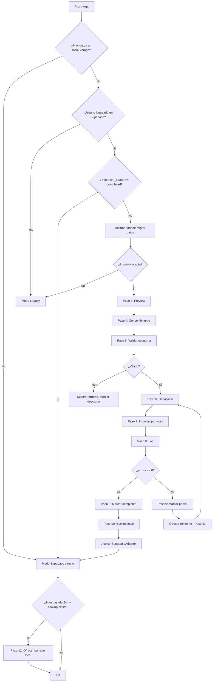

# 10 — Migración de localStorage al backend

> **Propósito:** Mover los datos del usuario desde las 12 claves `poseart_*` de localStorage a Supabase, **sin perder datos, sin romper la app actual, y de forma reversible e idempotente**.
>
> **Audiencia:** Desarrollador que ya completó `04-AUTH-AND-RLS.md` (auth), `03-DATA-MODEL.md` (tablas), `07-BILLING-AND-SUBSCRIPTIONS.md` (Stripe) y `08-MARKETPLACE-AND-PURCHASES.md` (marketplace).
>
> **Tiempo estimado:** 2 horas (la capa de adaptadores) + 2-3 horas (el flujo de migración guiado).
>
> **Estado actual:** 12 claves localStorage inventariadas en `01-CURRENT-STATE-AUDIT.md` (sección 2):
> `onboardingCompleted`, `selectedGoal`, `sessionOptions`, `favorites`, `gallery`, `sessionHistory`, `editorCustomPoses`, `tours`, `marketplacePacks`, `marketplaceReviews`, `ownedPacks`, `publishedPacks`.

---

## 0. Principios de la migración

> ⚠️ **Gradual.** La app debe poder funcionar en modo legacy (localStorage) y modo backend (Supabase) **al mismo tiempo** durante la transición. No hay "big bang".

> ⚠️ **Reversible.** Si la migración falla a mitad, el usuario no pierde datos. Se conserva una copia local temporal durante 30 días.

> ⚠️ **Idempotente.** Si la migración se ejecuta dos veces (o se interrumpe y se reanuda), no se duplican datos.

> ⚠️ **Con consentimiento.** El usuario decide migrar. No se migra automáticamente sin avisar.

> ⚠️ **Sin foto por defecto.** `poseart_gallery` (5-50 MB de Base64) **NO se migra automáticamente**. Solo se ofrece como opción explícita, porque excede la cuota típica de Supabase Free (500 MB DB) y requiere Storage privado (ver `00-READ-ME-FIRST.md`).

> ⚠️ **Sin entitlements inventados.** `poseart_ownedPacks` **no se migra como entitlements**. Se migra como `legacy_owned_packs` (metadata informativa). El acceso real a packs pagados requiere compra verificada (ver `08-MARKETPLACE-AND-PURCHASES.md`).

---

## 1. Capa de acceso a datos — patrón Adapter

### Objetivo
Definir una interfaz común (`DataAdapter`) con dos implementaciones (`LocalStorageAdapter` y `SupabaseAdapter`) que la app pueda intercambiar sin reescribir la lógica de negocio.

### Por qué se necesita
- Tu `js/app.js` está lleno de `persist()` y `restore()` que tocan localStorage directamente. Si reescribes cada llamada, introduces bugs.
- Con un adaptador, cambias una línea (`window.dataAdapter = supabaseAdapter`) y toda la app habla con el backend.
- Permite A/B testing: el 1% de los usuarios en modo Supabase mientras el 99% sigue en localStorage.

### Prerrequisitos
- Haber leído `01-CURRENT-STATE-AUDIT.md` (conoces las 12 claves).
- `03-DATA-MODEL.md` desplegado.
- `04-AUTH-AND-RLS.md` (auth funcionando).

### Dónde ejecutar
- Crear archivo: `js/data-adapter.js`.
- Cargarlo en `index.html` **antes** de `js/app.js`.

### Acción exacta

#### 1.1 Interfaz del adaptador

```javascript
// js/data-adapter.js
/**
 * Interfaz DataAdapter.
 * Cualquier implementación (localStorage, supabase, mock) debe exponer estos métodos.
 * Todos los métodos son asíncronos (las dos implementaciones devuelven Promises).
 */
class DataAdapter {
  // ---- Auth ----
  async getSession() { throw new Error('not implemented'); }
  async signIn(email, password) { throw new Error('not implemented'); }
  async signOut() { throw new Error('not implemented'); }

  // ---- Profile / preferences ----
  async getProfile() { throw new Error('not implemented'); }
  async updateProfile(patch) { throw new Error('not implemented'); }
  async getPreferences() { throw new Error('not implemented'); }
  async updatePreferences(patch) { throw new Error('not implemented'); }

  // ---- Poses ----
  async listCustomPoses() { throw new Error('not implemented'); }
  async saveCustomPose(pose) { throw new Error('not implemented'); }
  async deleteCustomPose(poseId) { throw new Error('not implemented'); }

  // ---- Tours ----
  async listTours() { throw new Error('not implemented'); }
  async saveTour(tour) { throw new Error('not implemented'); }
  async deleteTour(tourId) { throw new Error('not implemented'); }

  // ---- Favoritos ----
  async listFavorites() { throw new Error('not implemented'); }
  async toggleFavorite(poseId) { throw new Error('not implemented'); }

  // ---- Historial de sesiones ----
  async listSessionHistory() { throw new Error('not implemented'); }
  async addSessionHistory(session) { throw new Error('not implemented'); }

  // ---- Marketplace ----
  async listOwnedPacks() { throw new Error('not implemented'); }
  async listPublishedPacks() { throw new Error('not implemented'); }
  async listMarketplaceReviews() { throw new Error('not implemented'); }
  async submitReview(productId, review) { throw new Error('not implemented'); }

  // ---- Billing ----
  async getEntitlements() { throw new Error('not implemented'); }
  async createCheckout(plan) { throw new Error('not implemented'); }
  async createPortalSession() { throw new Error('not implemented'); }

  // ---- Analytics ----
  async trackEvent(name, props) { throw new Error('not implemented'); }

  // ---- Storage (fotos) ----
  async saveCapture(blob, metadata) { throw new Error('not implemented'); }
  async listCaptures() { throw new Error('not implemented'); }
}
```

#### 1.2 Implementación Legacy (localStorage)

```javascript
// js/data-adapter.js
class LocalStorageAdapter extends DataAdapter {
  constructor() {
    super();
    this._prefix = 'poseart_';
  }

  // ---- Helpers internos ----
  _read(key, fallback = null) {
    try { return JSON.parse(localStorage.getItem(this._prefix + key) || 'null') ?? fallback; }
    catch (e) { console.warn('read fail', key, e); return fallback; }
  }
  _write(key, data) {
    try { localStorage.setItem(this._prefix + key, JSON.stringify(data)); return true; }
    catch (e) { console.warn('write fail', key, e); return false; }
  }
  _delete(key) { localStorage.removeItem(this._prefix + key); }

  // ---- Auth (legacy: revisa sessionStorage) ----
  async getSession() {
    try {
      const raw = sessionStorage.getItem('poseart_auth_session');
      return raw ? JSON.parse(raw) : null;
    } catch { return null; }
  }
  async signIn(username, password) {
    // Mantiene la lógica de js/auth.js — solo como puente.
    // Se elimina al cerrar la migración.
    return window.legacyAuth?.signIn?.(username, password) ?? null;
  }
  async signOut() {
    sessionStorage.removeItem('poseart_auth_session');
    return true;
  }

  // ---- Profile ----
  async getProfile() {
    return {
      onboarding_completed: this._read('onboardingCompleted', false),
      selected_goal: this._read('selectedGoal', null),
    };
  }
  async updateProfile(patch) {
    if (patch.onboarding_completed !== undefined) this._write('onboardingCompleted', patch.onboarding_completed);
    if (patch.selected_goal !== undefined) this._write('selectedGoal', patch.selected_goal);
    return true;
  }
  async getPreferences() { return this._read('sessionOptions', {}); }
  async updatePreferences(patch) {
    const cur = this._read('sessionOptions', {});
    this._write('sessionOptions', { ...cur, ...patch });
    return true;
  }

  // ---- Poses ----
  async listCustomPoses() { return this._read('editorCustomPoses', []); }
  async saveCustomPose(pose) {
    const list = this._read('editorCustomPoses', []);
    const idx = list.findIndex(p => p.id === pose.id);
    if (idx > -1) list[idx] = pose; else list.unshift(pose);
    this._write('editorCustomPoses', list);
    return pose;
  }
  async deleteCustomPose(poseId) {
    const list = this._read('editorCustomPoses', []).filter(p => p.id !== poseId);
    this._write('editorCustomPoses', list);
    return true;
  }

  // ---- Tours ----
  async listTours() { return this._read('tours', []); }
  async saveTour(tour) {
    const list = this._read('tours', []);
    const idx = list.findIndex(t => t.id === tour.id);
    if (idx > -1) list[idx] = tour; else list.unshift(tour);
    this._write('tours', list);
    return tour;
  }
  async deleteTour(tourId) {
    this._write('tours', this._read('tours', []).filter(t => t.id !== tourId));
    return true;
  }

  // ---- Favoritos ----
  async listFavorites() { return this._read('favorites', []); }
  async toggleFavorite(poseId) {
    const favs = this._read('favorites', []);
    const i = favs.indexOf(poseId);
    if (i > -1) favs.splice(i, 1); else favs.push(poseId);
    this._write('favorites', favs);
    return favs.includes(poseId);
  }

  // ---- Sesiones ----
  async listSessionHistory() { return this._read('sessionHistory', []); }
  async addSessionHistory(session) {
    const list = this._read('sessionHistory', []);
    list.unshift(session);
    if (list.length > 50) list.length = 50;  // hard cap actual
    this._write('sessionHistory', list);
    return true;
  }

  // ---- Marketplace ----
  async listOwnedPacks() { return this._read('ownedPacks', []); }
  async listPublishedPacks() { return this._read('publishedPacks', []); }
  async listMarketplaceReviews() { return this._read('marketplaceReviews', {}); }
  async submitReview(productId, review) {
    const all = this._read('marketplaceReviews', {});
    if (!all[productId]) all[productId] = [];
    all[productId].push(review);
    this._write('marketplaceReviews', all);
    return true;
  }

  // ---- Billing (legacy: simula) ----
  async getEntitlements() {
    // En legacy, "Pro" no existe realmente. Solo packs owned.
    const owned = this._read('ownedPacks', []);
    return { pro: false, packs: owned };
  }
  async createCheckout(plan) {
    // Legacy: simula
    return { url: null, simulated: true, plan };
  }
  async createPortalSession() { return { url: null, simulated: true }; }

  // ---- Analytics (legacy: noop) ----
  async trackEvent(name, props) {
    // En legacy, no enviamos a PostHog. Solo log local opcional.
    if (window.DEBUG_ANALYTICS) console.log('[analytics]', name, props);
  }

  // ---- Storage ----
  async saveCapture(blob, metadata) {
    // Legacy: guarda en gallery como Base64
    const reader = new FileReader();
    return new Promise((resolve) => {
      reader.onloadend = () => {
        const gallery = JSON.parse(localStorage.getItem('poseart_gallery') || '[]');
        gallery.unshift({
          id: metadata.id,
          dataUrl: reader.result,
          poseId: metadata.poseId,
          poseName: metadata.poseName,
          timestamp: Date.now(),
          score: metadata.score,
          favorite: false,
        });
        localStorage.setItem('poseart_gallery', JSON.stringify(gallery));
        resolve({ id: metadata.id });
      };
      reader.readAsDataURL(blob);
    });
  }
  async listCaptures() { return this._read('gallery', []); }
}
```

#### 1.3 Implementación Supabase

```javascript
// js/data-adapter.js
class SupabaseAdapter extends DataAdapter {
  constructor(supabaseClient) {
    super();
    this.sb = supabaseClient;  // createClient(url, anonKey)
    this._entitlementsCache = null;
    this._entitlementsCacheAt = 0;
  }

  // ---- Auth ----
  async getSession() {
    const { data: { session }, error } = await this.sb.auth.getSession();
    if (error) { console.warn(error); return null; }
    return session;
  }
  async signIn(email, password) {
    const { data, error } = await this.sb.auth.signInWithPassword({ email, password });
    if (error) throw error;
    return data;
  }
  async signOut() {
    await this.sb.auth.signOut();
    return true;
  }

  // ---- Profile ----
  async getProfile() {
    const { data: { user } } = await this.sb.auth.getUser();
    if (!user) return null;
    const { data, error } = await this.sb
      .from('profiles').select('onboarding_completed, selected_goal')
      .eq('id', user.id).single();
    if (error) { console.warn(error); return null; }
    return data;
  }
  async updateProfile(patch) {
    const { data: { user } } = await this.sb.auth.getUser();
    if (!user) throw new Error('not authenticated');
    const { error } = await this.sb.from('profiles').update(patch).eq('id', user.id);
    if (error) throw error;
    return true;
  }
  async getPreferences() {
    const { data: { user } } = await this.sb.auth.getUser();
    if (!user) return {};
    const { data } = await this.sb.from('user_preferences')
      .select('timer_seconds, sensitivity, autocapture').eq('user_id', user.id).maybeSingle();
    return data ?? {};
  }
  async updatePreferences(patch) {
    const { data: { user } } = await this.sb.auth.getUser();
    if (!user) throw new Error('not authenticated');
    const { error } = await this.sb.from('user_preferences').upsert({
      user_id: user.id, ...patch,
    });
    if (error) throw error;
    return true;
  }

  // ---- Poses ----
  async listCustomPoses() {
    const { data, error } = await this.sb.from('poses')
      .select('*').eq('visibility', 'private').order('created_at', { ascending: false });
    if (error) throw error;
    return data;
  }
  async saveCustomPose(pose) {
    const { data: { user } } = await this.sb.auth.getUser();
    const { data, error } = await this.sb.from('poses').upsert({
      id: pose.id, creator_id: user.id, name: pose.name,
      joints: pose.joints, visibility: 'private',
    }).select().single();
    if (error) throw error;
    return data;
  }
  async deleteCustomPose(poseId) {
    const { error } = await this.sb.from('poses').delete().eq('id', poseId);
    if (error) throw error;
    return true;
  }

  // ---- Tours ----
  async listTours() {
    const { data, error } = await this.sb.from('tours').select('*').order('updated_at', { ascending: false });
    if (error) throw error;
    return data;
  }
  async saveTour(tour) {
    const { data, error } = await this.sb.from('tours').upsert(tour).select().single();
    if (error) throw error;
    return data;
  }
  async deleteTour(tourId) {
    const { error } = await this.sb.from('tours').delete().eq('id', tourId);
    if (error) throw error;
    return true;
  }

  // ---- Favoritos ----
  async listFavorites() {
    const { data, error } = await this.sb.from('favorites').select('pose_id');
    if (error) throw error;
    return data.map(r => r.pose_id);
  }
  async toggleFavorite(poseId) {
    const { data: { user } } = await this.sb.auth.getUser();
    const { data: existing } = await this.sb.from('favorites')
      .select('pose_id').eq('user_id', user.id).eq('pose_id', poseId).maybeSingle();
    if (existing) {
      await this.sb.from('favorites').delete().eq('user_id', user.id).eq('pose_id', poseId);
      return false;
    } else {
      await this.sb.from('favorites').insert({ user_id: user.id, pose_id: poseId });
      return true;
    }
  }

  // ---- Sesiones ----
  async listSessionHistory() {
    const { data, error } = await this.sb.from('pose_sessions')
      .select('*').order('timestamp', { ascending: false }).limit(50);
    if (error) throw error;
    return data;
  }
  async addSessionHistory(session) {
    const { data: { user } } = await this.sb.auth.getUser();
    const { error } = await this.sb.from('pose_sessions').insert({
      user_id: user.id, ...session,
    });
    if (error) throw error;
    return true;
  }

  // ---- Marketplace ----
  async listOwnedPacks() {
    const ent = await this.getEntitlements();
    return ent.packs ?? [];
  }
  async listPublishedPacks() {
    const { data, error } = await this.sb.from('products')
      .select('*').eq('status', 'published').eq('creator_id', (await this.sb.auth.getUser()).data.user.id);
    if (error) throw error;
    return data;
  }
  async listMarketplaceReviews() {
    const { data, error } = await this.sb.from('reviews').select('*');
    if (error) throw error;
    // Reagrupar por product_id para compat con formato legacy
    const grouped = {};
    for (const r of data) {
      (grouped[r.product_id] ??= []).push(r);
    }
    return grouped;
  }
  async submitReview(productId, review) {
    const { data: { user } } = await this.sb.auth.getUser();
    const res = await fetch(`${SUPABASE_URL}/functions/v1/submit-review`, {
      method: 'POST',
      headers: { 'Authorization': `Bearer ${(await this.sb.auth.getSession()).data.session.access_token}`, 'Content-Type': 'application/json' },
      body: JSON.stringify({ product_id: productId, ...review }),
    });
    if (!res.ok) throw new Error('submit-review failed');
    return true;
  }

  // ---- Billing ----
  async getEntitlements() {
    // Cache de 30s para no llamar a la BD en cada render
    if (this._entitlementsCache && Date.now() - this._entitlementsCacheAt < 30_000) {
      return this._entitlementsCache;
    }
    const { data, error } = await this.sb.from('entitlements')
      .select('product_key, status, metadata')
      .eq('status', 'active');
    if (error) throw error;
    const result = {
      pro: data.some(e => e.product_key === 'pro'),
      packs: data.filter(e => e.product_key.startsWith('pack:'))
                 .map(e => e.product_key.replace('pack:', '')),
      raw: data,
    };
    this._entitlementsCache = result;
    this._entitlementsCacheAt = Date.now();
    return result;
  }
  async createCheckout(plan) {
    const session = await this.sb.auth.getSession();
    const res = await fetch(`${SUPABASE_URL}/functions/v1/create-checkout`, {
      method: 'POST',
      headers: { 'Authorization': `Bearer ${session.data.session.access_token}`, 'Content-Type': 'application/json' },
      body: JSON.stringify({ plan }),
    });
    if (!res.ok) throw new Error('create-checkout failed');
    return await res.json();
  }
  async createPortalSession() {
    const session = await this.sb.auth.getSession();
    const res = await fetch(`${SUPABASE_URL}/functions/v1/create-portal-session`, {
      method: 'POST',
      headers: { 'Authorization': `Bearer ${session.data.session.access_token}` },
    });
    if (!res.ok) throw new Error('create-portal-session failed');
    return await res.json();
  }

  // ---- Analytics ----
  async trackEvent(name, props) {
    if (window.posthog) window.posthog.capture(name, props);
  }

  // ---- Storage ----
  async saveCapture(blob, metadata) {
    const { data: { user } } = await this.sb.auth.getUser();
    if (!user) throw new Error('not authenticated');
    const path = `${user.id}/captures/${metadata.id}.png`;
    const { error: upErr } = await this.sb.storage.from('captures').upload(path, blob, { contentType: 'image/png' });
    if (upErr) throw upErr;
    const { data: { publicUrl } } = this.sb.storage.from('captures').getPublicUrl(path);
    const { error: dbErr } = await this.sb.from('captures').insert({
      id: metadata.id, user_id: user.id,
      storage_path: path, pose_id: metadata.poseId,
      pose_name: metadata.poseName, score: metadata.score,
    });
    if (dbErr) throw dbErr;
    return { id: metadata.id, url: publicUrl };
  }
  async listCaptures() {
    const { data, error } = await this.sb.from('captures')
      .select('*').order('created_at', { ascending: false });
    if (error) throw error;
    return data;
  }
}
```

#### 1.4 Selector de adaptador (factory)

```javascript
// js/data-adapter.js
function pickAdapter() {
  // Si el usuario está autenticado en Supabase y ya migró → Supabase
  // Si no → LocalStorage (legacy)
  const flag = localStorage.getItem('poseart_migration_status');
  if (flag === 'completed' && window.supabaseClient) {
    return new SupabaseAdapter(window.supabaseClient);
  }
  return new LocalStorageAdapter();
}

// Exponer globalmente para que app.js lo use sin cambios:
window.dataAdapter = pickAdapter();
```

### Resultado esperado
- `js/app.js` puede usar `await window.dataAdapter.listFavorites()` en vez de `restore('favorites')`.
- La app funciona en ambos modos.
- Cambiar el adaptador es una línea.

### Cómo verificar
```javascript
// En la consola del navegador:
window.dataAdapter instanceof DataAdapter  // true
await window.dataAdapter.listFavorites()    // tu array actual
```

### Errores comunes
| Error | Causa | Solución |
|---|---|---|
| `dataAdapter is undefined` | Cargaste `app.js` antes que `data-adapter.js`. | Revisa el `<script>` order en `index.html`. |
| `Cannot read properties of null (reading 'user')` | Llamaste a un método Supabase sin sesión. | Verifica `await getSession()` antes. |
| Datos legacy desaparecen | El adaptador Supabase no encuentra nada (usuario nuevo sin migrar). | Ejecuta el flujo de migración (sección 2-13). |

### Cómo revertir
- En `pickAdapter()`, fuerza siempre `LocalStorageAdapter`:
  ```javascript
  function pickAdapter() { return new LocalStorageAdapter(); }
  ```
- La app vuelve a funcionar 100% en localStorage.

### Fuente oficial
- [MDN: localStorage](https://developer.mozilla.org/en-US/docs/Web/API/Window/localStorage)
- [Supabase JS client](https://supabase.com/docs/reference/javascript/introduction)
- [Refactoring Guru: Adapter pattern](https://refactoring.guru/design-patterns/adapter) (referencia general)

---

## 2. Repositorios de dominio

### Objetivo
Estructurar el código en **servicios** por dominio, cada uno delegando en `dataAdapter`.

### Por qué se necesita
Tu `js/app.js` tiene ~2770 líneas mezclando UI, datos y lógica. Los repositorios separan responsabilidades y facilitan tests.

### Prerrequisitos
- Sección 1 completa (`dataAdapter` disponible).

### Dónde ejecutar
- Crear archivos: `js/services/authService.js`, `profileRepository.js`, `poseRepository.js`, `tourRepository.js`, `marketplaceRepository.js`, `billingService.js`, `analyticsService.js`, `storageService.js`.

### Acción exacta (esqueletos)

```javascript
// js/services/authService.js
window.authService = {
  async current() { return await window.dataAdapter.getSession(); },
  async signIn(email, password) { return await window.dataAdapter.signIn(email, password); },
  async signOut() { return await window.dataAdapter.signOut(); },
  async requireUser() {
    const s = await this.current();
    if (!s) throw new Error('auth-required');
    return s.user;
  },
};

// js/services/profileRepository.js
window.profileRepository = {
  async get() { return await window.dataAdapter.getProfile(); },
  async update(patch) { return await window.dataAdapter.updateProfile(patch); },
  async getPreferences() { return await window.dataAdapter.getPreferences(); },
  async updatePreferences(patch) { return await window.dataAdapter.updatePreferences(patch); },
};

// js/services/poseRepository.js
window.poseRepository = {
  async listCustom() { return await window.dataAdapter.listCustomPoses(); },
  async save(pose) { return await window.dataAdapter.saveCustomPose(pose); },
  async remove(id) { return await window.dataAdapter.deleteCustomPose(id); },
};

// js/services/tourRepository.js
window.tourRepository = {
  async list() { return await window.dataAdapter.listTours(); },
  async save(tour) { return await window.dataAdapter.saveTour(tour); },
  async remove(id) { return await window.dataAdapter.deleteTour(id); },
};

// js/services/marketplaceRepository.js
window.marketplaceRepository = {
  async listOwned() { return await window.dataAdapter.listOwnedPacks(); },
  async listPublished() { return await window.dataAdapter.listPublishedPacks(); },
  async listReviews() { return await window.dataAdapter.listMarketplaceReviews(); },
  async submitReview(productId, review) { return await window.dataAdapter.submitReview(productId, review); },
};

// js/services/billingService.js
window.billingService = {
  async getEntitlements() { return await window.dataAdapter.getEntitlements(); },
  async startCheckout(plan) { return await window.dataAdapter.createCheckout(plan); },
  async openPortal() { return await window.dataAdapter.createPortalSession(); },
  async isPro() {
    const e = await this.getEntitlements();
    return e?.pro === true;
  },
};

// js/services/analyticsService.js
window.analyticsService = {
  async track(name, props = {}) {
    try { await window.dataAdapter.trackEvent(name, props); }
    catch (e) { console.warn('analytics fail', e); }
  },
};

// js/services/storageService.js
window.storageService = {
  async saveCapture(blob, metadata) { return await window.dataAdapter.saveCapture(blob, metadata); },
  async listCaptures() { return await window.dataAdapter.listCaptures(); },
};
```

### Resultado esperado
Tu `js/app.js` puede sustituir:
```javascript
// Antes:
_favorites = restore('favorites') || [];
persist('favorites', _favorites);

// Después:
_favorites = await window.poseRepository.listFavorites?.() ?? await window.dataAdapter.listFavorites();
```

(El repositorio de favoritos se añade al adaptador; lo dejé fuera del ejemplo por brevedad, pero la firma es la misma.)

### Cómo verificar
- Abre la app, todo funciona como antes.
- En la consola: `await window.billingService.isPro()` devuelve `false` en legacy.

### Errores comunes
| Error | Causa | Solución |
|---|---|---|
| Método `undefined` en un servicio | El adaptador legacy no implementa ese método. | Añádelo a `LocalStorageAdapter` con un comportamiento noop o fallback. |

### Cómo revertir
- Borra los archivos `js/services/*.js`.
- Quita los `<script>` de `index.html`.

### Fuente oficial
- [MDN: ES6 classes](https://developer.mozilla.org/en-US/docs/Web/JavaScript/Reference/Classes)
- [Refactoring Guru: Repository pattern](https://refactoring.guru/es/design-patterns/repository) (conceptual)

---

## 3. Flujo de migración guiada — 12 pasos

A continuación, los 12 pasos del flujo. Cada paso sigue el formato:
**Objetivo / Por qué / Prerrequisitos / Dónde / Acción / Resultado / Verificación / Errores / Reversión / Fuente.**

---

### Paso 1 — Detección de datos locales

**Objetivo:** Detectar si el navegador tiene datos `poseart_*` que migrar.

**Por qué se necesita:** Si no hay datos, no mostramos el banner de migración. Si hay datos corruptos, avisamos antes de intentar migrar.

**Prerrequisitos:** Sección 1 (adaptadores) cargada.

**Dónde ejecutar:** `js/migration/detect.js`.

**Acción exacta:**
```javascript
// js/migration/detect.js
window.migrationDetect = function() {
  const KEYS = [
    'onboardingCompleted', 'selectedGoal', 'sessionOptions',
    'favorites', 'gallery', 'sessionHistory', 'editorCustomPoses',
    'tours', 'marketplacePacks', 'marketplaceReviews',
    'ownedPacks', 'publishedPacks',
  ];
  const report = { hasData: false, keys: {}, totalBytes: 0 };
  for (const k of KEYS) {
    const raw = localStorage.getItem('poseart_' + k);
    if (raw) {
      report.hasData = true;
      report.keys[k] = { bytes: raw.length, parseable: false };
      report.totalBytes += raw.length;
      try { JSON.parse(raw); report.keys[k].parseable = true; }
      catch (e) { report.keys[k].parseable = false; report.keys[k].error = e.message; }
    }
  }
  return report;
};
```

**Resultado esperado:** Un objeto con `hasData: true/false`, tamaño por clave y flag de parseabilidad.

**Verificación:**
```javascript
// En consola:
window.migrationDetect()
// → { hasData: true, keys: { favorites: {bytes: 1234, parseable: true}, ... }, totalBytes: 45678 }
```

**Errores comunes:**
| Error | Causa | Solución |
|---|---|---|
| `hasData: false` pero el usuario tiene datos | Las claves se guardaron sin prefijo `poseart_`. | Inspecciona `localStorage` en DevTools. |
| `parseable: false` en alguna clave | Datos corruptos por escritura parcial. | Marca para no migrar esa clave. Ofrece al usuario descargarla como JSON. |

**Reversión:** No hay nada que revertir; la detección solo lee.

**Fuente:** [MDN: localStorage.getItem](https://developer.mozilla.org/en-US/docs/Web/API/Storage/getItem)

---

### Paso 2 — User login

**Objetivo:** Asegurar que el usuario está autenticado en Supabase antes de migrar.

**Por qué se necesita:** Los datos migrados se asocian a `auth.users.id`. Sin login, no hay dónde meterlos.

**Prerrequisitos:** `04-AUTH-AND-RLS.md` completado.

**Dónde ejecutar:** UI de migración (`js/migration/ui.js`).

**Acción exacta:**
```javascript
// Mostrar pantalla: "Para migrar tus datos a la nube, inicia sesión."
const session = await window.authService.current();
if (!session) {
  showAuthRequiredScreen();
  return;  // Detiene el flujo hasta login
}
// Continúa al paso 3
```

**Resultado esperado:** El usuario completa login y vuelve al flujo de migración.

**Verificación:**
```javascript
const s = await window.authService.current();
console.assert(s?.user?.id, 'Usuario autenticado');
```

**Errores comunes:**
| Error | Causa | Solución |
|---|---|---|
| Usuario cierra sesión a mitad | Sesión inválida. | Vuelve al paso 1. |
| Login OK pero `getSession()` devuelve null | El cliente Supabase no persiste la sesión. | Verifica `persistSession: true` en `createClient`. |

**Reversión:** El usuario puede cancelar la migración; sus datos en localStorage siguen intactos.

**Fuente:** [Supabase: Auth getSession](https://supabase.com/docs/reference/javascript/auth-getsession)

---

### Paso 3 — Preview de lo que se va a importar

**Objetivo:** Mostrar al usuario un resumen legible de qué se migrará.

**Por qué se necesita:** Consentimiento informado. El usuario debe saber qué se sube a la nube.

**Prerrequisitos:** Paso 1 (detección) y paso 2 (login).

**Dónde ejecutar:** UI de migración.

**Acción exacta:**
```javascript
const report = window.migrationDetect();
const preview = [
  { label: 'Favoritos', count: JSON.parse(localStorage.getItem('poseart_favorites') || '[]').length, willMigrate: true },
  { label: 'Tours personalizados', count: JSON.parse(localStorage.getItem('poseart_tours') || '[]').length, willMigrate: true },
  { label: 'Poses personalizadas', count: JSON.parse(localStorage.getItem('poseart_editorCustomPoses') || '[]').length, willMigrate: true },
  { label: 'Historial de sesiones', count: JSON.parse(localStorage.getItem('poseart_sessionHistory') || '[]').length, willMigrate: true },
  { label: 'Packs publicados', count: JSON.parse(localStorage.getItem('poseart_publishedPacks') || '[]').length, willMigrate: true },
  { label: 'Reseñas de marketplace', count: Object.keys(JSON.parse(localStorage.getItem('poseart_marketplaceReviews') || '{}')).length, willMigrate: true },
  { label: 'Galería de fotos (Base64)', bytes: (localStorage.getItem('poseart_gallery') || '').length, willMigrate: false, reason: 'Supera cuota típica de BD. Migración manual opcional.' },
  { label: 'Packs owned (legacy)', count: JSON.parse(localStorage.getItem('poseart_ownedPacks') || '[]').length, willMigrate: false, reason: 'Requiere compra verificada. Se registra como metadata informativa.' },
];
showMigrationPreview(preview);
```

**Resultado esperado:** Tabla con conteos y un flag `willMigrate` por categoría. Las fotos y `ownedPacks` aparecen como "no se migrarán automáticamente".

**Verificación:** El usuario ve la tabla y puede confirmar o cancelar.

**Errores comunes:**
| Error | Causa | Solución |
|---|---|---|
| Conteo 0 en todo | El navegador está en modo incógnito o se limpió. | Mensaje: "No hay datos para migrar." |
| Conteos negativos o NaN | `JSON.parse` falló en alguna clave corrupta. | Usa `try/catch` y muestra "datos corruptos" para esa clave. |

**Reversión:** Cancelar el flujo no cambia nada.

**Fuente:** [MDN: JSON.parse](https://developer.mozilla.org/en-US/docs/Web/JavaScript/Reference/Global_Objects/JSON/parse)

---

### Paso 4 — Consentimiento explícito

**Objetivo:** Obtener el OK del usuario con un checkbox obligatorio.

**Por qué se necesita:** Cumplimiento RGPD/LOPD. El usuario debe saber que sus datos salen del navegador y van a un servidor.

**Prerrequisitos:** Paso 3.

**Dónde ejecutar:** UI.

**Acción exacta:**
```html
<!-- En el modal de migración -->
<label>
  <input type="checkbox" id="migrationConsent" required>
  Entiendo que mis datos de PoseArt (favoritos, tours, poses, historial, reseñas)
  se transferirán desde este navegador al servicio de PoseArt en la nube (Supabase).
  Podré borrarlos en cualquier momento desde Ajustes.
</label>
<button id="migrationStart" disabled>Comenzar migración</button>
```
```javascript
document.getElementById('migrationConsent').addEventListener('change', e => {
  document.getElementById('migrationStart').disabled = !e.target.checked;
});
```

**Resultado esperado:** Botón "Comenzar migración" solo se habilita con el checkbox marcado.

**Verificación:** Inspecciona que el botón está deshabilitado sin consentimiento.

**Errores comunes:**
| Error | Causa | Solución |
|---|---|---|
| Usuario no entiende el texto | Texto demasiado legal. | Simplifica con bullets y enlaces a la política de privacidad. |

**Reversión:** Sin consentimiento, no se migra nada. El usuario puede cerrar el modal.

**Fuente:** [RGPD Art. 7: Condiciones para el consentimiento](https://gdpr-info.eu/art-7-gdpr/) (referencia legal; **sin verificar** aplicabilidad a tu jurisdicción — consulta un asesor).

---

### Paso 5 — Validación de esquema

**Objetivo:** Validar que cada dato legacy cumple el formato esperado antes de insertarlo.

**Por qué se necesita:** Un tour corrupto puede romper la BD o duplicar filas.

**Prerrequisitos:** Paso 4 (consentimiento).

**Dónde ejecutar:** `js/migration/validate.js`.

**Acción exacta:**
```javascript
// js/migration/validate.js
window.migrationValidate = function(data) {
  const errors = [];

  // Favoritos: array de strings no vacíos
  if (!Array.isArray(data.favorites)) errors.push('favorites: not array');
  else data.favorites.forEach((id, i) => {
    if (typeof id !== 'string' || id.length === 0) errors.push(`favorites[${i}]: invalid id`);
  });

  // Tours: array de objetos con id, name, sections
  if (!Array.isArray(data.tours)) errors.push('tours: not array');
  else data.tours.forEach((t, i) => {
    if (!t.id) errors.push(`tours[${i}]: missing id`);
    if (!t.name) errors.push(`tours[${i}]: missing name`);
    if (!Array.isArray(t.sections)) errors.push(`tours[${i}]: missing sections`);
  });

  // Poses custom: array con id, name, joints
  if (!Array.isArray(data.editorCustomPoses)) errors.push('editorCustomPoses: not array');
  else data.editorCustomPoses.forEach((p, i) => {
    if (!p.id) errors.push(`editorCustomPoses[${i}]: missing id`);
    if (!p.joints) errors.push(`editorCustomPoses[${i}]: missing joints`);
  });

  // SessionHistory: array con timestamp
  if (!Array.isArray(data.sessionHistory)) errors.push('sessionHistory: not array');
  else data.sessionHistory.forEach((s, i) => {
    if (!s.timestamp) errors.push(`sessionHistory[${i}]: missing timestamp`);
  });

  // ownedPacks: array de strings (legacy, se guarda como metadata)
  if (!Array.isArray(data.ownedPacks)) errors.push('ownedPacks: not array');

  return { valid: errors.length === 0, errors };
};
```

**Resultado esperado:** `{ valid: true }` o `{ valid: false, errors: [...] }`.

**Verificación:** Llama con datos corruptos y comprueba que detecta los errores.

**Errores comunes:**
| Error | Causa | Solución |
|---|---|---|
| Validación pasa pero la BD rechaza | Tu validador es más laxo que los constraints SQL. | Sincroniza las reglas; idealmente genera el validador desde el esquema SQL. |

**Reversión:** Si la validación falla, no se migra esa clave. Se ofrece al usuario descargar el JSON corrupto.

**Fuente:** [MDN: Array.isArray](https://developer.mozilla.org/en-US/docs/Web/JavaScript/Reference/Global_Objects/Array/isArray)

---

### Paso 6 — Deduplicación

**Objetivo:** Evitar insertar filas duplicadas si el usuario ya migró parcialmente o si el mismo dato existe con otro `id`.

**Por qué se necesita:** Idempotencia. Si el usuario ejecuta la migración dos veces, no debe duplicar.

**Prerrequisitos:** Paso 5.

**Dónde ejecutar:** `js/migration/dedupe.js` + Edge Function `migrate-local-data`.

**Acción exacta:**
```javascript
// js/migration/dedupe.js
window.migrationDedupe = async function(localData) {
  // 1) Cargar lo que ya existe en el backend
  const [existingTours, existingPoses, existingFavorites] = await Promise.all([
    window.dataAdapter.listTours(),
    window.dataAdapter.listCustomPoses(),
    window.dataAdapter.listFavorites(),
  ]);

  const existingTourIds = new Set(existingTours.map(t => t.id));
  const existingPoseIds = new Set(existingPoses.map(p => p.id));
  const existingFavIds = new Set(existingFavorites);

  return {
    tours: localData.tours.filter(t => !existingTourIds.has(t.id)),
    editorCustomPoses: localData.editorCustomPoses.filter(p => !existingPoseIds.has(p.id)),
    favorites: localData.favorites.filter(id => !existingFavIds.has(id)),
    sessionHistory: localData.sessionHistory, // sin dedupe: se insertan todas (con constraint UNIQUE por id)
    publishedPacks: localData.publishedPacks,
    marketplaceReviews: localData.marketplaceReviews,
    ownedPacks: localData.ownedPacks,
    profile: localData.profile,
  };
};
```

**Resultado esperado:** Objeto con solo los datos nuevos que faltan por migrar.

**Verificación:** Tras ejecutar la migración dos veces, la segunda llamada devuelve `tours: []`, `editorCustomPoses: []`, etc.

**Errores comunes:**
| Error | Causa | Solución |
|---|---|---|
| Duplicados siguen apareciendo | El `id` legacy difiere del que genera Supabase. | Añade columna `legacy_id` en las tablas para matching. |
| Tour local y remoto tienen mismo `id` pero distinto contenido | Edición en otro dispositivo. | Política: el remoto gana. No sobrescribir. Ofrécele al usuario "importar como copia". |

**Reversión:** Si la dedupe marcó algo como duplicado por error, el usuario puede forzar la importación manualmente.

**Fuente:** [MDN: Set](https://developer.mozilla.org/en-US/docs/Web/JavaScript/Reference/Global_Objects/Set)

---

### Paso 7 — Importación por lotes (batch)

**Objetivo:** Subir los datos deduplicados al backend en lotes pequeños, para no agotar timeouts.

**Por qué se necesita:** Insertar 500 favoritos de golpe puede exceder el límite de payload de Supabase (~1 MB por request) y dar timeout.

**Prerrequisitos:** Paso 6.

**Dónde ejecutar:** `js/migration/import.js`.

**Acción exacta:**
```javascript
// js/migration/import.js
window.migrationImport = async function(dedupedData) {
  const BATCH_SIZE = 100;
  const results = { favorites: 0, tours: 0, poses: 0, sessions: 0, packs: 0, reviews: 0, errors: [] };

  // Profile (upsert)
  try {
    await window.profileRepository.update({
      onboarding_completed: dedupedData.profile.onboardingCompleted,
      selected_goal: dedupedData.profile.selectedGoal,
    });
    await window.dataAdapter.updatePreferences(dedupedData.profile.sessionOptions || {});
    results.profile = true;
  } catch (e) { results.errors.push({ step: 'profile', error: e.message }); }

  // Favorites en lotes
  for (let i = 0; i < dedupedData.favorites.length; i += BATCH_SIZE) {
    const batch = dedupedData.favorites.slice(i, i + BATCH_SIZE);
    try {
      const { data: { user } } = await window.sb.auth.getUser();
      const rows = batch.map(poseId => ({ user_id: user.id, pose_id: poseId }));
      const { error } = await window.sb.from('favorites').insert(rows).onConflict('user_id, pose_id').ignore();
      if (error) throw error;
      results.favorites += batch.length;
    } catch (e) { results.errors.push({ step: 'favorites', batch: i, error: e.message }); }
  }

  // Tours
  for (const tour of dedupedData.tours) {
    try {
      await window.tourRepository.save(tour);
      results.tours++;
    } catch (e) { results.errors.push({ step: 'tour', id: tour.id, error: e.message }); }
  }

  // Poses
  for (const pose of dedupedData.editorCustomPoses) {
    try {
      await window.poseRepository.save(pose);
      results.poses++;
    } catch (e) { results.errors.push({ step: 'pose', id: pose.id, error: e.message }); }
  }

  // Session history
  for (let i = 0; i < dedupedData.sessionHistory.length; i += BATCH_SIZE) {
    const batch = dedupedData.sessionHistory.slice(i, i + BATCH_SIZE);
    try {
      const { data: { user } } = await window.sb.auth.getUser();
      const rows = batch.map(s => ({ user_id: user.id, ...s }));
      const { error } = await window.sb.from('pose_sessions').insert(rows);
      if (error) throw error;
      results.sessions += batch.length;
    } catch (e) { results.errors.push({ step: 'session', batch: i, error: e.message }); }
  }

  // ownedPacks: solo metadata informativa (NO crea entitlements)
  try {
    const { data: { user } } = await window.sb.auth.getUser();
    await window.sb.from('legacy_data').upsert({
      user_id: user.id,
      key: 'ownedPacks',
      value: dedupedData.ownedPacks,
      migrated_at: new Date().toISOString(),
    });
    results.ownedPacksRecorded = dedupedData.ownedPacks.length;
  } catch (e) { results.errors.push({ step: 'legacy_ownedPacks', error: e.message }); }

  // Published packs → como products draft
  for (const pack of dedupedData.publishedPacks) {
    try {
      const { data: { user } } = await window.sb.auth.getUser();
      await window.sb.from('products').insert({
        creator_id: user.id,
        slug: pack.id,
        name: pack.name,
        product_type: 'pack',
        status: 'draft',  // El creador debe revisar y publicar manualmente
        price_amount: Math.round((pack.price ?? 0) * 100),
        price_currency: 'usd',
      }).onConflict('creator_id, slug').ignore();
      results.packs++;
    } catch (e) { results.errors.push({ step: 'pack', id: pack.id, error: e.message }); }
  }

  return results;
};
```

**Resultado esperado:** Un objeto `results` con conteos de filas insertadas y array de errores por paso.

**Verificación:**
```javascript
const r = await window.migrationImport(deduped);
console.log(r);
// { favorites: 12, tours: 3, poses: 5, sessions: 50, packs: 2, errors: [] }
```

**Errores comunes:**
| Error | Causa | Solución |
|---|---|---|
| `payload too large` | Lote demasiado grande. | Reduce `BATCH_SIZE` a 50 o 25. |
| `duplicate key value` | No usaste `.onConflict('...').ignore()`. | Añade la cláusula. |
| `null value in column violates not-null constraint` | Algún tour legacy no tenía `name`. | Filtra antes de insertar; registra en `errors`. |

**Reversión:** Para cada tabla, `DELETE FROM <table> WHERE user_id = '<uuid>' AND created_at >= '<inicio migración>'`. O borra por `legacy_id` si lo guardaste en `metadata`.

**Fuente:** [Supabase: insert](https://supabase.com/docs/reference/javascript/insert), [Supabase: upsert](https://supabase.com/docs/reference/javascript/upsert)

---

### Paso 8 — Log de resultados

**Objetivo:** Guardar un registro de la migración para auditoría y debugging.

**Por qué se necesita:** Si el usuario reporta "migré pero faltan tours", necesitas un log.

**Prerrequisitos:** Paso 7.

**Dónde ejecutar:** Tabla `migration_logs` en Supabase.

**Acción exacta:**
```sql
CREATE TABLE IF NOT EXISTS migration_logs (
  id UUID PRIMARY KEY DEFAULT gen_random_uuid(),
  user_id UUID NOT NULL REFERENCES auth.users(id) ON DELETE CASCADE,
  started_at TIMESTAMPTZ NOT NULL,
  finished_at TIMESTAMPTZ,
  status TEXT NOT NULL,  -- 'in_progress', 'completed', 'failed', 'partial'
  counts JSONB NOT NULL,
  errors JSONB,
  source_version TEXT  -- versión de la app que migró
);
ALTER TABLE migration_logs ENABLE ROW LEVEL SECURITY;
CREATE POLICY "migration_logs: read own"
  ON migration_logs FOR SELECT TO authenticated USING (user_id = auth.uid());
```
```javascript
// js/migration/log.js
window.migrationLog = {
  async start() {
    const { data: { user } } = await window.sb.auth.getUser();
    const { data } = await window.sb.from('migration_logs').insert({
      user_id: user.id,
      started_at: new Date().toISOString(),
      status: 'in_progress',
      counts: {},
      errors: [],
      source_version: window.POSEART_VERSION || 'unknown',
    }).select().single();
    return data.id;
  },
  async finish(logId, results) {
    await window.sb.from('migration_logs').update({
      finished_at: new Date().toISOString(),
      status: results.errors.length === 0 ? 'completed' : 'partial',
      counts: results,
      errors: results.errors,
    }).eq('id', logId);
  },
};
```

**Resultado esperado:** Una fila por intento de migración, con timestamps, conteos y errores.

**Verificación:**
```sql
SELECT * FROM migration_logs WHERE user_id = '<uuid>' ORDER BY started_at DESC;
```

**Errores comunes:**
| Error | Causa | Solución |
|---|---|---|
| Usuario no ve sus logs | Falta policy SELECT. | Verifica RLS de `migration_logs`. |

**Reversión:** `DELETE FROM migration_logs WHERE user_id = '<uuid>';` (solo borra logs, no datos).

**Fuente:** [Supabase: JSONB columns](https://supabase.com/docs/guides/database/json)

---

### Paso 9 — Marcado idempotente de migración

**Objetivo:** Marcar que el usuario completó la migración, de forma que no se le vuelva a ofrecer.

**Por qué se necesita:** Idempotencia a nivel de UX. El banner no debe aparecer cada vez que abre la app.

**Prerrequisitos:** Paso 8 con `status = 'completed'` o `'partial'`.

**Dónde ejecutar:** `profiles.migration_status` + flag local `poseart_migration_status`.

**Acción exacta:**
```sql
ALTER TABLE profiles ADD COLUMN IF NOT EXISTS migration_status TEXT;
-- valores: NULL (nunca intentada), 'completed', 'partial', 'declined'
```
```javascript
// js/migration/mark.js
window.migrationMark = async function(status) {
  // 1) Actualizar perfil en backend
  await window.profileRepository.update({ migration_status: status });

  // 2) Flag local (para no tener que consultar la BD en cada carga)
  localStorage.setItem('poseart_migration_status', status);
  localStorage.setItem('poseart_migration_completed_at', new Date().toISOString());

  // 3) Cambiar adaptador activo si completed
  if (status === 'completed' && window.supabaseClient) {
    window.dataAdapter = new SupabaseAdapter(window.supabaseClient);
  }
};
```

**Resultado esperado:** Tras migrar, la próxima carga usa `SupabaseAdapter`. El banner no aparece.

**Verificación:**
```javascript
console.log(localStorage.getItem('poseart_migration_status'));  // 'completed'
console.log(window.dataAdapter.constructor.name);  // 'SupabaseAdapter'
```

**Errores comunes:**
| Error | Causa | Solución |
|---|---|---|
| Banner sigue apareciendo | El flag local se borró pero el perfil en BD dice `completed`. | El selector de adaptador debe consultar primero el perfil si no hay flag local. |
| Migración marcada como completada pero con errores | Bug en la lógica de `status`. | Solo marca `completed` si `errors.length === 0`. Si no, `partial`. |

**Reversión:**
```javascript
// Resetear flags:
localStorage.removeItem('poseart_migration_status');
await window.profileRepository.update({ migration_status: null });
window.dataAdapter = new LocalStorageAdapter();
```

**Fuente:** [MDN: localStorage.setItem](https://developer.mozilla.org/en-US/docs/Web/API/Storage/setItem)

---

### Paso 10 — Retención de copia local temporal

**Objetivo:** Mantener los datos en localStorage durante 30 días como respaldo, en una clave separada.

**Por qué se necesita:** Si la migración falla silenciosamente o el usuario se arrepiente, tiene un respaldo.

**Prerrequisitos:** Paso 9.

**Dónde ejecutar:** `js/migration/backup.js`.

**Acción exacta:**
```javascript
// js/migration/backup.js
window.migrationBackup = {
  RETENTION_DAYS: 30,

  create() {
    const KEYS = [
      'onboardingCompleted','selectedGoal','sessionOptions','favorites',
      'sessionHistory','editorCustomPoses','tours','marketplacePacks',
      'marketplaceReviews','ownedPacks','publishedPacks',
      // gallery NO se incluye aquí (es muy grande; solo metadatos)
    ];
    const snapshot = { createdAt: new Date().toISOString(), data: {} };
    for (const k of KEYS) {
      const raw = localStorage.getItem('poseart_' + k);
      if (raw) snapshot.data[k] = raw;  // string crudo
    }
    localStorage.setItem('poseart_migration_backup', JSON.stringify(snapshot));
    localStorage.setItem('poseart_migration_backup_created_at', snapshot.createdAt);
  },

  ageDays() {
    const created = localStorage.getItem('poseart_migration_backup_created_at');
    if (!created) return null;
    return Math.floor((Date.now() - new Date(created).getTime()) / 86400000);
  },

  shouldExpire() {
    const age = this.ageDays();
    return age !== null && age > this.RETENTION_DAYS;
  },
};
```

**Resultado esperado:** Una clave `poseart_migration_backup` con el snapshot completo (sin gallery).

**Verificación:**
```javascript
console.log(window.migrationBackup.ageDays());  // 0, 1, 2, ... 30
```

**Errores comunes:**
| Error | Causa | Solución |
|---|---|---|
| `QuotaExceededError` | El backup más los datos activos superan 5-10 MB. | El backup ya excluye gallery. Si aún así falla, comprime con `JSON.stringify + pako` (gzip JS). **Sin verificar** que pako funcione; evalúa antes. |

**Reversión:** Borrar la clave `poseart_migration_backup` no afecta los datos activos.

**Fuente:** [MDN: QuotaExceededError](https://developer.mozilla.org/en-US/docs/Web/API/Storage/setItem#exceptions)

---

### Paso 11 — Opción de reintento

**Objetivo:** Si la migración quedó `partial`, permitir reintentar sin duplicar.

**Por qué se necesita:** Errores transitorios (red, rate limit) no deben bloquear al usuario.

**Prerrequisitos:** Paso 8 (logs) y 9 (marcado).

**Dónde ejecutar:** UI.

**Acción exacta:**
```javascript
async function retryMigration() {
  // 1) Reejecutar desde el paso 5 (validate) en adelante
  // La deduplicación (paso 6) garantiza que no se dupliquen los que ya se migraron.
  const report = window.migrationDetect();
  if (!report.hasData) {
    showToast('No quedan datos locales por migrar.');
    return;
  }
  const localData = collectLocalData();
  const validation = window.migrationValidate(localData);
  if (!validation.valid) {
    showToast('Datos corruptos. Revisa: ' + validation.errors.join(', '));
    return;
  }
  const deduped = await window.migrationDedupe(localData);
  const logId = await window.migrationLog.start();
  const results = await window.migrationImport(deduped);
  await window.migrationLog.finish(logId, results);
  if (results.errors.length === 0) {
    await window.migrationMark('completed');
    showToast('Migración completada ✓');
  } else {
    await window.migrationMark('partial');
    showToast(`Migración parcial: ${results.errors.length} errores`);
  }
}
```

**Resultado esperado:** Botón "Reintentar" en Ajustes. Si todo va bien, marcado `completed`.

**Verificación:** Ejecuta el reintento 3 veces seguidas. La 3ª debe decir "no quedan datos".

**Errores comunes:**
| Error | Causa | Solución |
|---|---|---|
| Reintento duplica | La dedupe no está funcionando. | Verifica el paso 6. |

**Reversión:** Igual que la migración inicial.

**Fuente:** — (patrón de reintento estándar)

---

### Paso 12 — Borrado local solo tras confirmación

**Objetivo:** Borrar las claves `poseart_*` del navegador solo después de que el usuario confirme explícitamente.

**Por qué se necesita:** El paso 9 marca `completed`, pero no borra datos locales. El borrado es destructivo y debe ser consciente.

**Prerrequisitos:** Paso 9 (`migration_status = 'completed'`) y paso 10 (backup existe).

**Dónde ejecutar:** UI, modal separado, 24h después de la migración exitosa.

**Acción exacta:**
```javascript
// Modal: "Hace 24h migraste tus datos a la nube. ¿Quieres borrar la copia local?
//         Tendrás 30 días para cambiar de opinión gracias al backup."
async function offerLocalDeletion() {
  const profile = await window.profileRepository.get();
  if (profile.migration_status !== 'completed') return;
  const ageHours = window.migrationBackup.ageDays() * 24;
  if (ageHours < 24) return;  // Esperar 24h

  if (!confirm('¿Borrar la copia local de tus datos? Ya están en la nube.')) return;

  const KEYS_TO_DELETE = [
    'onboardingCompleted','selectedGoal','sessionOptions','favorites',
    'sessionHistory','editorCustomPoses','tours','marketplacePacks',
    'marketplaceReviews','ownedPacks','publishedPacks',
  ];
  for (const k of KEYS_TO_DELETE) {
    localStorage.removeItem('poseart_' + k);
  }
  // NO borramos 'poseart_migration_status' ni 'poseart_migration_backup'
  // (el backup se borra solo a los 30 días, ver paso 10 shouldExpire).
  showToast('Copia local borrada. Tus datos están en la nube.');
}

// Ejecutar en cada carga (es noop si no aplica):
window.addEventListener('load', offerLocalDeletion);
```

**Resultado esperado:** Las claves legacy desaparecen de localStorage. El backup se conserva 30 días.

**Verificación:**
```javascript
// En DevTools → Application → Local Storage:
// Las claves poseart_favorites, poseart_tours, etc. NO existen.
// La clave poseart_migration_backup SÍ existe.
```

**Errores comunes:**
| Error | Causa | Solución |
|---|---|---|
| Borrado demasiado agresivo | Incluiste `poseart_migration_status` en la lista. | NO la borres; la necesitas para que el selector de adaptador funcione. |
| Usuario pierde datos | Migración marcada `completed` pero con errores silenciosos. | Solo marca `completed` si `errors.length === 0`. Verifica con un SELECT antes de ofrecer borrado. |

**Reversión:** Si el usuario se arrepiente dentro de 30 días:
```javascript
// Restaurar desde backup:
const backup = JSON.parse(localStorage.getItem('poseart_migration_backup'));
for (const [k, v] of Object.entries(backup.data)) {
  localStorage.setItem('poseart_' + k, v);
}
// Y marcar migration_status = null para volver a intentar
await window.profileRepository.update({ migration_status: null });
localStorage.removeItem('poseart_migration_status');
window.dataAdapter = new LocalStorageAdapter();
```

**Fuente:** [MDN: localStorage.removeItem](https://developer.mozilla.org/en-US/docs/Web/API/Storage/removeItem)

---

## 4. Diagrama de flujo de la migración



---

## 5. Tabla resumen: qué se migra, qué no, cómo

| Clave localStorage | Destino | ¿Se migra? | Notas |
|---|---|---|---|
| `poseart_onboardingCompleted` | `profiles.onboarding_completed` | Sí | Booleano simple. |
| `poseart_selectedGoal` | `profiles.selected_goal` | Sí | String. |
| `poseart_sessionOptions` | `user_preferences` (tabla) | Sí | Objeto con timer, sensitivity, etc. |
| `poseart_favorites` | `favorites` (tabla) | Sí | Array de pose IDs → filas. |
| `poseart_sessionHistory` | `pose_sessions` (tabla) | Sí | Máx 50. |
| `poseart_editorCustomPoses` | `poses` (tabla, visibility=private) | Sí | Array → filas. |
| `poseart_tours` | `tours` (tabla) | Sí | Array → filas. |
| `poseart_publishedPacks` | `products` (tabla, status=draft) | Sí | Como draft; creador debe revisar y publicar. |
| `poseart_marketplaceReviews` | `reviews` (tabla) | Sí | Solo si el producto existe en el nuevo marketplace. Si no, ignorar y log. |
| `poseart_marketplacePacks` | `products` (tabla) | Solo los creados por el usuario | Los seed packs son oficiales, no se migran. |
| `poseart_gallery` | `captures` + Storage | **NO por defecto** | Excede cuota DB. Migración manual opcional. |
| `poseart_ownedPacks` | `legacy_data` (metadata) | **NO como entitlements** | Registro informativo. Acceso real requiere compra verificada. |

---

## 6. Checklist final

- [ ] `js/data-adapter.js` creado con `DataAdapter`, `LocalStorageAdapter`, `SupabaseAdapter`, `pickAdapter`.
- [ ] `js/services/*.js` creados (8 servicios).
- [ ] `<script>` order en `index.html`: data-adapter → services → app.
- [ ] `js/migration/detect.js`, `validate.js`, `dedupe.js`, `import.js`, `log.js`, `mark.js`, `backup.js` creados.
- [ ] Tabla `migration_logs` creada con RLS.
- [ ] Tabla `legacy_data` creada con RLS (para `ownedPacks` y otros no migrables a entitlements).
- [ ] `profiles.migration_status` añadido.
- [ ] Banner de migración aparece solo si `hasData && !migration_status`.
- [ ] Tras migrar, `window.dataAdapter` es `SupabaseAdapter`.
- [ ] Reintentar la migración no duplica datos (dedupe funciona).
- [ ] Backup local se crea y expira a los 30 días.
- [ ] Borrado local solo se ofrece tras 24h y con confirmación.
- [ ] `poseart_ownedPacks` NO se lee para conceder acceso a packs pagados (solo el servidor vía `entitlements`).

---

## 7. Siguientes pasos

- `06-DOMAIN-HOSTING-DEPLOYMENT.md` — Despliegue del frontend con las nuevas variables de entorno (Supabase URL, anon key, Stripe publishable key).
- `09-ANALYTICS-AND-OBSERVABILITY.md` — Tracking de eventos de migración (`migration_started`, `migration_completed`, `migration_failed`).
- `11-TESTING-AND-SECURITY-CHECKLIST.md` — Pruebas de idempotencia y de no-regresión.
- `12-OPERATIONS-PRIVACY-AND-BACKUPS.md` — Política de retención del backup local y de los `legacy_data`.

---

## 8. Fuentes oficiales (resumen)

| Tema | URL |
|---|---|
| MDN: localStorage | https://developer.mozilla.org/en-US/docs/Web/API/Window/localStorage |
| MDN: localStorage.setItem exceptions | https://developer.mozilla.org/en-US/docs/Web/API/Storage/setItem#exceptions |
| MDN: sessionStorage | https://developer.mozilla.org/en-US/docs/Web/API/Window/sessionStorage |
| MDN: JSON.parse | https://developer.mozilla.org/en-US/docs/Web/JavaScript/Reference/Global_Objects/JSON/parse |
| MDN: Set | https://developer.mozilla.org/en-US/docs/Web/JavaScript/Reference/Global_Objects/Set |
| MDN: ES6 classes | https://developer.mozilla.org/en-US/docs/Web/JavaScript/Reference/Classes |
| Supabase JS client | https://supabase.com/docs/reference/javascript/introduction |
| Supabase: insert | https://supabase.com/docs/reference/javascript/insert |
| Supabase: upsert | https://supabase.com/docs/reference/javascript/upsert |
| Supabase: auth.getSession | https://supabase.com/docs/reference/javascript/auth-getsession |
| Supabase: Storage | https://supabase.com/docs/guides/storage |
| Supabase: JSONB | https://supabase.com/docs/guides/database/json |
| Refactoring Guru: Adapter | https://refactoring.guru/design-patterns/adapter |
| Refactoring Guru: Repository | https://refactoring.guru/es/design-patterns/repository |
| RGPD Art. 7 (consentimiento) | https://gdpr-info.eu/art-7-gdpr/ (**sin verificar** aplicabilidad — consulta asesor) |
