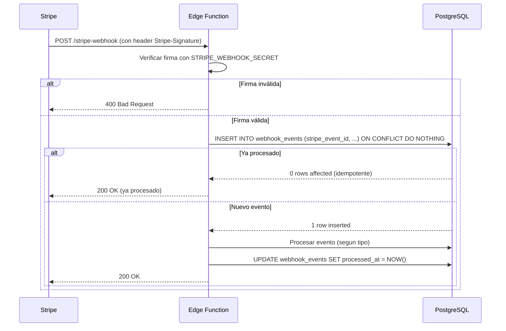

# Webhook Event Matrix — Eventos de Stripe a procesar

> **Propósito:** Documentar cada evento de webhook de Stripe que PoseArt debe procesar, qué acción toma, y cómo garantiza idempotencia.

---

## Eventos de suscripción

| Evento de Stripe | Acción en PoseArt | Tabla afectada | Idempotencia |
|---|---|---|---|
| `checkout.session.completed` | Crear/actualizar `billing_customers`, `subscriptions`, `entitlements` | `billing_customers`, `subscriptions`, `entitlements`, `webhook_events` | PK `stripe_event_id` en `webhook_events` con `ON CONFLICT DO NOTHING` |
| `customer.subscription.created` | Registrar `subscription_events` (tipo `created`) | `subscription_events`, `webhook_events` | Misma PK |
| `customer.subscription.updated` | Actualizar `subscriptions` (estado, periodo), registrar `subscription_events` (tipo `updated`) | `subscriptions`, `subscription_events`, `webhook_events` | Misma PK |
| `customer.subscription.deleted` | Marcar `subscriptions` como `canceled`, cerrar `entitlements`, registrar `subscription_events` (tipo `canceled`) | `subscriptions`, `entitlements`, `subscription_events`, `webhook_events` | Misma PK |
| `customer.subscription.trial_will_end` | Notificar al usuario (email) que el trial termina pronto | `webhook_events` | Misma PK |
| `invoice.payment_succeeded` | Registrar `invoices` (paid), renovar `entitlements`, registrar `subscription_events` (tipo `renewed`) | `invoices`, `entitlements`, `subscription_events`, `webhook_events` | Misma PK |
| `invoice.payment_failed` | Marcar `subscriptions` como `past_due`, registrar `subscription_events` (tipo `payment_failed`) | `subscriptions`, `subscription_events`, `webhook_events` | Misma PK |
| `invoice.finalized` | Registrar `invoices` (open) | `invoices`, `webhook_events` | Misma PK |
| `charge.refunded` | Si es suscripción: cerrar `entitlements`, registrar `subscription_events` (tipo `refunded`) | `entitlements`, `subscription_events`, `webhook_events` | Misma PK |

---

## Eventos de marketplace (compras puntuales)

| Evento de Stripe | Acción en PoseArt | Tabla afectada | Idempotencia |
|---|---|---|---|
| `checkout.session.completed` (mode=payment) | Ejecutar RPC `fulfill_marketplace_purchase`: crear `orders` + `purchases` + `entitlements` + `creator_earnings` atómicamente | `orders`, `order_items`, `purchases`, `entitlements`, `creator_earnings`, `webhook_events` | PK `stripe_event_id` + chequeo de `purchases.stripe_payment_intent_id` existente |
| `charge.refunded` (marketplace) | Revocar `entitlements` asociados, registrar `refunds` | `entitlements`, `refunds`, `webhook_events` | Misma PK |

---

## Eventos que NO se procesan (pero se registran)

| Evento | Por qué no se procesa | Acción |
|---|---|---|
| `customer.created` | Se maneja en `checkout.session.completed` | Solo log en `webhook_events` |
| `customer.updated` | No afecta entitlements | Solo log |
| `payment_intent.payment_failed` | Se maneja via `invoice.payment_failed` | Solo log |
| `payment_intent.succeeded` | Se maneja via `checkout.session.completed` o `invoice.payment_succeeded` | Solo log |

---

## Estados de suscripción y acciones

| Estado Stripe | `subscriptions.status` | `entitlements.active` | Acción del usuario |
|---|---|---|---|
| `trialing` | `trialing` | `true` | Acceso Pro completo durante el trial |
| `active` | `active` | `true` | Acceso Pro completo |
| `past_due` | `past_due` | `true` (grace period 7 días) | Acceso Pro temporal; notificar pago fallido |
| `canceled` | `canceled` | `false` | Sin acceso Pro; conservar datos |
| `incomplete` | `incomplete` | `false` | Sin acceso Pro; esperar confirmación |
| `unpaid` | `unpaid` | `false` | Sin acceso Pro después de grace period |

---

## Reconstrucción de racha y antigüedad

La racha y antigüedad se **reconstruyen** desde `subscription_events`, no se guardan como contadores mutables:

```sql
-- current_subscription_started_at: inicio del periodo activo ininterrumpido más reciente
SELECT MAX(event_timestamp)
FROM subscription_events
WHERE event_type IN ('created', 'reactivated')
  AND subscription_id = $1
  AND NOT EXISTS (
    SELECT 1 FROM subscription_events e2
    WHERE e2.subscription_id = $1
      AND e2.event_type IN ('canceled', 'lapsed')
      AND e2.event_timestamp > subscription_events.event_timestamp
  );

-- lifetime_subscribed_days: suma de días entre cada 'created'/'reactivated' y el siguiente 'canceled'/'lapsed'
-- (o NOW() si sigue activo)

-- current_subscription_streak_days: NOW() - current_subscription_started_at (si está activa)
```

> **Nota:** La query exacta está en `03-DATA-MODEL.md` y `07-BILLING-AND-SUBSCRIPTIONS.md`. Marcada como "sin verificar en producción" — debe probarse con datos reales de Stripe en modo test.

---

## Flujo de verificación de webhook


